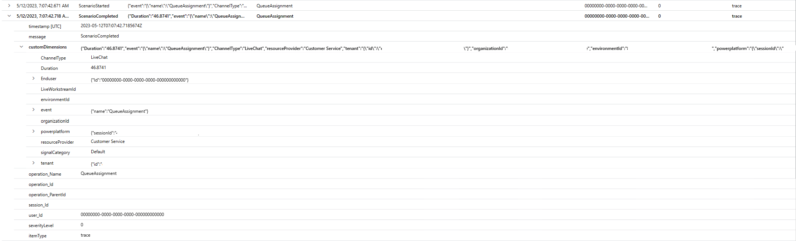
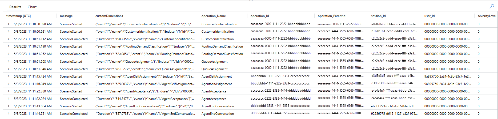

# Conversation diagnostics in Azure Application Insights (preview)

[!INCLUDE [preview-banner](~/../shared-content/shared/preview-includes/preview-banner.md)]

Conversation diagnostics logs each of the conversation lifecycle events, giving you a greater visibility into conversations-based operational telemetry of your organization.  This helps your support team to proactively monitor the system and allows developers to easily identify, diagnose, and fix problematic conversations, or seek swift support.

Connect your Dynamics 365 Customer Service environment to an Azure Application Insights instance to collect and store conversation logs. For more information about Application Insights features and how they can be used to monitor your telemetry and diagnose failures, see [Application Insights Overview dashboard](/azure/azure-monitor/app/overview-dashboard) and [Diagnose failures using the Azure portal](/azure/azure-monitor/app/asp-net-exceptions#diagnose-failures-using-the-azure-portal).

You can then use the conversation lifecycle events data from Dynamics 365 Customer Service in Application Insights to monitor system health, export, and combine it with additional data sets to build custom dashboards per your business needs.

[!INCLUDE [preview-note](~/../shared-content/shared/preview-includes/preview-note.md)]

> [!NOTE]
> Export of Power Automate and Dynamics 365 Customer Service data is not available in sovereign clouds, such as Government Community Cloud (GCC), Government Community Cloud - High (GCC High), and Department of Defense (DoD), at this time.

> [!IMPORTANT]
> When this feature transitions to General Availability (GA), the feature will be available for Managed Environments only.  Users will need a Power Apps, Power Automate, or Dynamics 365 license with premium use rights. For this public preview only, the premium use rights requirement and the Managed Environments restriction are relaxed.

## Pricing

Azure Application Insights is an extension of Azure Monitor and charges for data ingested. There are two log ingestion plans – Basic and Analytic logs. To know the pricing for your business requirements, see [Azure Monitor pricing](https://azure.microsoft.com/pricing/details/monitor/#pricing).

## Set up a connection with Azure Application Insights

Before you perform a data export, create a connection between your Dynamics 365 Customer Service tenant and Azure Application Insights in Power Platform admin center. You can create only one data export configuration from Dynamics 365 Customer Service to Application Insights per environment. To enable the data export, complete the following steps.

1.  In the [Power Platform admin center](https://admin.powerplatform.microsoft.com), select **Data Export** in the navigation pane.

1.  On the **Data export** page, select the **App Insights** tab. Then select **New data export**.

1.  On the **New data exports to Azure Application Insights** page, complete the following actions, and then select **Next**.

    - Enter a name in the **Name of the export package** field.
    - Select **Dynamics Customer Service**.
    - Select **Next**.

1.  Select the environment from which you'd like to export the data, and then select **Next**. You can export data from a [Managed Environment](managed-environment-enable.md) only.

1. Specify the **Subscription**, **Resource group**, and the **Application Insights** instance. Then select **Next**.

1. Review the setup configuration, and then select **Create.** The data export from Dynamics 365 Customer Service to Application Insights is created and displayed on the **Data export** page.
   
## Access and use the conversation information in Application Insights

After you've configured the data export setup, conversation lifecycle information for live chat, digital messaging, voice, and custom channel conversations is available in the Application Insights **Traces** table.

### Conversation scenarios
The **Traces** table contains data about the following conversation scenarios.

- **Category**: Conversation initiation 
  - **Scenario**: Conversation is initialized 
  - **Scenario**: Customer identified

- **Category**: Virtual agent interaction
  - **Scenario**: Virtual agent assigned
  - **Scenario**: Conversation ended by virtual assistant
  - **Scenario**: Virtual assistant escalation to human agent from virtual agent

- **Category**:  Routing
  - **Scenario**: Demand Classification
  - **Scenario**: Queue assignment

- **Category**:  Human agent interaction
  - **Scenario**: Agent accepted
  - **Scenario**: Agent rejected
  - **Scenario**: Acceptance request timed out
  - **Scenario**: Agent rejoined
  - **Scenario**: Agent self-assignment

- **Category**: Conversation completion
  - **Scenario**: Conversation ended by customer
  - **Scenario**: Conversation ended by agent
  - **Scenario**: Agent session closed
  - **Scenario**: Conversation abandoned by customer/customer disconnect
  - **Scenario**: Conversation force close by supervisor
  - **Scenario**: Conversation closed
 
### Conversation scenarios metadata
The conversation scenarios in the **Traces** table contains has the following metadata.

-	Org ID
- LiveWorkItem ID
-	Channel Type
-	Scenario Status (Started/Failed/Completed)
-	Timestamp
-	Duration (for completed scenarios)
-	Participant Type (human agent or virtual agent)
-	Active Directory User ID (where applicable)

## Understand conversation logs metadata

A description of the attributes displayed in Application Insights is as follows:

- **Timestamp \[UTC\]**: The date and time at which the event is logged. 
- **Message**: Indicates the scenario status the conversation lifecycle event. This can be Started, Failed, or Completed.
    -   **Started**: Indicates that the conversation scenario started.
    -   **Completed**: Indicates that the conversation scenario was successfully completed.
    -   **Failed**: Indicates that the conversation scenario failed.
- **customDimensions**: Contains the following metadata required for detailed debugging:
    - **organizationId**: The unique identifier of the organization.
    - **LiveWorkItemID**: The unique identifier of the conversation to which the message must be sent to.
    - **Channel Type**: Indicates the channel through which the customer is sending messages.
    - **Duration**: The time taken for the scenario to complete.
    - **Participant Type**: Indicates if the conversation is assigned to a human agent or a bot.
- **Operation\_name**: Indicates the conversation lifecycle event.
- **Operation\_id**: The unique identifier of the root operation. This is the transaction ID of the conversation from Dynamics 365 Customer Service.
- **Operation\_parentid**: The conversation ID of the conversation.
- **Session\_id**: The instance of the user's interaction with the app.
- **User\_id**: Represents the user of the application. This field is populated with the Active Directory user ID whenever the scenario includes human agents or bots. For all other scenarios, 0 is displayed.
- **Severitylevel**: The trace severity level. This is set to 0.
- **itemType**: The table that the record was retrieved from. This is always set to Trace.

For example, in a scenario where a live chat conversation is assigned to a queue, the Traces table displays the following metadata:

-   The **ScenarioStarted** message, with the **Operation\_name**, QueueAssignment, and the timestamp at which the scenario started.
-   The **ScenarioCompleted** message, with the duration the application took for the scenario to be successfully completed as the scenario is a success, and the conversation is assigned to a queue.  
      
    

## Access conversation logs from Application Insights

To view the logs for a conversation, complete the following steps.

1.  Log in to [Azure portal](https://portal.azure.com/#home) and access your Application Insights instance. Ensure this is the same instance that you've used to setup the data export.

2.  Select **Logs** in **Monitoring**.

3.  Run a query on the **Traces** table, filtering by the conversation ID of your conversation. A sample query is as follows:

    ``` SQL
    *let lwiId = "269079bb-f39d-4281-bf87-d13bae6d0ed2";*
    
    *let operationIds = (traces*
    
    *\| where operation\_ParentId == lwiId // LWI to be checked*
    
    *\| distinct operation\_Id);*
    
    *traces*
    
    *\| where operation\_Id in (operationIds) or operation\_ParentId == lwiId*
    
    *\| project timestamp, message, customDimensions, operation\_Name, operation\_Id, operation\_ParentId, session\_Id, user\_Id, severityLevel, itemType*
    
    *\| sort by timestamp asc*
    ```

    Where **lwid** is the conversation ID you've retrieved from your Dynamics 365 Customer Service application.

4.  The application displays the trace for the conversation.

## Conversation lifecycle scenario: Success

A customer initializes a chat conversation on your portal. The application identifies the customer and routes the chat request to a queue. A chat notification appears, and the agent picks up the request from the Agent Dashboard. The agent chats with the customer, and the customer ends the conversation.

When you run a query for the specific conversation ID, here's the trace log that's displayed:



## Export conversation data

You can use the **Export** option to export the logs and combine this data with data sets from other tables to create your own custom monitoring dashboards. More information: [Create custom KPI dashboards using Application Insights](/azure/azure-monitor/app/tutorial-app-dashboards).
