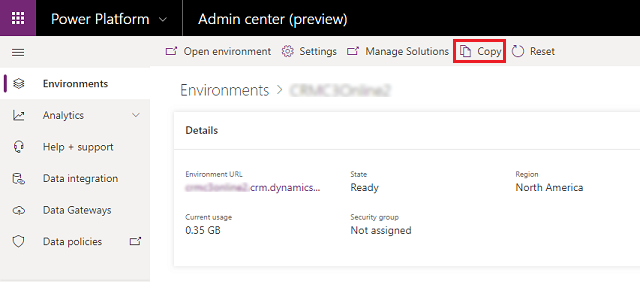
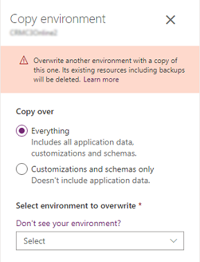
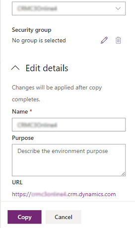
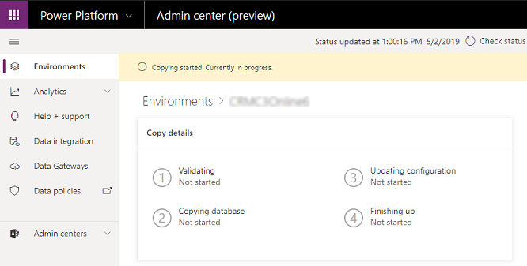

# Copy an environment

You can use Copy environment in the Microsoft Power Platform admin center to copy the customer engagement apps (Dynamics 365 Sales, Dynamics 365 Customer Service, Dynamics 365 Field Service, Dynamics 365 Marketing, and Dynamics 365 Project Service Automation), and all data between environments. You can select two levels of copy: **Everything** or **Customizations and schemas only**.  

> [!div class="mx-imgBorder"] 
> 

> [!NOTE]
> - The target environment will be listed in the **Select environment to overwrite** drop-down. If you do not see an environment, that means you cannot overwrite it. For example, you cannot overwrite production environments so you won't see any environments of type production.  
>   :::image type="content" source="media/copy-environment-no-target.png" alt-text="No target for copying environment.":::
> - You can only copy to an environment in the same tenant and region.
> - Components that have not been added to a solution (including canvas apps, flows, custom connectors, and connections) might not be part of the copy. You should validate your apps post copy.
> - You cannot copy from or to a default type environment.
  
## Copy over everything
 An **Everything** copy includes all application data, users, and customizations, and schemas from the source environment and is suitable for:  
  
- User acceptance testing  
- Upgrade testing  
- Preview in production (TAP/EA)  
- Training  
  
**An example scenario**  
  
Isaac, a business application developer, has received a request from the sales department to configure and deploy a social media integration solution from another company vendor.  Isaac has never installed a solution from this vendor and is unsure what impact this would have on the production application. Isaac would like to import the solution into an environment that is nearly identical to, but isolated from, production to learn about the solution and make the appropriate configuration changes. Isaac submits a request to Thomas, the IT Manager for Contoso, to create an Everything copy sandbox environment for him.  
  
After the Everything copy is complete, Isaac receives a mail from Thomas telling him the sandbox environment is ready.  Isaac logs into the sandbox environment and makes the necessary changes to make sure that production external services will not be impacted by the sandbox environment.  Once changes are complete, Isaac turns off administration mode and enables background services.  Isaac is able to use the Everything copy sandbox environment to do his testing and later manually import the solution into production.  
  
## Copy over customizations and schemas only 
 Customizations and schemas copy only includes users, customizations, and schema from the source environment and is suitable for:  
  
- Iterative team development  
- Partner/ISV solutions  
- Proof of concept  
  
**An example scenario**  
  
Isaac has a large development project starting next week for the sales department.  He has a team of developers ready to start on the project, some of whom are internal to Contoso and some are external vendors. The Contoso sales application contains Personally Identifiable Information (PII) that the sales manager has explicitly stated must not be made available to any external parties for privacy and legal liability reasons.  Isaac requests customizations and schemas only copy sandbox environment that does not contain any production data or users. In addition, Isaac creates a Microsoft 365 security group to give the development team access to the sandbox environment.  
  
After modifying and enabling some of the plug-ins, the developer sandbox environment functions the same and is isolated from the production application.  The development team works on their modifications in this environment for several weeks.  They package their changes into a solution and export/import to deploy to the Everything copy sandbox environment.  After a successful round of testing and signoffs, the changes are manually deployed to production.  
  
### Tables truncated in customizations and schemas only copy 
 The following tables will be truncated when you do a customizations and schemas only copy:  

| Tables |  |  |
|-----------|-----------|-----------| 
| Account | InterProcessLock | SocialActivity |
| AccountLeads | Invoice | SocialInsightsConfiguration |
| ActivityMimeAttachment | InvoiceDetail | SocialProfile |
| ActivityParty | KnowledgeArticle | SqlEncryptionAudit |
| ActivityPointer | KnowledgeArticlesCategories | Subscription |
| AdvancedSimilarityRule | KbArticle | SubscriptionClients |
| Annotation | KbArticleComment | SubscriptionManuallyTrackedObject |
| AnnualFiscalCalendar | KnowledgeSearchModel | SubscriptionStatisticsOffline |
| Appointment | Lead | SubscriptionStatisticsOutlook |
| Attachment | LeadAddress | SubscriptionSyncEntryOffline |
| Audit | LeadCompetitors | SubscriptionSyncEntryOutlook |
| AzureServiceConnection | LeadProduct | SubscriptionSyncInfo |
| BulkDeleteFailure | Letter | SystemApplicationMetadata |
| BulkOperation | License | SystemUserBusinessUnitEntityMap |
| BulkOperationLog | List | SystemUserLicenses |
| BusinessProcessFlowInstance | ListMember | Task |
| BusinessUnitNewsArticle | MailboxStatistics | TeamProfiles |
| Campaign | MonthlyFiscalCalendar | TeamRoles |
| CampaignActivity | Notification | Territory
| CampaignActivityItem | Opportunity | TimeZoneLocalizedName |
| CampaignItem | OpportunityClose | Topic |
| CampaignResponse | OpportunityCompetitors | TopicHistory |
| Competitor | OpportunityProduct | TopicModel |
| ChannelAccessProfile | OrderClose | TopicModelConfiguration |
| CompetitorAddress | OrganizationUI | TopicModelExecutionHistory |
| CompetitorProduct | OwnerMapping | TraceAssociation |
| CompetitorSalesLiterature | PhoneCall | TraceLog |
| Connection | PluginTypeStatistic | TraceRegarding |
| Contact | PluginTraceLog | UnresolvedAddress |
| ContactInvoices | Post | UntrackedEmail |
| ContactLeads | PostComment | UserApplicationMetadata |
| ContactOrders | PostFollow | UserEntityInstanceData |
| ContactQuotes | PostLike | UserEntityUISettings |
| Contract | PostRegarding | UserFiscalCalendar |
| ContractDetail | PostRole | UserForm |
| CustomerAddress | PriceLevel | UserQueryVisualization |
| CustomerOpportunityRole | PrincipalObjectAccess | WizardAccessPrivilege |
| CustomerRelationship | PrincipalObjectAttributeAccess | WorkflowLog |
| DelveActionHub | ProcessSession | WorkflowWaitSubscription |
| Discount | Product | BusinessDataLocalizedLabel |
| DiscountType | ProductAssociation | DynamicProperty |
| DocumentIndex | ProductPriceLevel | ChannelPropertyGroup |
| DuplicateRecord | ProductSalesLiterature | DynamicPropertyAssociation |
| Email | ProductSubstitute | DynamicPropertyInstance |
| EmailHash | QuarterlyFiscalCalendar | DynamicPropertyOptionSetItem |
| EmailSearch | QueueItem | Position |
| Entitlement | Quote | ChannelProperty |
| EntitlementChannel | QuoteClose | RollupJob |
| EntitlementContacts | QuoteDetail | SLAKPIInstance |
| EntitlementProducts | RecurrenceRule | SystemUserManagerMap |
| EntitlementTemplate | TextAnalyticsEntityMapping | SystemUserSyncMappingProfiles |
| EntitlementTemplateChannel | RecurringAppointmentMaster | OfficeGraphDocument |
| EntitlementTemplateProducts | RelationshipRole | SimilarityRule |
| ExchangeSyncIdMapping | RelationshipRoleMap | BookableResource |
| BookableResourceBookingExchangeSyncIdMapping | ReplicationBacklog | BookableResourceGroup |
| ExternalParty | SalesLiterature | BookableResourceBooking |
| ExternalPartyItem | SalesLiteratureItem | BookableResourceBookingHeader |
| Fax | SalesOrder | BookableResourceCategory |
| FixedMonthlyFiscalCalendar | SalesOrderDetail | BookableResourceCharacteristic |
| Goal | SdkMessageProcessingStepSecureConfig | BookableResourceCategoryAssn |
| GoalRollupQuery | SemiAnnualFiscalCalendar | Characteristic |
| Import | Service | RatingValue |
| ImportData | ServiceAppointment | RatingModel |
| ImportFile | ServiceContractContacts | BookingStatus |
| ImportLog | SharePointData | RecommendedDocument |
| Incident | SharePointDocument | EmailSignature |
| IncidentResolution | SharePointDocumentLocation | UserSearchFacet |
| IntegrationStatus | SharePointSite | GlobalSearchConfiguration |

## Copy an environment
  
1. Go to the [Power Platform admin center](https://admin.powerplatform.microsoft.com) and sign in using Environment Admin or System Administrator role credentials.
  
   > [!NOTE]
   > Environment Admins or System Administrators can copy all available environments. System administrators can copy environments for which they have the Environment Admin or System Administrator role.  
  
2. From the left-side menu, select **Environments**, and then select an environment to copy.

3. Select **Copy** from the top menu bar.
  
4. Select the desired copy over level.
  
   > [!div class="mx-imgBorder"] 
   > 

5. Select a target environment.
  
   A target environment can be a sandbox or preview environment, not a production environment. If you're copying an environment of type **Trial (subscription-based)**, you'll be able to see and select target environments of the same type, that is **Trial (subscription-based)**.
  
   > [!WARNING]
   >  The target environment will be deleted and replaced with a copy of the data and customizations from the source environment. You won’t be able to recover any deleted data.  

6. To restrict environment access to people in a security group select **Edit** ().

7. Edit the details for the copied environment, and then select **Copy**.

   > [!div class="mx-imgBorder"] 
   > 

8. Select **Confirm** to overwrite the target environment.

The overwrite process starts.

> [!div class="mx-imgBorder"] 
> 
  
Once the copy process is complete, the target environment is placed in [Administration mode](sandbox-environments.md#administration-mode) and background operations are disabled. The next section describes recommended Administrator actions for the newly created copy (target) environment.  
 
### Next steps after copying an environment  
 To ensure the newly created copy (target) environment does not impact your production environment, once the copy operation is complete, two things happen:  
  
1. The newly created copy environment is placed in administration mode. Only those with System Administrator or System Customizer security roles can sign in and manage the copy environment. Regular users cannot sign in and use the copy environment.  
  
2. Background operations are disabled in the copy environment. Disabled operations include workflows and synchronization with Microsoft Exchange.  
  
#### Review components
  
 You should review the status of application components in the copy environment with external connections such as Yammer, email, plug-ins, custom workflow activities, etc. Review these and consider what action to take:  
  
1. Disable the component.  
  
2. Redirect the component to another service environment such as one running Exchange or SharePoint.  
  
3. Do nothing – leave the component as is in the copy environment. For example, you might decide to allow Yammer posting to both the copy and production environments.  
  
   Here are some possible application components in the copy environment that could have external connections and therefore could impact services with the same connections in your production environment.  
  
- **Email** - A mailbox cannot be synced with two different environments. For an Everything copy environment, the user mailboxes in the copy environment must be disabled so the mailboxes do not attempt to send or receive email, or track appointments, contacts, or tasks. Set synchronization for the following to None.  
  
    - Incoming Email  
    - Outgoing Email  
    - Appointments, Contacts, Tasks  
  
  More information: [Set the delivery method for incoming and outgoing email](set-up-server-side-synchronization-of-email-appointments-contacts-and-tasks.md)  
  
- **SharePoint** - Deactivate or redirect SharePoint to a sandbox SharePoint environment to prevent impacting documents managed by SharePoint. Go to **Settings** > **Documentation Management** > **SharePoint Sites**. Select your site, and then click **Deactivate**.  
  
- **Yammer** - Disable Yammer or redirect to a separate Yammer service to prevent posts made in the copy environment conflicting with posts made in the production environment. Go to **Settings** > **Administration** > **Yammer Configuration**.  
  
     After creating a new sandbox environment, workflows and system jobs might be pending execution. Apart from these jobs, if you have connected Yammer to customer engagement apps there will be Yammer activity streams posted from customer engagement apps to Yammer asynchronously. These activity streams are not visible through the system jobs. If there were any pending Yammer activity streams before the Disable Background Process is turned on, these activity steams will be posted to the current Yammer configuration once the Disable Background Process is turned back off. In the sandbox environment, if you have your current Yammer configuration connected to the same Yammer network as your production environment, you might see duplicate activity streams. To avoid duplicate Yammer activity streams, redirect your sandbox environment to another Yammer network (possibly a test network) before turning background processes back on.  
  
- **Platform extensibility** - Consider disabling the following that could be running in the copy environment and impacting external service components.  
    - **Server-side plug-ins**.  
    - **Workflow custom activity**.  

- **Client extensibility** - Review the following.  
    - **Client-side JavaScript**. Take a look at your JavaScript and HTML web resources for read/write operations that could impact external services.  
    - **IFRAMES**. Determine if the target of an IFRAME is a production environment.  

-	**Relevance Search** - Confirm that search returns expected results. If results are not accurate, you can turn off Relevance Search for a period of 12 hours and then turn Relevance Search back on again to refresh the index. You may contact [Microsoft support](get-help-support.md) if you're still experiencing issues.

-	**Flows** - Review the flows in the freshly copied environment. Edit flows that need triggers and actions adjusted. Enable and disable flows as needed.

- **Connection References** - Connection References will require new connections. Create and set connections on Connection References.

- **Custom Connectors** - Custom connectors should be reviewed and, if needed, deleted and reinstalled.

### See also  
[What's new about storage](whats-new-storage.md)  
[New Microsoft Dataverse storage capacity](capacity-storage.md)  
[Legacy storage capacity](legacy-capacity-storage.md)

[!INCLUDE[footer-include](../includes/footer-banner.md)]
