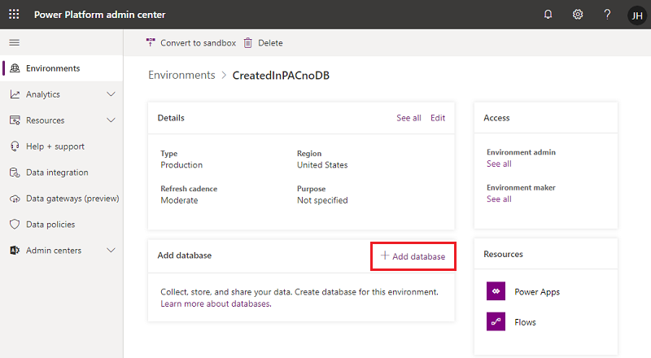
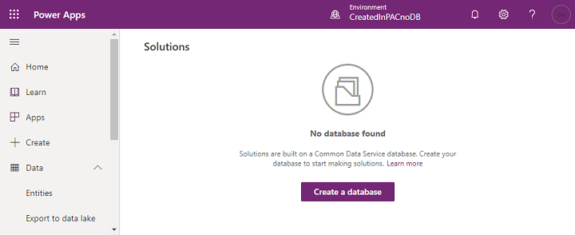

# Add a Microsoft Dataverse database

[!INCLUDE [cc-data-platform-banner](../includes/cc-data-platform-banner.md)]

You can create a database and build apps by using Dataverse as a data store. You can either create your own custom entities or use the predefined entities. To create a database, you first need to either create an environment, or be assigned to an existing environment as an **Environment Admin**. In addition, you must be assigned the appropriate license. For information on purchasing a plan for using Dataverse, see [Pricing info](pricing-billing-skus.md).

There are various ways to add or create a database:

- In the Power Platform admin center
- In the **Entities** pane of powerapps.com

> [!NOTE]
> For security reasons, we do not support creating a copy of the database for local use.

## Add a database in the admin center
1. In the [admin center](https://admin.powerplatform.microsoft.com), in the left navigation pane, select **Environments**.
    
2. Select the environment to which you want to add the database.

3. Select **+ Add database**. 
    
    

4. Enter the following, and then select **Add**.

   |Setting  |Description  |
   |---------|---------|
   |Language     | The default language for this environment. More information: [Dataverse language collations](language-collations.md)     |
   |Currency     | The base currency used for reporting.         |
   |Enable Dynamics 365 apps | Select **Yes** and make a selection to automatically deploy apps such as Dynamics 365 Sales and Dynamics 365 Customer Service. |
   |Deploy sample apps and data     | Select **Yes** to include sample apps and data. Sample data gives you something to experiment with as you learn. You must select **No** for **Enable Dynamics 365 apps** for this setting to appear.        |
   |Security group | Select a security group to restrict access to this environment. |

## Create a database in the Entities pane of Power Apps
1. On [make.powerapps.com](https://make.powerapps.com), expand the **Data** section and click or tap **Entities** in the left navigation pane.

2. Select **Create a database** to create the database.

    

## Security model for the databases
When a database is created, the users who have environment roles assigned to them, will continue to maintain those privileges.  
    Users with **Environment Admin** role are now assigned to **System Administrator** role. 
    Users with **Environment Maker** continue to possess the same role.

You can assign additional users to pre-defined roles or even create custom roles. See [Database Security](database-security.md) for more details.

> [!NOTE]
> On creating the database, any security group assigned to Environment Admin or Environment Maker role will not be honored any more. Currently, assigning permissions in database, do not support Azure AD security group.

## License and security permissions
To create a database, you must be an administrator in the selected environment, and the appropriate license must be assigned to you. From the environment, you can further configure security permissions for other users by using the **Security** tab. For more information, see [Configure database security](database-security.md).

## Privacy notice
With the Microsoft Power Apps Common Data Model we collect and store custom entity and field names in our diagnostic systems.  We use this knowledge to improve the Common Data Model for our customers. The entity and field names that Creators create help us understand scenarios that are common across the Microsoft Power Apps community and ascertain gaps in the service’s standard entity coverage, such as schemas related to organizations. The data in the database tables associated with these entities is not accessed or used by Microsoft or replicated outside of the region in which the database is provisioned. Note, however, the custom entity and field names may be replicated across regions and are deleted in accordance with our data retention policies. Microsoft is committed to your privacy as described further in our [Trust Center](https://www.microsoft.com/trustcenter/Privacy/default.aspx).
