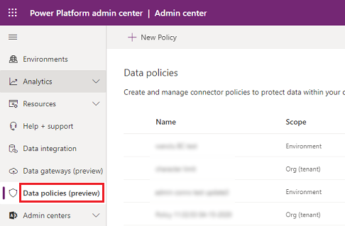

# Create a data loss prevention (DLP) policy
To protect data in your organization, Power Apps lets you create and enforce policies that define which consumer connectors specific business data can be shared with. These policies that define how data can be shared are referred to as data loss prevention (DLP) policies. DLP policies ensure that data is managed in a uniform manner across your organization, and they prevent important business data from being accidentally published to connectors such as social media sites.

DLP policies can be created at the tenant level or at the environment level.

## Prerequisites

### Tenant-level 

To follow the steps below for tenant-level policies, **one** of the following permissions is required. Tenant-level policies can be defined to include or exclude specific environment(s). 

- Power Platform service admin permissions
- Microsoft 365 Global admin permissions

We refer to these roles throughout this document as tenant admins. For more information, see [Use service admin roles to manage your tenant](use-service-admin-role-manage-tenant.md).

### Environment-level

To follow the steps below for environment-level policies, you need to have Power Apps Environment Admin permissions. For more information, see [Environment permissions](environments-administration.md#environment-permissions). 

## View DLP policies

DLP policies can be viewed and managed from the Power Platform Admin Center. The new user interface is now in public preview.

Sign in to the Power Platform admin center and select **Data policies**.

> [!div class="mx-imgBorder"] 
> 

## The DLP process

The following are the steps you follow to create a DLP policy.

1. Assign the policy a name
2. Classify connectors
3. Define scope - this step does not apply to environment-level policies 
4. Select environments
5. Review settings

These are covered in the next section.

## Create a DLP policy

In these steps, you'll add SharePoint and Salesforce to the **Business** data only data group of a DLP policy. If a person who is part of the DLP policy's environment creates an app that shares data between SharePoint or Salesforce and any service in the **Non-business** data allowed data group, the app will not be allowed to connect.

In this example walkthrough, you will create a tenant-level DLP policy. You will add SharePoint and Salesforce to the Business data group of a DLP policy. You will also add Facebook and Twitter to the Blocked data group. You will leave the remaining connectors in the **Non-Business** data group. You will then exclude test environments from the scope of this policy and apply it on the remaining environments such as default and production environments in your tenant.

Once this policy is saved, any Power App or Power Automate maker who is part of the DLP policy's environment can create an app or a flow that shares data between SharePoint or Salesforce. Any service in the **Non-business** data group, will not be allowed to establish connections. Similarly, makers will not be able to add Facebook and Twitter connectors in any app or flow.

1. In Power Platform admin center, select **Data policies** > **New policy** to start the New Policy process.

   > [!div class="mx-imgBorder"] 
   > 

   If no policies exist in the tenant, admins see the following experience.

   > [!div class="mx-imgBorder"] 
   > 

2. Enter a policy name and then select **Next**.

3. Review the various attributes and settings you can take on the **Assign connectors** page. 

   > [!div class="mx-imgBorder"] 
   >  

   **Attributes**  

   <table style="width:100%">
<tr>
<th>Attribute</th>
<th>Description</th>
<tr>
<td width="20%"> Name</td>
<td width="80%"> The name of the connector. </td>
</tr>
<tr>
<td width="20%"> Blockable</td>
<td width="80%"> Connectors which can be blocked. For a list of connectors that cannot be blocked, see [List of connectors that cannot be blocked](wp-data-loss-prevention.md#list-of-connectors-that-cannot-be-blocked).  </td>
</tr>
<tr>
<td width="20%"> Type</td>
<td width="80%"> If the connector usage requires a Premium license or is it included in the base/Standard license for Power Platform.    </td>
</tr>
<tr>
<td width="20%"> Publisher</td>
<td width="80%">  The company that publishes the connector. The publisher value can be different from the service owner. For example, Microsoft can be the publisher of Salesforce connector but the underlying service is not owned by Microsoft and is owned by Salesforce.  </td>
</tr>
<tr>
<td width="20%"> About</td>
<td width="80%"> Select the URL for more information about the connector. </td>
</tr>
</table>

   > [!div class="mx-tableFixed"]
   > |Attribute  |Description  |
   > |---------|---------|
   > |Name     | The name of the connector.        |
   > |Blockable     | Connectors which can be blocked. For a list of connectors that cannot be blocked, see [List of connectors that cannot be blocked](wp-data-loss-prevention.md#list-of-connectors-that-cannot-be-blocked).     |
   > |Type     | If the connector usage requires a Premium license or is it included in the base/Standard license for Power Platform.     |
   > |Publisher     |  The company that publishes the connector. The publisher value can be different from the service owner. For example, Microsoft can be the publisher of Salesforce connector but the underlying service is not owned by Microsoft and is owned by Salesforce.    |
   > |About      | Select the URL for more information about the connector.       |

   **Lists**  

   |Setting  |Description  |
   |---------|---------|
   |Business (n)     | Connectors for business sensitive data. Connectors in this group can’t share data with connectors in other groups.         |
   |Non-Business / Default (n)      | Connectors for non-business data such as personal use data. Connectors in this group can’t share data with connectors in other groups.|
   |Blocked (n)      | Blocked connectors can’t be used where this policy is applied.  |

   **Actions**  

   |Setting  |Description  |
   |---------|---------|
   |Set default group | Group that maps any new connectors added by Power Platform *after* your DLP policy is created.  For more information on the default group, see [Default data group for new connectors](wp-data-loss-prevention.md#default-data-group-for-new-connectors).        |
   |Search Connectors     | To search a long list of connectors to find specific connectors to classify them. You can search on any field in the connector list view such as Name, Blockable, Type, and Publisher.      |

   You can take the following actions:

   > [!div class="mx-imgBorder"] 
   >  

   |         |Description  |
   |---------|---------|
   |**1**     | Assign one or more connectors across connector classification groups        |
   |**2**     | Connector classification group pivot tables         |
   |**3**     | Search bar to find connectors across properties like **Name**, **Blockable**, Type Publisher       |
   |**4**     |  Connector classification group  that maps any new connectors added by Power Platform *after* your DLP policy is created.         |
   |**5**     |  Select, multi-select, bulk select connector to move across groups        |
   |**6**     |  Alphabetical sort capability across individual columns        |
   |**7**     |  Action buttons to assign individual connectors across connector classification groups        |

4. Select one or more connectors, such as SalesForce and Sharepoint, and then select **Move to Business** from the top menu bar to apply to all the selected. You can also use the ellipses () to the right of the connector name. 

   > [!div class="mx-imgBorder"] 
   > 

   The connectors will appear in the **Business** data group.

   > [!div class="mx-imgBorder"] 
   > 

   Connectors can reside in only one data group at a time. By moving the SharePoint and Salesforce connectors to the **Business** data group, you're preventing users from creating flows and apps that combine these two connectors with any of the connectors in the **Non-Business** and **Blocked** groups.

   For connectors like SharePoint that are not blockable, **Block** action will be greyed out and a warning appears informing the reasoning behind making **Block** action being unavailable for these connectors.

5. Choose the scope of the DLP policy. This step is not available for environment-level policies since they are always meant for a single environment.

   > [!div class="mx-imgBorder"] 
   > 

   For the purpose of this walkthrough, to exclude test environments from this policy, select **Exclude certain environments** which brings up the **Add Environments** page. 

  Select **Next**.

6. Review the various attributes and settings on the **Add Environments** page. For tenant-level policies this list will show all the environments in the tenant to the tenant admin. For environment-level policies this list will only show a subset of the environments in the tenant that are managed by the logged in user as Environment admin. 

   **Attributes**  

   |Attribute  |Description  |
   |---------|---------|
   |Name     | The name of the environment.        |
   |Type     | Type of the environment: Trial, Production, Sandbox, Default |
   |Region     |Region associated with the environment.     |
   |Created by     |  User who created the environment.      |
   |Created (On)      | Date on which the environment was created.     |

   **Lists**  

   |Setting  |Description  |
   |---------|---------|
   |Available (n)     | Environments which are not explicitly included or excluded in the policy scope. For environment policy and tenant-level policies with scope defined as **Add multiple environments**, this list represents the subset of environments that are not included in the policy scope. For tenant-level policies with scope defined as **Exclude certain environments**, this pivot represents the set of environments that are included within the policy scope.       |
   |Added to policy (n)     | For environment policy and tenant-level policies with scope defined as **Add multiple environments**, this pivot represents the subset of environments that are within the policy scope. For tenant-level policies with scope defined as **Exclude certain environments**, this pivot represents the subset of environments that are excluded from the policy scope. |

7. Select one or more environments. You can use the search bar to quickly find the environments of your interest. For this walkthrough, we'll search for test environments - sandbox. Once we select the sandbox environments, we assign them to the policy scope by using **Add to policy** from the top menu bar. 

   > [!div class="mx-imgBorder"] 
   > 

   Since the policy scope was initially selected as **Exclude certain environments** these test environments will now be excluded from the policy scope and the DLP settings will be applied to all the remaining (Available) environments. For environment-level policy you can only select a single environment from the list of available environments.

   After making your selections for environments, select **Next** to move to the Review step.

8. Review the policy settings and then select **Create Policy**.

   > [!div class="mx-imgBorder"] 
   > 

The policy is created and appears in the list of data loss prevention policies. As a result of this policy, SharePoint and Salesforce apps can share data in non-test environments such as production environments since they are both part of the same **Business** data group. However, any connector, such as Outlook.com, that resides in the **Non-Business** data group will not share data with apps and flows using SharePoint and/or Salesforce connectors. Facebook and Twitter connectors are altogether blocked from being used in any app or flow in non-test environments such as production and default environments. 

It's good practice for administrators to share a list of DLP policies with their organization so that users are aware of the policies prior to creating apps.

This table describes the outcome of the DLP policy created.

|Connector matrix  |SharePoint (Business)  |Salesforce (Business)  |Outlook.com (Non-Business)   |Facebook (Blocked)  |Twitter (Blocked) |
|---------|---------|---------|---------|---------|---------|
|SharePoint (Business)     | Allowed        | Allowed        | Denied        |Denied        |Denied         |
|Salesforce (Business)     | Allowed        | Allowed        |  Denied       | Denied        | Denied        |
|Outlook.com (Non-Business)      |Denied         | Denied        | Allowed        |  Denied       | Denied        |
|Facebook (Blocked)     |  Denied       | Denied        |  Denied       |  Denied       |  Denied       |
|Twitter (Blocked)     |  Denied       | Denied        | Denied        | Denied        |  Denied       |

Since no DLP policy has been applied to test environments, apps and flows can use any set of connectors together in these environments.

## About new connectors

By default, all connectors are considered part of the **Non-Business** data group; no connectors are included in the **Business** data group. This effectively means that all connectors can be used with other connectors. 

New connectors are added to the default data group, **Non-Business**. If you prefer, you can change which category is considered the default, and then all new connectors will be classified in that category by default. See [Change the default data group](prevent-data-loss.md#change-the-default-data-group). 

Typically, most companies will want to treat new connectors as **Non-Business** until they evaluate if it is appropriate to use with data classified as business data. 

## Example new DLP policy scenario

You create a new tenant-wide DLP policy that has just Common Data Service added to the **Business** data group and all other connectors in **Non-Business**. Let's look at the outcome of this policy on a few application examples. 

|Connectors used in app or flow  |Connection impact of DLP  |
|---------|---------|
|SharePoint and OneDrive      | This would be allowed         |
|Common Data Service      | This would be allowed         |
|Common Data Service and SharePoint      | This would not be allowed         |
|harePoint and Twitter     | This would be allowed         |
|SharePoint, Twitter, and Common Data Service      | This would not be allowed         |

## Use DLP PowerShell commands
See [Data Loss Prevention (DLP) policy commands](powerapps-powershell.md#data-loss-prevention-dlp-policy-commands).

### See also
[Data loss prevention policies](wp-data-loss-prevention.md)  
[Manage data loss prevention (DLP) policies](prevent-data-loss.md)  
[Data Loss Prevention (DLP) policy commands](powerapps-powershell.md#data-loss-prevention-dlp-policy-commands)
