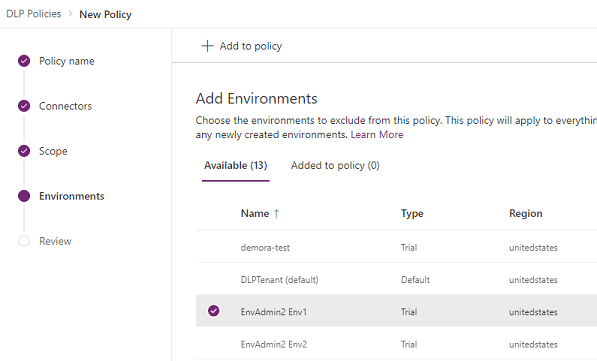

# Create a data loss prevention (DLP) policy
To protect data in your organization, Power Apps lets you create and enforce policies that define which consumer connectors specific business data can be shared with. These policies that define how data can be shared are referred to as data loss prevention (DLP) policies. DLP policies ensure that data is managed in a uniform manner across your organization, and they prevent important business data from being accidentally published to connectors such as social media sites.

In this topic, you'll learn how to create a DLP policy for a single environment that prevents data that's stored in your Common Data Service and SharePoint databases from being published to Twitter.

## Prerequisites
To follow the steps, **one** of the following items is required:
* Power Platform service admin permissions
* Global admin permissions
* Power Apps Environment Admin permissions plus a Power Apps plan, Power Automate plan, or a [free Power Apps trial](https://docs.microsoft.com/powerapps/maker/signup-for-powerapps) license

For more information, see [Environments administration in Power Apps](environments-administration.md).

## Create a DLP policy
1. In Power Platform admin center, select **Data policies** > **New policy** to start the New Policy process.

   > [!div class="mx-imgBorder"] 
   > 

2. Enter a policy name and then select **Next**.

3. Review the various actions you can take on the **Assign connectors** page. 

   > [!div class="mx-imgBorder"] 
   >  

   |Setting  |Action  |
   |---------|---------|
   |Set default group |         |
   |Business (n)     |         |
   |Non-Business / Default (n)      |        |
   |Blocked (n)      | Select to see the number of blocked connectors which can't be used where the policy is applied.   |
   |Search Connectors     |         |
   |Name     |         |
   |Blockable     |         |
   |Type     |         |
   |Publisher     |         |
   |About      |         |

4. Select one or more connectors and then select **Move to Business** or **Block** from the top menu bar to apply to all the selected. To set individual connectors, use the ellipses () to the right of the connector name. 

   > [!div class="mx-imgBorder"] 
   > 

   - Select **Move to business** to 
   - Select **Block** to 
   - Select **Next** to move to the next step.

5. Tenant admins, choose the environment scope. Environment admins, you won't see scope options so move to Step 6.

   > [!div class="mx-imgBorder"] 
   > 

   Depending on which scope you've chosen, you'll see more options for selecting environments to include in or exclude from the DLP policy.

   Make your selections and select **Next**.

6. Environment admins can add a single environment to the DLP policy. Tenant admins can add multiple environments to the DLP policy. Select **Next** to continue.

   > [!div class="mx-imgBorder"] 
   > 

    Note that environment DLP policies cannot override tenant-wide DLP policies.

7. Review the policy settings and then select **Create Policy**.

   > [!div class="mx-imgBorder"] 
   > 

    Connectors can reside in only one data group at a time and are added to the **No business data allowed** group by default. By moving Common Data Service and SharePoint to the **Business data only** group, you're preventing users from creating flows and apps that combine these two connectors with any of the connectors in the **No business data allowed** group.

The policy is created and appears in the list of data loss prevention policies. Since the Twitter connector resides in the **No business data allowed** data group, this policy ensures that the Common Data Service and SharePoint do not share their data with Twitter.

It's good practice for administrators to share a list of DLP policies with their organization so that users are aware of the policies prior to creating apps.

## Next steps
In this topic, you learned how to create a DLP policy for a single environment to prevent important business data from being accidentally published to connectors such as Twitter. To learn more about DLP policies, check out the article about how to manage them.

### See also
