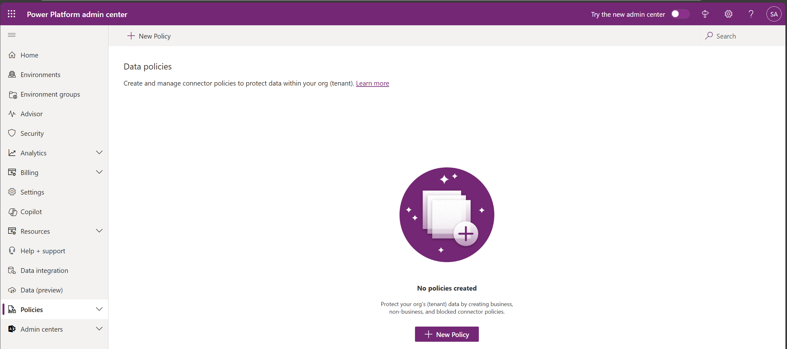
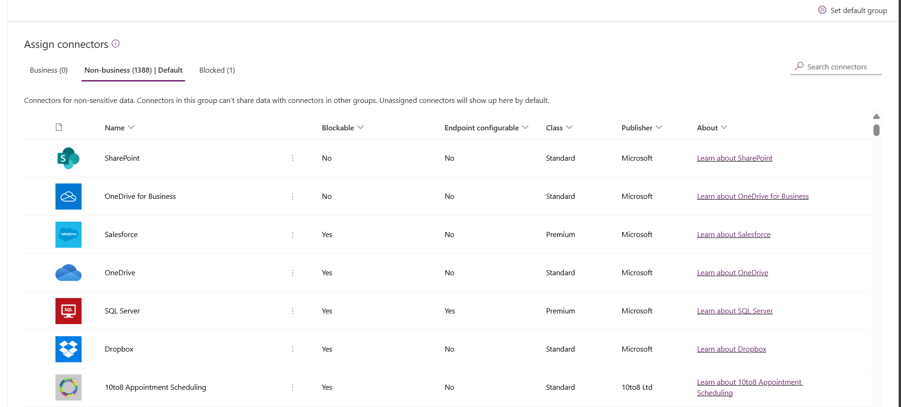
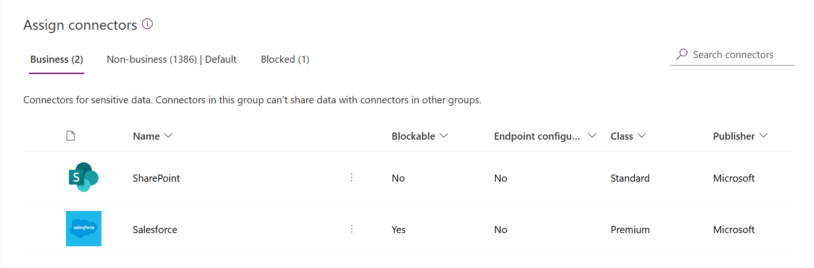

# Create a data loss prevention (DLP) policy 
To protect data in your organization, Power Apps lets you create and enforce policies that define which consumer connectors specific business data can be shared with. These policies that define how data can be shared are referred to as data loss prevention (DLP) policies. DLP policies ensure that data is managed in a uniform manner across your organization, and they prevent important business data from being accidentally published to connectors such as social media sites.

DLP policies can be created at the tenant-level or at the environment-level and are managed from the Power Platform Admin Center. The new user interface is now in public preview.

## Prerequisites

### Tenant-level 

To follow the steps below for tenant-level policies, **one** of the following permissions is required. Tenant-level policies can be defined to include or exclude specific environment(s). 

- Power Platform service admin permissions
- Microsoft 365 Global admin permissions

We refer to these roles throughout this document as tenant admins. For more information, see [Use service admin roles to manage your tenant](use-service-admin-role-manage-tenant.md).

### Environment-level

To follow the steps below for environment-level policies, you need to have Power Apps Environment Admin permissions. For more information, see [Environment permissions](environments-administration.md#environment-permissions). 

## Find and view DLP policies

To find and view DLP policies, see [Find and view DLP policies](prevent-data-loss.md#find-and-view-dlp-policies).

## The DLP process

The following are the steps you follow to create a DLP policy.

1. Assign the policy a name
2. Classify connectors
3. Define scope - this step does not apply to environment-level policies 
4. Select environments
5. Review settings

These are covered in the next section.

## Create DLP policy process

In this example walkthrough, we'll create a tenant-level DLP policy. We will add SharePoint and Salesforce to the Business data group of a DLP policy. We will also add Facebook and Twitter to the Blocked data group. We will leave the remaining connectors in the **Non-Business** data group. We will then exclude test environments from the scope of this policy and apply it on the remaining environments such as default and production environments in the tenant.

Once this policy is saved, any Power App or Power Automate maker who is part of the DLP policy's environment can create an app or a flow that shares data between SharePoint or Salesforce. Any Power App or Power Automate resource having an existing connection with a connector in the **Non-business** data group, will not be allowed to establish connections with SharePoint or Salesforce connectors and vice versa. Also, these makers will not be able to add Facebook and Twitter connectors to any Power App or Power Automate resource.

1. In Power Platform admin center, select **Data policies** > **New policy** to start the New Policy process.

   > [!div class="mx-imgBorder"] 
   > 

   If no policies exist in the tenant, you'll see the following page.

   > [!div class="mx-imgBorder"] 
   > 

2. Enter a policy name and then select **Next**.

3. Review the various attributes and settings you can take on the **Assign Connectors** page. 

   > [!div class="mx-imgBorder"] 
   >  

   **Attributes**   

   <table style="width:100%">
   <tr>
   <th>Attribute</th>
   <th>Description</th>
   </tr>
   <tr>
   <td width="20%"> Name</td>
   <td width="80%"> The name of the connector. </td>
   </tr>
   <tr>
   <td width="20%"> Blockable</td>
   <td width="80%"> Connectors which can be blocked. For a list of connectors that cannot be blocked, see <a href="wp-data-loss-prevention.md#list-of-connectors-that-cannot-be-blocked">List of connectors that cannot be blocked</a>.  </td>
   </tr>
   <tr> 
   <td width="20%"> Type</td>
   <td width="80%"> If the connector usage requires a Premium license or is it included in the base/Standard license for Power Platform.    </td>
   </tr>
   <tr>
   <td width="20%"> Publisher</td>
   <td width="80%">  The company that publishes the connector. The publisher value can be different from the service owner. For example, Microsoft can be the publisher of Salesforce connector but the underlying service is not owned by Microsoft and is owned by Salesforce.  </td>
   </tr>
   <tr>
   <td width="20%"> About</td>
   <td width="80%"> Select the URL for more information about the connector. </td>
   </tr>
   </table>

   **Lists**   

   <table style="width:100%">
   <tr>
   <th>Pivot</th>
   <th>Description</th>
   </tr>
   <tr>
   <td width="20%"> Business (n) </td>
   <td width="80%"> Connectors for business sensitive data. Connectors in this group can’t share data with connectors in other groups.      </td>
   </tr>
   <tr>
   <td width="20%"> Non-Business/ Default (n)</td>
   <td width="80%"> Connectors for non-business data such as personal use data. Connectors in this group can’t share data with connectors in other groups. </td>
   </tr>
   <tr>
   <td width="20%"> Blocked (n)    </td>
   <td width="80%"> Blocked connectors can’t be used where this policy is applied.    </td>
   </tr>
   </table>

   **Actions**     

   <table style="width:100%">
   <tr>
   <th>Action</th>
   <th>Description</th>
   </tr>
   <tr>
   <td width="20%"> Set default group </td>
   <td width="80%"> Group that maps any new connectors added by Power Platform *after* your DLP policy is created.  For more information on the default group, see <a href="wp-data-loss-prevention.md#default-data-group-for-new-connectors">Default data group for new connectors</a>.      </td>
   </tr>
   <tr>
   <td width="20%"> Search Connectors </td>
   <td width="80%"> To search a long list of connectors to find specific connectors to classify them. You can search on any field in the connector list view such as <b>Name</b>, <b>Blockable</b>, <b>Type</b>, and <b>Publisher</b>.    </td>
   </tr>
   </table>

   You can take the following actions:

   > [!div class="mx-imgBorder"] 
   >  

   |         |   |Description  |
   |---------|---------|---------|
   |**1**  |   | Assign one or more connectors across connector classification groups        |
   |**2**  |   | Connector classification group pivot tables         |
   |**3**  |   | Search bar to find connectors across properties like **Name**, **Blockable**, **Type**, **Publisher**       |
   |**4**  |  |  Connector classification group  that maps any new connectors added by Power Platform *after* your DLP policy is created.         |
   |**5**  |   |  Select, multi-select, bulk select connector to move across groups        |
   |**6**  |   |  Alphabetical sort capability across individual columns        |
   |**7**  |   |  Action buttons to assign individual connectors across connector classification groups        |

4. Select one or more connectors, such as SalesForce and SharePoint, and then select **Move to Business** from the top menu bar to apply to all the selected. You can also use the ellipses () to the right of the connector name. 

   > [!div class="mx-imgBorder"] 
   > 

   The connectors will appear in the **Business** data group.

   > [!div class="mx-imgBorder"] 
   > 

   Connectors can reside in only one data group at a time. By moving the SharePoint and Salesforce connectors to the **Business** data group, you're preventing users from creating flows and apps that combine these two connectors with any of the connectors in the **Non-Business** and **Blocked** groups.

   For connectors like SharePoint that are not blockable, **Block** action will be greyed out and a warning appears informing the reasoning behind making **Block** action being unavailable for these connectors.

5. Review and change the default group setting for new connectors, if you need to. We recommend keeping the default setting as **Non-Business** to map any new connectors added to Power Platform by default. **Non-Business** connectors can be manually assigned to **Business** or **Blocked** later by editing the DLP policy, once you have had a chance to review and assign them. If the new connector setting is set as **Blocked** then any new connectors which are blockable will map to **Blocked** as expected. However, any new connectors that are unblockable will be mapped to **Non-Business** since they by design cannot be blocked. 

   In the upper-right, select **Set default group**.

   > [!div class="mx-imgBorder"] 
   > 

   Once you have completed all the connector assignments across **Business**/**Non-Business**/**Blocked** groups and set the default group for new connectors, select **Next** to move to the scope selection step.

6. Choose the scope of the DLP policy. This step is not available for environment-level policies since they are always meant for a single environment.

   > [!div class="mx-imgBorder"] 
   > 

   For the purpose of this walkthrough, to exclude test environments from this policy, select **Exclude certain environments** which brings up the **Add Environments** page. Select **Next**.
  
7. Review the various attributes and settings on the **Add Environments** page. For tenant-level policies this list will show all the environments in the tenant to the tenant admin. For environment-level policies this list will only show a subset of the environments in the tenant that are managed by the user signed in as Environment Admin. 

   > [!div class="mx-imgBorder"] 
   > 

   **Attributes**   

   <table style="width:100%">
   <tr>
   <th>Attribute</th>
   <th>Description</th>
   </tr>
   <tr>
   <td width="20%"> Name</td>
   <td width="80%"> The name of the environment. </td>
   </tr>
   <tr>
   <td width="20%"> Type</td>
   <td width="80%"> Type of the environment: trial, production, sandbox, default   </td>
   </tr>
   <tr>
   <td width="20%"> Region</td>
   <td width="80%"> Region associated with the environment.    </td>
   </tr>
   <tr>
   <td width="20%"> Created by  </td>
   <td width="80%">   User who created the environment.   </td>
   </tr>
   <tr>
   <td width="20%"> Created (On) </td>
   <td width="80%"> Date on which the environment was created.  </td>
   </tr>
   </table>

   **Lists**   

   <table style="width:100%">
   <tr>
   <th>Pivot</th>
   <th>Description</th>
   </tr>
   <tr>
   <td width="20%"> Available (n)    </td>
   <td width="80%"> Environments which are not explicitly included or excluded in the policy scope. For environment policy and tenant-level policies with scope defined as <b>Add multiple environments</b>, this list represents the subset of environments that are not included in the policy scope. For tenant-level policies with scope defined as <b>Exclude certain environments</b>, this pivot represents the set of environments that are included within the policy scope.   </td>
   </tr>
   <tr>
   <td width="20%"> Added to policy (n)   </td>
   <td width="80%">  For environment policy and tenant-level policies with scope defined as <b>Add multiple environments</b>, this pivot represents the subset of environments that are within the policy scope. For tenant-level policies with scope defined as <b>Exclude certain environments</b>, this pivot represents the subset of environments that are excluded from the policy scope.   </td>
   </tr>
   </table>

   **Actions**   

   <table style="width:100%">
   <tr>
   <th>Action</th>
   <th>Description</th>
   </tr>
   <tr>
   <td width="20%"> Add to policy   </td>
   <td width="80%"> Environments in <b>Available</b> category can be moved to <b>Added to policy</b> category using this action. </td>
   </tr>
   <tr>
   <td width="20%"> Remove from policy  </td>
   <td width="80%">  Environments in <b>Added to policy</b> category can be moved to <b>Available</b`> category using this action.  </td>
   </tr>
   </table>

8. Select one or more environments. You can use the search bar to quickly find the environments of your interest. For this walkthrough, we'll search for test environments - type sandbox. Once we select the sandbox environments, we assign them to the policy scope by using **Add to policy** from the top menu bar. 

   > [!div class="mx-imgBorder"] 
   > 

   Since the policy scope was initially selected as **Exclude certain environments** these test environments will now be excluded from the policy scope and the DLP settings will be applied to all the remaining (Available) environments. For environment-level policy you can only select a single environment from the list of available environments.

   After making selections for environments, select **Next** to move to the Review step.

9. Review the policy settings and then select **Create Policy**.

   > [!div class="mx-imgBorder"] 
   > 

The policy is created and appears in the list of data loss prevention policies. As a result of this policy, SharePoint and Salesforce apps can share data in non-test environments such as production environments since they are both part of the same **Business** data group. However, any connector, such as Outlook.com, that resides in the **Non-Business** data group will not share data with apps and flows using SharePoint and/or Salesforce connectors. Facebook and Twitter connectors are altogether blocked from being used in any app or flow in non-test environments such as production and default environments. 

It's good practice for administrators to share a list of DLP policies with their organization so that users are aware of the policies prior to creating apps.

This table describes the impact of the created DLP policy on app connections.

|Connector matrix  |SharePoint (Business)  |Salesforce (Business)  |Outlook.com (Non-Business)   |Facebook (Blocked)  |Twitter (Blocked) |
|---------|---------|---------|---------|---------|---------|
|SharePoint (Business)     | Allowed        | Allowed        | Denied        |Denied        |Denied         |
|Salesforce (Business)     | Allowed        | Allowed        |  Denied       | Denied        | Denied        |
|Outlook.com (Non-Business)      |Denied         | Denied        | Allowed        |  Denied       | Denied        |
|Facebook (Blocked)     |  Denied       | Denied        |  Denied       |  Denied       |  Denied       |
|Twitter (Blocked)     |  Denied       | Denied        | Denied        | Denied        |  Denied       |

Since no DLP policy has been applied to test environments, apps and flows can use any set of connectors together in these environments.

## Use DLP PowerShell commands
See [Data Loss Prevention (DLP) policy commands](powerapps-powershell.md#data-loss-prevention-dlp-policy-commands).

### See also
[Data loss prevention policies](wp-data-loss-prevention.md)  
[Manage data loss prevention (DLP) policies](prevent-data-loss.md)  
[Data Loss Prevention (DLP) policy commands](powerapps-powershell.md#data-loss-prevention-dlp-policy-commands)
