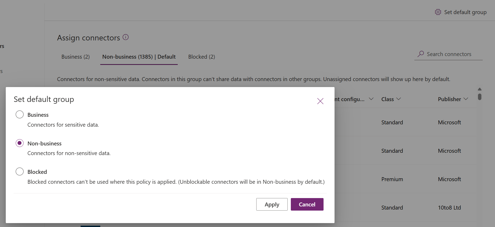
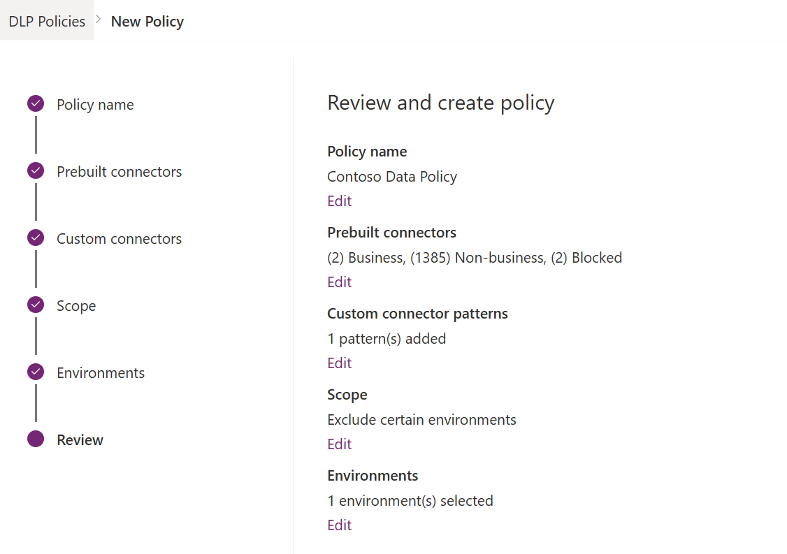

# Create a data loss prevention (DLP) policy 

[!INCLUDE [cc-data-platform-banner](../includes/cc-data-platform-banner.md)]

To protect data in your organization, you can use Power Apps to create and enforce policies that define the consumer connectors that specific business data can be shared with. These policies are called *data loss prevention* (DLP) policies. DLP policies ensure that data is managed in a uniform manner across your organization, and they prevent important business data from being accidentally published to connectors such as social media sites.

DLP policies can be created at the tenant level or at the environment level and are managed from the Power Platform admin center. 

## Prerequisites

### Tenant-level 

Tenant-level policies can be defined to include or exclude specific environments. To follow the steps described in this article for tenant-level policies, *one* of the following permissions is required:

- Power Platform admin permissions
- Microsoft 365 Global admin permissions

We refer to these roles throughout this article as *tenant admins*. More information: [Use service admin roles to manage your tenant](use-service-admin-role-manage-tenant.md)

### Environment-level

To follow the steps for environment-level policies, you need to have Power Apps Environment Admin permissions.  

## Find and view DLP policies

To find and view DLP policies, see [Find and view DLP policies](prevent-data-loss.md#find-and-view-dlp-policies).

## The DLP policy process

The following are the steps you follow to create a DLP policy:

1. Assign the policy a name.
2. Classify connectors.
3. Define the scope of the policy. This step doesn't apply to environment-level policies.
4. Select environments.
5. Review settings.

These are covered in the next section.

## Walkthrough: Create a DLP policy

In this example walkthrough, we'll create a tenant-level DLP policy. We'll add SharePoint and Salesforce to the **Business** data group of a DLP policy. We'll also add Facebook and Twitter to the **Blocked** data group. We'll leave the remaining connectors in the **Non-Business** data group. We'll then exclude test environments from the scope of this policy and apply the policy to the remaining environments, such as default and production environments in the tenant.

After this policy is saved, any Power Apps or Power Automate maker who is part of the DLP policy's environment can create an app or a flow that shares data between SharePoint or Salesforce. Any Power Apps or Power Automate resource that includes an existing connection with a connector in the **Non-business** data group won't be allowed to establish connections with SharePoint or Salesforce connectors, and vice versa. Also, these makers won't be able to add Facebook or Twitter connectors to any Power Apps or Power Automate resource.

1. In Power Platform admin center, select **Data policies** > **New policy**.

   > [!div class="mx-imgBorder"] 
   > 

   If no policies exist in the tenant, you'll see the following page.

   > [!div class="mx-imgBorder"] 
   > 

2. Enter a policy name, and then select **Next**.

3. Review the various attributes and settings you can make on the **Assign Connectors** page. 

   > [!div class="mx-imgBorder"] 
   >  

   **Attributes**   

   <table style="width:100%">
   <tr>
   <th>Attribute</th>
   <th>Description</th>
   </tr>
   <tr>
   <td width="20%"> Name</td>
   <td width="80%"> The name of the connector. </td>
   </tr>
   <tr>
   <td width="20%"> Blockable</td>
   <td width="80%"> Connectors that can be blocked. For a list of connectors that can't be blocked, see <a href="wp-data-loss-prevention.md#list-of-connectors-that-cant-be-blocked">List of connectors that can't be blocked</a>.  </td>
   </tr>
   <tr> 
   <td width="20%"> Type</td>
   <td width="80%"> Whether connector usage requires a Premium license or is it included in the base/Standard license for Power Platform.    </td>
   </tr>
   <tr>
   <td width="20%"> Publisher</td>
   <td width="80%">  The company that publishes the connector. This value can be different from the service owner. For example, Microsoft can be the publisher of the Salesforce connector, but the underlying service is owned by Salesforce, not Microsoft.  </td>
   </tr>
   <tr>
   <td width="20%"> About</td>
   <td width="80%"> Select the URL for more information about the connector. </td>
   </tr>
   </table>

   **Lists**   

   <table style="width:100%">
   <tr>
   <th>Pivot</th>
   <th>Description</th>
   </tr>
   <tr>
   <td width="20%"> Business (<i>n</i>) </td>
   <td width="80%"> Connectors for business-sensitive data. Connectors in this group can't share data with connectors in other groups.  </td>
   </tr>
   <tr>
   <td width="20%"> Non-Business/ Default (<i>n</i>)</td>
   <td width="80%"> Connectors for non-business data, such as personal use data. Connectors in this group can't share data with connectors in other groups. </td>
   </tr>
   <tr>
   <td width="20%"> Blocked (<i>n</i>)    </td>
   <td width="80%"> Blocked connectors can't be used where this policy is applied.    </td>
   </tr>
   </table>

   **Actions**     

   <table style="width:100%">
   <tr>
   <th>Action</th>
   <th>Description</th>
   </tr>
   <tr>
   <td width="20%"> Set default group </td>
   <td width="80%"> The group that maps any new connectors added by Power Platform <i>after</i> your DLP policy is created. More information: <a href="wp-data-loss-prevention.md#default-data-group-for-new-connectors">Default data group for new connectors</a>      </td>
   </tr>
   <tr>
   <td width="20%"> Search Connectors </td>
   <td width="80%"> Search a long list of connectors to find specific connectors to classify. You can search on any field in the connector list view, such as <b>Name</b>, <b>Blockable</b>, <b>Type</b>, or <b>Publisher</b>.    </td>
   </tr>
   </table>

   You can take the following actions:

   > [!div class="mx-imgBorder"] 
   >  

   |         |   |Description  |
   |---------|---------|---------|
   |**1**  |   | Assign one or more connectors across connector classification groups        |
   |**2**  |   | Connector classification group pivot tables    |
   |**3**  |   | Search bar to find connectors across properties like **Name**, **Blockable**, **Type**, or **Publisher**       |
   |**4**  |  |  Connector classification group that maps any new connectors added by Power Platform *after* your DLP policy is created.         |
   |**5**  |   |  Select, multi-select, or bulk-select connectors to move across groups        |
   |**6**  |   |  Alphabetical sort capability across individual columns        |
   |**7**  |   |  Action buttons to assign individual connectors across connector classification groups        |

4. Select one or more connectors. For this walkthrough, select the SalesForce and SharePoint connectors, and then select **Move to Business** from the top menu bar. You can also use the ellipsis () to the right of the connector name. 

   > [!div class="mx-imgBorder"] 
   > 

   The connectors will appear in the **Business** data group.

   > [!div class="mx-imgBorder"] 
   > 

   Connectors can reside in only one data group at a time. By moving the SharePoint and Salesforce connectors to the **Business** data group, you're preventing users from creating flows and apps that combine these two connectors with any of the connectors in the **Non-Business** or **Blocked** groups.

   For connectors like SharePoint that are not blockable, the **Block** action will be grayed out and a warning will appear.

5. Review and change the default group setting for new connectors, if you need to. We recommend keeping the default setting as **Non-Business** to map any new connectors added to Power Platform by default. **Non-Business** connectors can be manually assigned to **Business** or **Blocked** later by editing the DLP policy, after you've had a chance to review and assign them. If the new connector setting is **Blocked**, any new connectors that are blockable will be mapped to **Blocked**, as expected. However, any new connectors that are unblockable will be mapped to **Non-Business** because by design they can't be blocked. 

   In the upper-right corner, select **Set default group**.

   > [!div class="mx-imgBorder"] 
   > 

   After you've completed all the connector assignments across the **Business**/**Non-Business**/**Blocked** groups and set the default group for new connectors, select **Next**.

6. Choose the scope of the DLP policy. This step isn't available for environment-level policies, because they're always meant for a single environment.

   > [!div class="mx-imgBorder"] 
   > 

   For the purpose of this walkthrough, you will exclude test environments from this policy. Select **Exclude certain environments**, and on the **Add Environments** page, select **Next**.
  
7. Review the various attributes and settings on the **Add Environments** page. For tenant-level policies, this list will show the tenant-level admin all the environments in the tenant. For environment-level policies, this list will only show the subset of environments in the tenant that are managed by the user who has signed in as an environment admin. 

   > [!div class="mx-imgBorder"] 
   > 

   **Attributes**   

   <table style="width:100%">
   <tr>
   <th>Attribute</th>
   <th>Description</th>
   </tr>
   <tr>
   <td width="20%"> Name</td>
   <td width="80%"> The name of the environment. </td>
   </tr>
   <tr>
   <td width="20%"> Type</td>
   <td width="80%"> The type of the environment: trial, production, sandbox, default   </td>
   </tr>
   <tr>
   <td width="20%"> Region</td>
   <td width="80%"> The region associated with the environment.    </td>
   </tr>
   <tr>
   <td width="20%"> Created by  </td>
   <td width="80%">  The user who created the environment.   </td>
   </tr>
   <tr>
   <td width="20%"> Created (On) </td>
   <td width="80%"> The date on which the environment was created.  </td>
   </tr>
   </table>

   **Lists**   

   <table style="width:100%">
   <tr>
   <th>Pivot</th>
   <th>Description</th>
   </tr>
   <tr>
   <td width="20%"> Available (<i>n</i>)    </td>
   <td width="80%"> Environments that aren't explicitly included or excluded in the policy scope. For environment-level policy and tenant-level policies with scope defined as <b>Add multiple environments</b>, this list represents the subset of environments that aren't included in the policy scope. For tenant-level policies with scope defined as <b>Exclude certain environments</b>, this pivot represents the set of environments that are included within the policy scope.   </td>
   </tr>
   <tr>
   <td width="20%"> Added to policy  (<i>n</i>)   </td>
   <td width="80%">  For environment-level policy and tenant-level policies with scope defined as <b>Add multiple environments</b>, this pivot represents the subset of environments that are within the policy scope. For tenant-level policies with scope defined as <b>Exclude certain environments</b>, this pivot represents the subset of environments that are excluded from the policy scope.   </td>
   </tr>
   </table>

   **Actions**   

   <table style="width:100%">
   <tr>
   <th>Action</th>
   <th>Description</th>
   </tr>
   <tr>
   <td width="20%"> Add to policy   </td>
   <td width="80%"> Environments in the <b>Available</b> category can be moved to the <b>Added to policy</b> category by using this action. </td>
   </tr>
   <tr>
   <td width="20%"> Remove from policy  </td>
   <td width="80%">  Environments in the <b>Added to policy</b> category can be moved to the <b>Available</b> category by using this action.  </td>
   </tr>
   </table>

8. Select one or more environments. You can use the search bar to quickly find the environments of interest. For this walkthrough, we'll search for test environments - type sandbox. After we select the sandbox environments, we assign them to the policy scope by using **Add to policy** from the top menu bar. 

   > [!div class="mx-imgBorder"] 
   > 

   Because the policy scope was initially selected as **Exclude certain environments**, these test environments will now be excluded from the policy scope and the DLP policy settings will be applied to all the remaining (**Available**) environments. For environment-level policy, you can only select a single environment from the list of available environments.

   After making selections for environments, select **Next**.

9. Review the policy settings, and then select **Create Policy**.

   > [!div class="mx-imgBorder"] 
   > 

The policy is created and appears in the list of DLP policies. As a result of this policy, SharePoint and Salesforce apps can share data in non-test environments&mdash;such as production environments&mdash;because they're both part of the same **Business** data group. However, any connector that resides in the **Non-Business** data group&mdash;such as Outlook.com&mdash;won't share data with apps and flows by using SharePoint or Salesforce connectors. Facebook and Twitter connectors are altogether blocked from being used in any app or flow in non-test environments such as production or default environments. 

It's good practice for admins to share the list of DLP policies with their organization so that users are aware of the policies before they create apps.

This table describes how the DLP policy you created affects data connections in apps and flows.

|Connector matrix  |SharePoint (Business)  |Salesforce (Business)  |Outlook.com (Non-Business)   |Facebook (Blocked)  |Twitter (Blocked) |
|---------|---------|---------|---------|---------|---------|
|SharePoint (Business)     | Allowed        | Allowed        | Denied        |Denied        |Denied         |
|Salesforce (Business)     | Allowed        | Allowed        |  Denied       | Denied        | Denied        |
|Outlook.com (Non-Business)      |Denied         | Denied        | Allowed        |  Denied       | Denied        |
|Facebook (Blocked)     |  Denied       | Denied        |  Denied       |  Denied       |  Denied       |
|Twitter (Blocked)     |  Denied       | Denied        | Denied        | Denied        |  Denied       |

Because no DLP policy has been applied to test environments, apps and flows can use any set of connectors together in these environments.

## Use DLP PowerShell commands
See [Data Loss Prevention (DLP) policy commands](powerapps-powershell.md#data-loss-prevention-dlp-policy-commands).

### See also

[Data loss prevention policies](wp-data-loss-prevention.md)  
[Manage data loss prevention (DLP) policies](prevent-data-loss.md)  
[Data loss prevention (DLP) policy commands](powerapps-powershell.md#data-loss-prevention-dlp-policy-commands)
