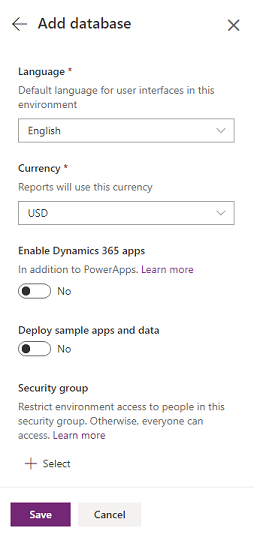

# Create and manage environments in the Power Platform Admin center 
An environment is a space to store, manage, and share your organization’s business data, apps, and flows. It also serves as a container to separate apps that may have different roles, security requirements, or target audiences. PowerApps automatically creates a single default environment for each tenant, which is shared by all users in that tenant.

> [!TIP]
> For the blog announcing the latest changes to environment creation, see [Provisioning and administration updates are now live in the Power Platform Admin center](https://powerapps.microsoft.com/blog/5105). 

## Provisioning a new environment
You have a choice when provisioning a new environment. You can:

- Provision based on [buying an instance](https://docs.microsoft.com/dynamics365/customer-engagement/admin/add-instance-subscription#add-an-additional-instance) using the Dynamics 365 Admin center. 
or  
- Provision based on [available capacity](capacity-storage.md#about-the-new-capacity-analytics-reporting). See the section [Create an environment in the Power Platform Admin center](#create-an-environment-in-the-power-platform-admin-center).

### What's new in provisioning environments
We're consolidating how you view, create, and manage environments. 

- **Environments can now be provisioned in the Power Platform Admin center**: You can create environments in the Power Platform Admin center. Previously, environments could only be created in the Dynamics 365 Admin center and the PowerApps Admin center. 
- **Admins can govern environment creation**: To limit environment creation to admins (Dynamics 365 Service admins, Office 365 Global admins, or Delegated admins), see [Control who can create environments in the Power Platform Admin center](control-environment-creation.md). Previously, limiting was done by controlling who had PowerApps P2 licenses.  
- **Admins can see all environments**: Admins can see all environments (environments with and without a database, and environments with apps) in the Power Platform Admin center. Previously, admins could not see environments created without a database.
- **Trial environment provisioning**: You can create one Trial environment per user. Previously, you could create two per user.

## Who can create environments?
Your license determines whether you can create environments.

| License | Trial | Production |
| --- | --- | --- |
| Office 365 Plans |No | No |
| Dynamics 365 Teams Plans   |No | No |
| PowerApps Community Plan   |No | No |
| Dynamics 365 Customer Engagement Trial | Yes (one) | Yes|
| Dynamics 365 Plans |Yes (one)| Yes |
| Dynamics 365 Apps Plans |Yes (one)| Yes |
| PowerApps P2 |Yes (one)| Yes |
| PowerApps P2 Trial |Yes (one)| Yes |
| PowerApps P1 |Yes (one)| Yes |
| PowerApps P1 Trial |Yes (one)| No |

## Create an environment in the Power Platform Admin center
Every environment can have zero or one Common Data Service database, which provides storage for apps. When users create an app in an environment, that app can connect to any data source, including connections, gateways, and flows. However, the app is only permitted to connect to the Common Data Service databases in that same environment. How you choose to leverage environments depends on your organization and the apps you're trying to build. For more information, see [Environments overview](environments-overview.md).

You have multiple options when creating an environment:

1. [Create an environment with a Common Data Service database](#create-an-environment-with-a-database)
2. [Create an environment with Customer Engagement apps](#create-an-environment-with-customer-engagement-apps)
3. [Create an environment without a Common Data Service database](#create-an-environment-without-a-database)

## Create an environment with a database
You create a database to use Common Data Service as a data store. The Common Data Service is a cloud scale database used to securely store data for business applications built on PowerApps. Common Data Service provides not just data storage, but a way to implement business logic that enforces business rules and automation against the data. For more information, see [Why use Common Data Service?](https://docs.microsoft.com/powerapps/maker/common-data-service/data-platform-intro#why-use-common-data-service)

### Prerequisites
To create an environment with a database, you need 1GB available database capacity.

### Steps

1. Sign in to the Power Platform Admin center at [https://admin.powerplatform.microsoft.com](https://admin.powerplatform.microsoft.com) as an admin (Dynamics 365 Service admin, Office 365 Global admin, or Delegated admin).
2. In the navigation pane, select **Environments**, and then select **New**.

   > [!div class="mx-imgBorder"] 
   > 

3. Enter the following, and then select **Next**.
   
   |Setting  |Description  |
   |---------|---------|
   |Name     | The name of your environment.        |
   |Type     | You can choose Production or Trial.        |
   |Region     | Choose a region for the environment.        |
   |Purpose     | A description of the environment.         |
   |Create a database for this environment? | Select **Yes**. |

   > [!div class="mx-imgBorder"] 
   > 

4. Enter the following, and then select **Save**.

   |Setting  |Description  |
   |---------|---------|
   |Language     | The default language for this environment.        |
   |Currency     | The base currency used for reporting.         |
   |Enable Dynamics 365 apps     | Select **Yes** and make a selection to automatically deploy apps such as Sales and Customer Service.      |
   |Deploy sample apps and data     | Select **Yes** to include sample apps and data. Sample data gives you something to experiment with as you learn. You must select **No** for Enable Dynamics 365 apps for this setting to appear.        |
   |Security group | Select a security group to restrict access to this environment. |

   > [!div class="mx-imgBorder"] 
   > 

## Create an environment with Customer Engagement apps
When you create an environment with a database, you can add Customer Engagement apps such as Sales and Field Service.

> [!NOTE]
> Currently, apps can only be enabled for Production environments. You can create trials at [https://trials.dynamics.com](https://trials.dynamics.com/).

### Prerequisites
To create an environment with a database, you need 1GB available database capacity.

### Steps

1. Sign in to the Power Platform Admin center at [https://admin.powerplatform.microsoft.com](https://admin.powerplatform.microsoft.com) as an admin (Dynamics 365 Service admin, Office 365 Global admin, or Delegated admin).
2. In the navigation pane, select **Environments**, and then select **New**.

   > [!div class="mx-imgBorder"] 
   > 

3. Enter the following, and then select **Next**.
   
   |Setting  |Description  |
   |---------|---------|
   |Name     | The name of your environment.        |
   |Type     | You can choose Production or Trial.        |
   |Region     | Choose a region for the environment.        |
   |Purpose     | A description of the environment.         |
   |Create a database for this environment? | Select **Yes**. |

   > [!div class="mx-imgBorder"] 
   > 

4. Enter the language and currency settings.

5. Set **Enable Dynamics 365 apps** to **Yes**, and then select apps to include from the **Automatically deploy these apps** drop-down list.

6. Select **Save**.

   > [!div class="mx-imgBorder"] 
   > 

## Create an environment without a database 
You can create an environment without a database and use your own data store.

### Prerequisites
You need 1GB available database capacity.

### Steps
1. Sign in to the Power Platform Admin center at [https://admin.powerplatform.microsoft.com](https://admin.powerplatform.microsoft.com) as an admin (Dynamics 365 Service admin, Office 365 Global admin, or Delegated admin).
2. In the navigation pane, select **Environments**, and then select **New**.

   > [!div class="mx-imgBorder"] 
   > 

3. Enter the following, and then select **Save**.
   
   |Setting  |Description  |
   |---------|---------|
   |Name     | The name of your environment.        |
   |Type     | You can choose Production or Trial.        |
   |Region     | Choose a region for the environment.        |
   |Purpose     | A description of the environment.         |
   |Create a database for this environment? | Select **No**. |

   > [!div class="mx-imgBorder"] 
   > 

## FAQ

### I’m a Dynamics 365 customer. Should I provision using the Dynamics 365 Admin center or Power Platform Admin center?
Power Platform Admin center provisioning is only available for customers who have transitioned to the new capacity-based licenses. If you have not transitioned, please use the Dynamics 365 Admin center for provisioning. 

### What are the new Trial limits for PowerApps customers?
The new trial limits are one per user. 

### Can an Office 365 licensed user manage and create environments?
No, Office 365 licensed users will not be able to manage environments. 

### If I create an environment in the Dynamics 365 Admin center, will it appear in the Power Platform Admin center?
Yes it will appear in both admin centers.

### What is the PowerApps Production environment limit?
Provisioning environments is based on database capacity. Previously, it was two environments per PowerApps Plan 2 license. Now all you need is 1GB of available capacity to provision. All environments with or without Common Data Service will consume at least 1GB capacity.

### See also 
[Manage environments in PowerApps](environments-administration.md)  
[Preview: Common Data Service storage capacity](capacity-storage.md)

