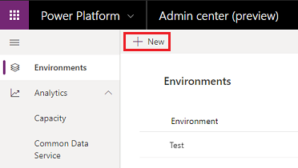
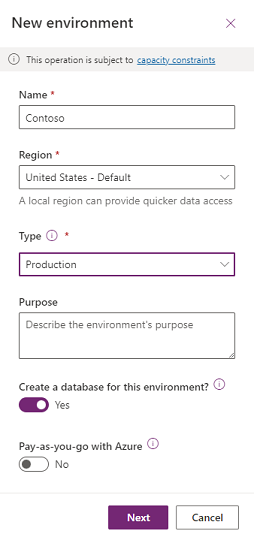
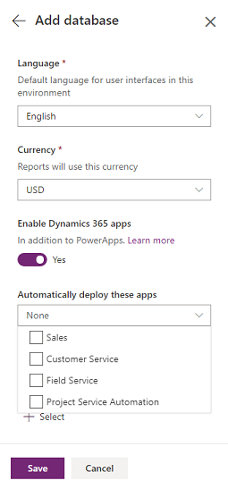
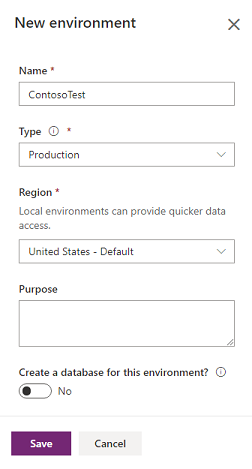
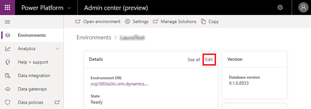
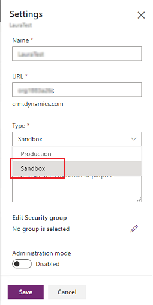

# Create and manage environments in the Power Platform admin center 
An environment is a space to store, manage, and share your organization's business data, apps, and flows. It also serves as a container to separate apps that may have different roles, security requirements, or target audiences. Power Apps automatically creates a single default environment for each tenant, which is shared by all users in that tenant.

> [!TIP]
> For the blog announcing the latest changes to environment creation, see [Provisioning and administration updates are now live in the Power Platform admin center](https://powerapps.microsoft.com/blog/provisioning-and-administration-updates-are-now-live-in-the-power-platform-admin-center/). 

## Provisioning a new environment
You can provision a new environment based on [available capacity](capacity-storage.md). See the section [Create an environment in the Power Platform admin center](#create-an-environment-in-the-power-platform-admin-center).

### What's new in provisioning environments
We're consolidating how you view, create, and manage environments. 

- **Environments can now be provisioned in the Power Platform admin center**: You can create environments in the Power Platform admin center. Previously, environments could only be created in the Dynamics 365 Admin center and the Power Apps Admin center. 
- **Admins can govern environment creation**: To limit environment creation to admins (Dynamics 365 admins, Global admins, or Power Platform admins), see [Control who can create environments in the Power Platform admin center](control-environment-creation.md). Previously, limiting was done by controlling who had Power Apps P2 licenses.  
- **Admins can see all environments**: Admins can see all environments (environments with and without a database, and environments with apps) in the Power Platform admin center. Previously, admins could not see environments created without a database.
- **Trial environment provisioning**: You can create one trial environment per user. Previously, you could create two per user. See [About trial environments](trial-environments.md).

## Who can create environments?
Your license determines whether you can create environments.

| License | Trial | Production |
| --- | --- | --- |
| Microsoft 365 Plans |No | No |
| Dynamics 365 Teams Plans   |No | No |
| Power Apps Community Plan   |No | No |
| Dynamics 365 trial | Yes (one) | No|
| Dynamics 365 Plans |Yes (one)| Yes |
| Power Apps plan |Yes (one)| Yes |
| Power Apps trial |Yes (one)| Yes |
| Power Virtual Agents trial plan |Yes | No |
| Power Virtual Agents plan | No | Yes |

To determine which license a user has, sign in to the [Microsoft 365 admin center](https://admin.microsoft.com) and follow the steps in [Assign licenses to multiple users on the Active users page](https://docs.microsoft.com/office365/admin/manage/assign-licenses-to-users?view=o365-worldwide).

> [!NOTE]
> Global admins and Power Platform admins can create environments without a license. See [Administer without a license](global-service-administrators-can-administer-without-license.md). 

## Create an environment in the Power Platform admin center
An environment provides storage for apps, flows, data, and various other resources. When users create an app in an environment, that app can connect to any data source, including connections, gateways, and flows. How you choose to leverage environments depends on your organization and the apps you're trying to build. For more information, see [Environments overview](environments-overview.md).

You can store the app/business data in a database with Microsoft Dataverse. You can create a database with Dataverse with any environment.

You have multiple options when creating an environment:

1. [Create an environment with a Dataverse database](#create-an-environment-with-a-database)
2. [Create an environment without a Dataverse database](#create-an-environment-without-a-database)

### Some important considerations when creating a new environment

- **Why create an environment with a database**: When you create a production or sandbox environment with a Dataverse database, you have the option to add Dynamics 365 apps such as Dynamics 365 Sales and Field Service during the creation process (by choosing **Enable Dynamics 365 apps**). Currently, if you don't select **Enable Dynamics 365 apps** at the time of database provisioning, you will not be able to make this change later. 
- **Why create an environment without a database**: If you don't need Dynamics 365 apps or don't need to use Dataverse, and you are creating Power Apps or Power Automate using other data sources, create the environment without the Dataverse database.
- **The Enable Dynamics 365 apps decision is not reversible**: Once you create an environment, if you don't select **Enable Dynamics 365 apps** at the time of database provisioning, you will not be able to make this change later.
- **Dynamics 365 apps and trial environments**: Currently, Dynamics 365 apps cannot be enabled for trial environments. To create a trial with Dynamics 365 apps, see [Start your digital transformation here](https://trials.dynamics.com).

## Create an environment with a database
You create a database to use Dataverse as a data store. The Dataverse is a cloud scale database used to securely store data for business applications built on Power Apps. Dataverse provides not just data storage, but a way to implement business logic that enforces business rules and automation against the data. For more information, see [Why use Dataverse?](https://docs.microsoft.com/powerapps/maker/common-data-service/data-platform-intro#why-use-common-data-service)

### Prerequisites 
To create an environment with a database, you need 1GB available database capacity.

### Steps

1. Sign in to the Power Platform admin center at [https://admin.powerplatform.microsoft.com](https://admin.powerplatform.microsoft.com) as an admin (Dynamics 365 admin, Global admin, or Power Platform admin).
2. In the navigation pane, select **Environments**, and then select **New**.

   > [!div class="mx-imgBorder"] 
   > 

3. Enter the following, and then select **Next**.
   
   |Setting  |Description  |
   |---------|---------|
   |Name     | The name of your environment.        |
   |Type     | Choose production, trial, or sandbox.        |
   |Region     | Choose a region for the environment.        |
   |Purpose     | A description of the environment.         |
   |Create a database for this environment? | Select **Yes**. |

   > [!div class="mx-imgBorder"] 
   > 

4. Enter the following, and then select **Save**.

   |Setting  |Description  |
   |---------|---------|
   |Language     | The default language for this environment. More information: [Dataverse language collations](language-collations.md)     |
   | URL         | Enter your organization name. Organization URLs must be unique. If your organization name has already been reserved in the destination datacenter, it won't be available. |
   |Currency     | The base currency used for reporting.         |
   |Enable Dynamics 365 apps | Select **Yes** and make a selection to automatically deploy apps such as Dynamics 365 Sales and Dynamics 365 Customer Service. |
   |Deploy sample apps and data     | Select **Yes** to include sample apps and data. Sample data gives you something to experiment with as you learn. You must select **No** for **Enable Dynamics 365 apps** for this setting to appear.        |
   |Security group | Select a security group to restrict access to this environment. |

   > [!div class="mx-imgBorder"] 
   > 

## Create an environment without a database 
You can create an environment without a database and use your own data store.

### Prerequisites
You need 1GB available database capacity.

### Steps
1. Sign in to the Power Platform admin center at [https://admin.powerplatform.microsoft.com](https://admin.powerplatform.microsoft.com) as an admin (Dynamics 365 admin, Global admin, or Power Platform admin).

2. In the navigation pane, select **Environments**, and then select **New**.

   > [!div class="mx-imgBorder"] 
   > 

3. Enter the following, and then select **Save**.
   
   |Setting  |Description  |
   |---------|---------|
   |Name     | The name of your environment.        |
   |Type     | You can choose production or trial.        |
   |Region     | Choose a region for the environment.        |
   |Purpose     | A description of the environment.         |
   |Create a database for this environment? | Select **No**. |

   > [!div class="mx-imgBorder"] 
   > 

## Provision a sandbox environment
To provision a [sandbox environment](sandbox-environments.md), you change a production environment to sandbox.

1. Sign in to the Power Platform admin center at [https://admin.powerplatform.microsoft.com](https://admin.powerplatform.microsoft.com) as an admin (Dynamics 365 admin, Global admin, or Power Platform admin).

2. From the left-side menu, select **Environments**, and then select a production environment.

3. Select **Edit**

   > [!div class="mx-imgBorder"] 
   > 

4. Under **Type**, choose the sandbox environment type. 

   > [!div class="mx-imgBorder"] 
   > 

5. Select **Save**.

## Setting an environment refresh cadence
You can indicate how often you would prefer an environment to receive updates and features to certain Power Platform services. You have two options to choose from after creating an environment.

|Service  |Setting  |Description  |
|---------|---------|---------|
|Canvas app authoring |Frequent     | Get access the latest updates and newest features multiple times a month.|
|                     |Moderate     | Get access to updates and features at least once a month.|

To set refresh cadence:

1. Sign in to the Power Platform admin center at [https://admin.powerplatform.microsoft.com](https://admin.powerplatform.microsoft.com) as an admin (Dynamics 365 admin, Global admin, or Power Platform admin).

2. From the left-side menu, select **Environments**, and then select an environment.

3. Select **Edit**

   > [!div class="mx-imgBorder"] 
   > 

4. Under **Refresh cadence**, choose the cadence type. 

5. Select **Save**.

The refresh cadence does not change when you will receive updates for:
- Power Platform
- Dynamics 365 Sales
- Dynamics 365 Customer Service
- Dynamics 365 Marketing

> [!NOTE]
> - By default, environments are automatically in the **frequent** cadence; creating and editing canvas apps will receive updates once a week. When apps are published, they will receive the corresponding runtime version. 
> - If you’ve chosen the **moderate** cadence for the environment, all creating and editing of canvas apps will receive updates once a month. When apps are published, they will receive the corresponding runtime version.

## FAQ

### What are the new trial limits for Power Apps customers?
The new trial limits are one per user. 

### Can an Microsoft 365 licensed user manage and create environments?
No, Microsoft 365 licensed users will not be able to manage environments. 

### If I create an environment in the Dynamics 365 Admin center, will it appear in the Power Platform admin center?
Yes, it will appear in both admin centers.

### What is the Power Apps production environment limit?
Provisioning environments is based on database capacity. Previously, it was two environments per Power Apps Plan 2 license. Now all you need is 1GB of available capacity to provision. All environments with or without Dataverse will consume at least 1GB capacity.

### See also 
[Manage environments in Power Apps](environments-administration.md)  
[Dataverse storage capacity](capacity-storage.md)  
[Control user access to environments: security groups and licenses](control-user-access.md)

