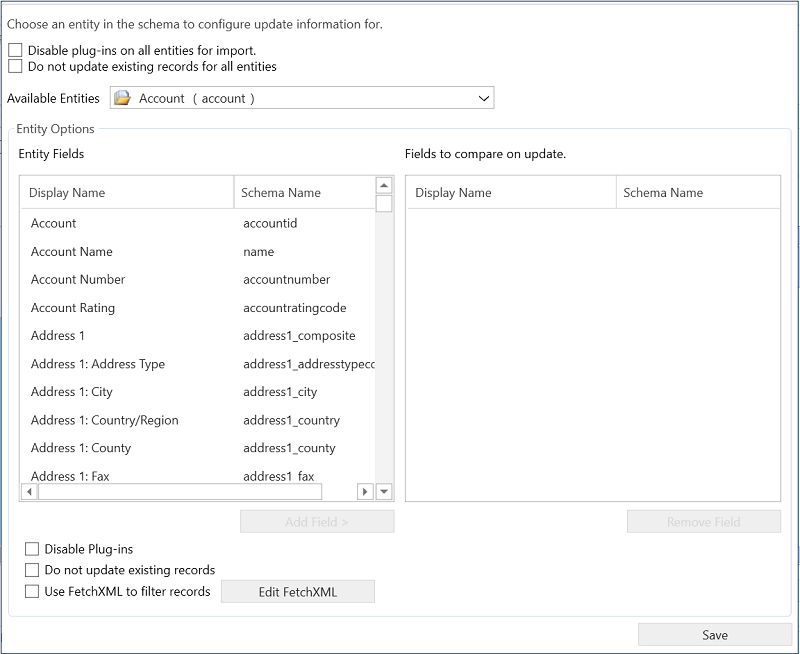

# Create a schema to export configuration data

[!INCLUDE [cc-data-platform-banner](../includes/cc-data-platform-banner.md)]

The Configuration Migration tool lets you build a schema to describe your export data. It also enables you to check for any missing dependencies and relationships in the entities or fields to be exported to avoid an inconsistent data set.  
  
   

## Before you begin 

Download the Configuration Migration Tool. The Configuration Migration tool is available as a [NuGet package](https://www.nuget.org/packages/Microsoft.CrmSdk.XrmTooling.ConfigurationMigration.Wpf). To download the tool, see [Download tools from NuGet](https://docs.microsoft.com/powerapps/developer/common-data-service/download-tools-nuget). Follow the steps on this page to extract the **DataMigrationUtility.exe** tool. 
 
  

## Create a schema and export configuration data  
  
1. Start the Configuration Migration tool. Double-click **DataMigrationUtility.exe** in the folder: \[your folder]\Tools\ConfigurationMigration\  
  
2. On the main screen, click **Create schema**, and click **Continue**.  
  
3. On the **Login** screen, provide authentication details to connect to your environment from where you want to export data. If you have multiple organizations on the server, and want to select the organization from where to export the data, select the **Always display list of available orgs** check box. Click **Login**.  
  
4. If you have multiple organizations, and you selected the **Always display list of available orgs** check box, the next screen lets you choose the organization that you want to connect to. Select an organization to connect to.  
  
5. From the **Select the solution** list, select a solution from where you want to export the data:  
  
6. In the selected solution, you can select the entities and fields to be exported or export all the entities within the solution.  
  
   1.  To select the entities and fields to be exported, from the **Select Entity** list, select the entity for which you want to export the data. The **Fields for the entity** list displays all the fields of the selected entity.  
  
       1.  To add selected fields of the entity, click **Add Fields**.  
  
       2.  To add the entity itself and all the fields, click **Add Entity**.  
  
   2.  To export all the entities, click **Add All** next to the **Select Entity** list.  
  
     
  
7. You can select the **Show the relationships of the selected entity** to view the related entities for the selected entity so that you can export them as well.  
  
8. The selected entities are displayed in the **Selected Fields and Entities** box.  
  
   -   If you want to remove an entity, field, or relationship, click to select it, right-click, and then select the remove option.  
  
   -   If you want to remove all the items in the **Selected Fields and Entities** and start over, click **Clear Selection**.  
  
     
  
9. To validate the selected data to be exported, click **Tools** > **Validate Schema**.  
  
     
  
10. A message is displayed if there are any missing dependencies. To close the message, click **OK**.  
  
      
  
11. Add the missing entities, and then perform step 9 again to validate the data. A confirmation message is displayed if there are no validation errors.  
  
    > [!TIP]
    >  If the missing entity is not in the solution you selected for export, you can add the entity from the **Default Solution** by selecting it from the **Select the solution** list.  
  
12. Define the uniqueness condition for your data to be exported. To open a new screen, click **Tools** > **Configure Import Settings**. For each entity that you have selected to export, add the field or fields on which you want the records to be compared with existing records on the target system during the import. Select a field, and click **Add Field**.  
  
      
  
13. To disable plug-ins for all the entities before the data is imported on to the target system, select the **Disable plug-ins on all entities for import** check box. The tool will disable all the plug-ins while importing data on to the target server, and re-enable them after the import process.  
  
14. To save the settings and return to the main screen, click **Save**.  
  
    > [!NOTE]
    >  If you want to undo any changes in the **Configure Import Settings** dialog box, you must manually revert those changes in this dialog box, and then click **Save** to save your changes, and close the dialog box.  
  
15. In the main screen:  
  
    1.  Click **File** > **Save Schema** to just save the schema without exporting the data. You are prompted to specify the name and location of the schema file (.xml) to save. You can use the schema later to export the data. You can exit the tool now.  
  
    2.  Click **Export Data** to export the data and schema file. You are prompted to specify the name and location of the schema file to be exported. Specify the name and location, and click **Save**. Go to the next step.  
  
    3.  Click **Save and Export** to choose whether to export the data after saving the schema file or not. You are prompted to specify the name and location of the schema file to be exported. Specify the name and location, and click **Save**. You are prompted to save the data file: click **Yes** to export it or **No** to export it later. If you clicked **Yes**, go to the next step.  
  
16. On the next screen, specify the location of the data file to be exported in the **Save to data file** box, and then click **Export Data**. The screen displays the export progress status and the location of the exported file at the bottom of the screen once the export is complete.  
  
      
  
17. Click **Exit** to close the tool.  
  
   
## Reuse an existing schema to export configuration data  
 You can reuse a schema file that was generated using the Configuration Migration tool to quickly export data across environments without having to create the schema all over again.  
  
1. Start the Configuration Migration tool.  
  
2. On the main screen, click **Export data**, and click **Continue**.  
  
3. On the **Login** screen, provide authentication details to connect to your environment from where you want to export data. If you have multiple organizations on the server, and want to select the organization from where to export the data, select the **Always display list of available orgs** check box. Click **Login**.  
  
4. If you have multiple organizations, and you selected the **Always display list of available orgs** check box, the next screen lets you choose the organization that you want to connect to. Select an organization to connect to.  
  
5. On the next screen, select the schema file to be used for the data export.  
  
6. Specify the name and location of the data file to be exported.  
  
7. Click **Export Data**. The screen displays the export progress status and the location of the exported file at the bottom of the screen once the export is complete.  
  
8. Click **Exit** to close the tool.  

### See also 
 [Download tools from NuGet](https://docs.microsoft.com/powerapps/developer/common-data-service/download-tools-nuget)  
 [Modify a schema](modify-configuration-data-schema.md)  
 [Manage your configuration data](manage-configuration-data.md)   
 [Import configuration data](import-configuration-data.md)
