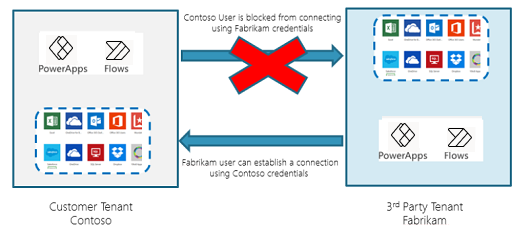

# Cross-tenant inbound and outbound restrictions

With tenant restrictions, organizations can control access to SaaS cloud applications, based on the Azure AD tenant the applications use for single sign-on. For example, you may want to allow access to your organization's Microsoft 365 applications, while preventing access to other organizations' instances of these same applications.

With tenant restrictions, organizations can specify the list of tenants that their users are permitted to access. Azure AD then only grants access to these permitted tenants.

Restricting outbound cross-tenant connections can be done using tenant restrictions that apply to all Azure AD Cloud SaaS apps, or at the API Hub level which would block outbound connections just for canvas apps and flows.

Restricting inbound cross-tenant connections requires a support ticket – this restriction then only applies to Power Apps and Power Automate.

