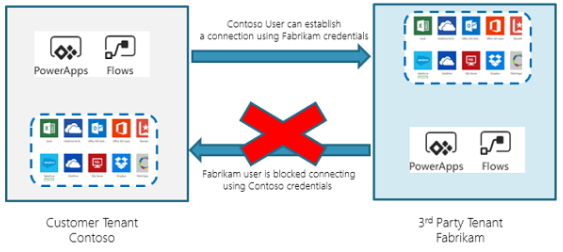
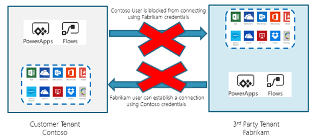

# Cross-tenant inbound and outbound restrictions

With tenant restrictions, organizations can control access to SaaS cloud applications, based on the Azure AD tenant the applications use for single sign-on. With tenant restrictions, organizations can specify the list of tenants that their users are permitted to access. Azure AD then only grants access to these permitted tenants using Azure AD-based tenant restriction. 

Additionally, if organizations want to enforce tenant isolation for Power Platform connections, then they can use Power Platform’s tenant isolation capability. Note that the Power Platform tenant isolation feature does not impact Azure AD-based access outside of Power Apps and Power Automate. Power Platform tenant isolation only works for connectors using Azure AD-based authentication such as Office 365 Outlook or SharePoint. If you want to block connectors that use external identity providers such as Microsoft account, Google, etc., you can [create a data loss prevention policy](create-dlp-policy.md) and classify the connector under the **Blocked** group.  

Power Platform tenant isolation ability is available with two options: one-way or two-way restriction.  

> [!NOTE]
> For now, this capability can be enabled for your tenant by opening a [support case](get-help-support.md) and providing the details of your tenant ID.  

## One-way tenant isolation (inbound connection restriction) 

One-way tenant isolation or inbound isolation will block connection establishment attempts to your tenant from other tenants. For example, as an admin of Contoso.com (tenant A), if you have enabled one-way tenant isolation then Azure AD-based Power Platform connection creation attempts from any other tenants like Fabrikam.com (tenant B) will fail.  

One-way tenant isolation restricts incoming connection attempts into your tenant, hence the term inbound connection restriction.  

|Connection creator tenant   |Connection sign-in tenant   |Access allowed?   |
|---------|---------|---------|
|A     | A        | Yes         |
|A (one-way data loss prevention policy enforced)     | B        | Yes         |
|B     | A (one-way data loss prevention policy enforced)         | No (inbound)        |
|B     | B        | Yes        |

## Two-way tenant isolation (inbound and outbound connection restriction) 

Like one-way tenant isolation, two-way tenant isolation will block connection establishment attempts to your tenant from other tenants. Additionally, two-way tenant isolation will also block connection establishment attempts from your tenant to other tenants. For example, as an admin of Contoso.com (tenant A), if you have enabled two-way tenant isolation then connection creation attempts from any other tenants like Fabrikam.com (tenant B) will fail. Additionally, Azure AD-based Power Platform connection creation attempts from Contoso.com (tenant A) to any other tenants like Fabrikam.com (tenant B) will fail.  

Two-way tenant isolation restricts incoming connection attempts into your tenant, hence the term inbound connection restriction. Two-way tenant isolation also restricts outgoing connection attempts from your tenant, hence the term outbound connection restriction. 

|Connection creator tenant   |Connection sign-in tenant   |Access allowed?   |
|---------|---------|---------|
|A     | A        | Yes         |
|A (two-way data loss prevention policy enforced)     | B        | No (outbound)         |
|B     | A (two-way data loss prevention policy enforced)         | No (inbound)        |
|B     | B        | Yes        |

