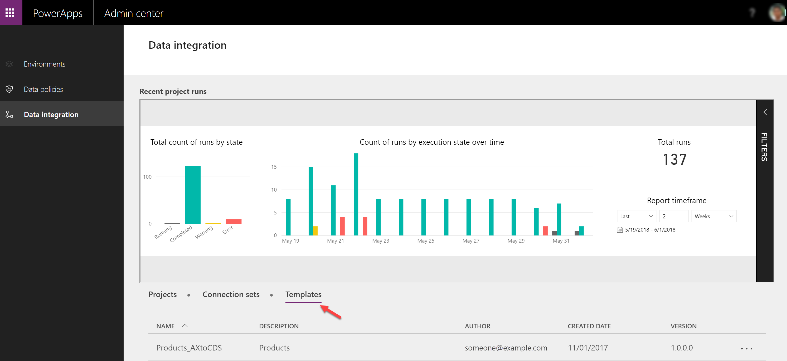
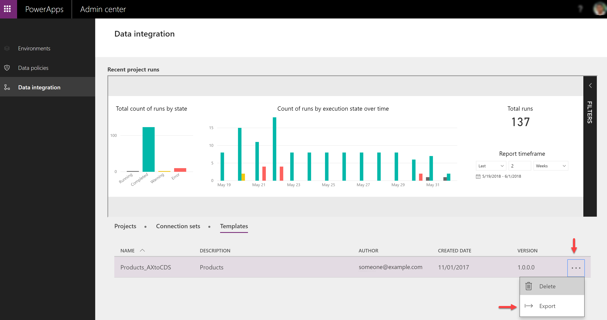
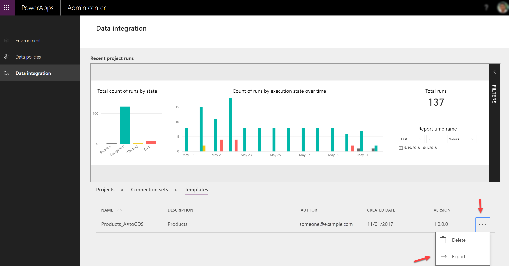

# Responding to Data Subject Rights (DSR) requests for Data Integration for Microsoft Dataverse customer data

[!INCLUDE[new-PPAC-banner](~/includes/new-PPAC-banner.md)]

## Introduction to DSR requests

[!INCLUDE [gdpr-intro](~/../shared-content/shared/privacy-includes/gdpr-intro.md)]

This article provides examples of steps you can take to support privacy compliance when using Data Integration for Admins via the administrator portal in Dataverse. You'll learn how to use Microsoft products, services, and administrative tools to help controller customers find, access, and act on personal data in the Microsoft cloud in response to Data Subject Rights (DSR) requests.

### Searching for and identifying personal data

Data Integration for Admins in Dataverse allows any user of the integrator application to view their data by using the data integration tab at:

[https://admin.powerapps.com/dataintegration](https://admin.powerapps.com/dataintegration)

The data stored for the user is shown in the portal. All projects are visible on the projects tab:

All connection sets are visible on the connection sets tab:

All Templates are visible on the Templates tab:

## Securing and controlling access to personal information

In the Data Integration for Admins in Dataverse, data stored by the data integration application can only be accessed through the administrator portal.

## Deleting personal data

In Data Integration for Admins in Dataverse user-authored data, projects, and connection sets can be deleted by the user the data is associated with. To delete their personal data, users can log on to the administrator portal: [https://admin.powerapps.com](https://admin.powerapps.com)

Users can delete projects by navigating to the projects tab and clicking on the ellipses next to the project, and then selecting the delete option:

Users can delete templates by navigating to the templates tab and clicking the ellipses next to the template, and then selecting the delete option:

Users can delete connection sets by navigating to the connection sets tab and clicking on the ellipses next to the connection set, and then selecting the delete option:

## Exporting personal data

In Data Integration for Admins in Dataverse, user-authored data can be exported by the user the data is associated with. To export their personal data, users can log on to the administrator portal:

[https://admin.powerapps.com](https://admin.powerapps.com)

To export projects or projects with execution history, users can navigate to the projects tab and click the ellipses next to the project, and then select the desired export option:

To export templates, users can navigate to the templates tab and click on the ellipses next to the template, and then select the export option:

To export connection sets, users can navigate to the connection set tab and click on the ellipses next to the connection set, and then select the export option:

[!INCLUDE[footer-include](../includes/footer-banner.md)]
