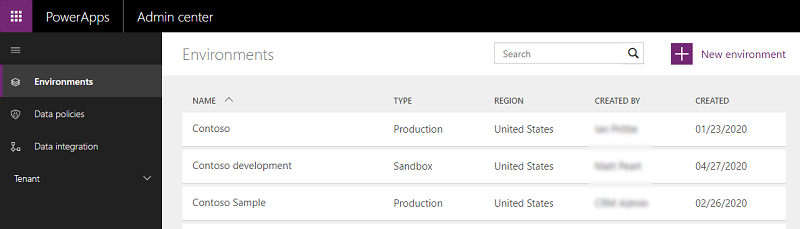
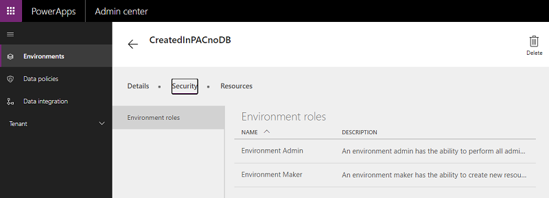
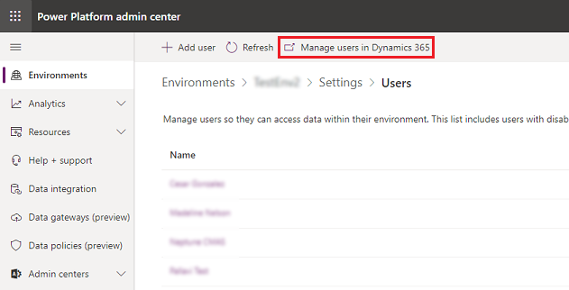
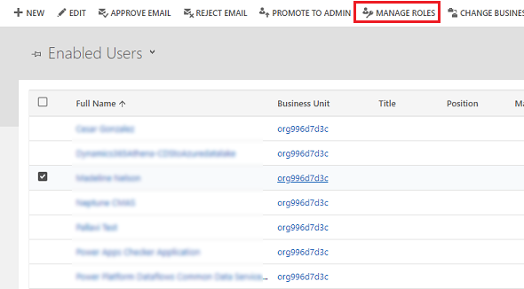
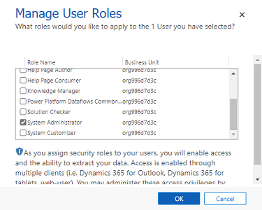

# Configure user security to resources in an environment

Common Data Service uses a role-based security model to help secure access to the database. This topic explains how to create the security artifacts that you must have to help secure resources in an environment. Security roles can be used to configure environment-wide access to all resources in the environment, or to configure access to specific apps and data in the environment. Security roles control a user’s access to an environment’s resources through a set of access levels and permissions. The combination of access levels and permissions that are included in a specific security role governs the limitations on the user’s view of apps and data and on the user’s interactions with that data. 

An environment can have zero or one Common Data Service database. The process for assigning security roles for environments with no Common Data Service database differs from that for an environment with a Common Data Service database. 

## Predefined security roles
Environments include predefined security roles that reflect common user tasks with access levels defined to match the security best-practice goal of providing access to the minimum amount of business data required to use the app. 

|Security role  |*Database Privileges  |Description |
|---------|---------|---------|
|Environment Admin     |  Create, Read, Write, Delete, Customizations, Security Roles       | The Environment Admin role can perform all administrative actions on an environment, including the following:  <ul><li>Add or remove a user from either the Environment Admin or Environment Maker role.</li><li>Provision a Common Data Service database for the environment. Once database is provisioned, System Customizer role should also be assigned to an Environment Admin to give them access to the environment’s data.</li><li>View and manage all resources created within an environment.</li><li>Set data loss prevention policies. More information: [Data loss prevention policies](prevent-data-loss.md)</li></ul>    |
|Environment Maker     |  Customizations       | Can create new resources associated with an environment including apps, connections, custom APIs, gateways, and flows using Microsoft Power Automate. However, does not have any privileges to access data within an environment. More information: [Environments overview](https://powerapps.microsoft.com/blog/powerapps-environments/)        |
|System Administrator     |  Create, Read, Write, Delete, Customizations, Security Roles       | Has full permission to customize or administer the environment, including creating, modifying, and assigning security roles. Can view all data in the environment. More information: [Privileges required for customization](https://docs.microsoft.com/dynamics365/customer-engagement/customize/privileges-required-customization)        |
|System Customizer     | Create (self), Read (self), Write (self), Delete (self), Customizations         | Has full permission to customize the environment. However, can only view records for environment entities that they create. More information: [Privileges required for customization](https://docs.microsoft.com/dynamics365/customer-engagement/customize/privileges-required-customization)        |
|Common Data Service User     |  Read (self), Create (self), write (self), delete (self)       | Can run an app within the environment and perform common tasks for the records that they own. Note: this only applies to non-custom entities. See [Create or configure a custom security role](#create-or-configure-a-custom-security-role).    |
|Delegate     | Act on behalf of another user        | Allows code to run as another user or impersonate.  Typically used with another security role to allow access to records. More information: [Impersonate another user](https://docs.microsoft.com/powerapps/developer/common-data-service/impersonate-another-user)        |

*Privilege is global scope unless specified otherwise.

> [!NOTE]
> - Environment Maker and Environment Admin are the only predefined roles for environments with no Common Data Service database. 
> - Environment Maker role can create resources within an environment including apps, connections, custom connectors, gateways, and flows using Power Automate. Environment Makers can also distribute the apps they build in an environment to other users in your organization. They can share the app with individual users, security groups, or all users in the organization. More information: [Share an app in Power Apps](https://docs.microsoft.com/powerapps/maker/canvas-apps/share-app) 
> - For users making apps which are connecting to the database and needs to create or update entities and security roles, the System Customizer security role be assigned in addition to the Environment Maker role, as Environment Maker role does not have privileges on the environment’s data. 
> - If the environment has a Common Data Service database, a user must be assigned the System Administrator role instead of the Environment Admin role for full admin privileges as stated in the table above. 

## Assign security role to users in an environment with no Common Data Service database 

A user who already has the Environment Admin role in the environment can take these steps.

> [!NOTE]
> Roles can be assigned to [Owner](manage-teams.md#create-an-owner-team) and [Azure AD Group](manage-teams.md#create-a-group-team) teams, in addition to individual users. 

1. In [Power Apps Admin center](https://admin.powerapps.com/) select the environment for which you want to update a security role.

   > [!div class="mx-imgBorder"] 
   > 

2. Select the **Security** tab. 

3. Select either the **Environment Admin** or **Environment Maker** role. 

   > [!div class="mx-imgBorder"] 
   > 

4. Specify the names of one or more users or security groups from Azure Active Directory or specify that you want to add your entire organization.

   > [!div class="mx-imgBorder"] 
   > 

5. Select **Save** to update the assignments to the environment role.

## Assign security role to users in an environment that has a Common Data Service database 

Refer to Add users to environment to check if the user you want to assign a security role to is present in the environment. If not present, add the user to the environment. The add user operation leads into assigning a security role to the user you just added.  

In general, security role can only be assigned to users in Enabled state. But if you need to assign a security role to users in Disabled state, you can do so by enabling the allowRoleAssignmentOnDisabledUsers in  OrgDBOrgSettings. 

To add a security role to a user who is already present in an environment: 

1. Sign in to the [Power Platform admin center](https://admin.powerplatform.microsoft.com).

2. Select **Environments** > [select an environment] > **Settings** > **Users + permissions** > **Users**. 

3. Select **Manage users in Dynamics 365**.

   > [!div class="mx-imgBorder"] 
   > 

4. Select the user from the list of users in the environment, and then select **Manage roles**.

   > [!div class="mx-imgBorder"] 
   > 

5. Assign one or more security roles to the user. 

   > [!div class="mx-imgBorder"] 
   > 

6. Select **OK** to apply the changes you made. 

## Create or configure a custom security role 

If your app uses a custom entity, its privileges must be explicitly granted in a security role before your app can be used. You can either add these privileges in an existing security role or create a custom security role. There are a set of minimum privileges that are required in order for the new security role to be used - see Minimum privileges to run app. 

> [!TIP]
> If you want to create a custom security role with the minimum required privileges to run an app, check out the section below: Minimum privileges to run app. 
> 
> The environment might maintain the records which can be used by multiple apps, you might need multiple security roles to access the data with different privileges. e.g. 
> - Some of the users (Type A) might only need to read, update, and attach other records so their security role will have read, write, and append privileges. 
> - Other users might need all the privileges that users of Type A has, plus the ability to create, append to, delete, and share, so their security role will have create, read, write, append, delete, assign, append to, and share privileges. 

For more information about access and scope privileges, see Security roles. 

1. Sign in to the [Power Platform admin center](https://admin.powerplatform.microsoft.com) and select the environment for which you want to update a security role. 

2. Select the environment’s URL. 

   > [!div class="mx-imgBorder"] 
   > 

3. If you see published apps and tiles, select the **Gear** icon () in the upper-right corner, and then select **Advanced settings**. 

4. In the menu bar, select **Settings** > **Security**. 

   > [!div class="mx-imgBorder"] 
   > 

5. Select **Security roles**.

   > [!div class="mx-imgBorder"] 
   > 

6. Select **New**.

7. From the security role designer, enter a role name in the **Details** tab. From the other tabs, you'll select the actions and the scope for performing that action.

8. Select a tab and search for your entity; for example - **Custom Entities** tab, for setting permissions on a custom entity.

9. Select the privileges **Read, Write, Append**.

10. Select **Save and Close**.

## Minimum privileges to run app
When you create a custom security role, you need to include a set of minimum privileges into the security role in order for a user to run an app. We've created a solution you can import that provides a security role with the required minimum privileges.  

Start by downloading the solution from the Download Center: [Common Data Service minimum privilege security role](https://download.microsoft.com/download/6/5/5/6552A30E-05F4-45F0-AEE3-9BB01E13118A/MinprivilegeSecRole_1_0_0_0.zip).

Then, follow the directions to import the solution: [Import, update, and export solutions](/powerapps/maker/common-data-service/import-update-export-solutions).

When you import the solution, it creates the **min prv apps use** role which you can copy (see: [Create a security role by Copy Role](create-edit-security-role.md#create-a-security-role-by-copy-role)). When Copying Role is complete, navigate to each tab - Core Records, Business Management, Customization, etc - and set the appropriate privileges. 

> [!IMPORTANT]
> You should try out the solution in a development environment before importing into a production environment. 

### See also
[Grant users access](grant-users-access.md)  
[Control user access to environments: security groups and licenses](control-user-access.md)
