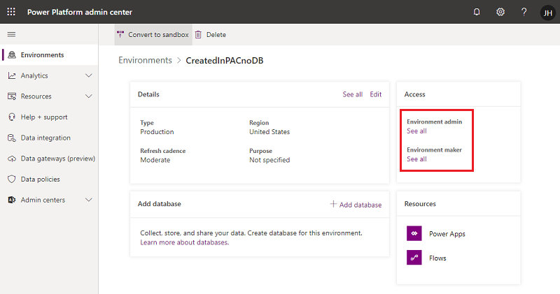
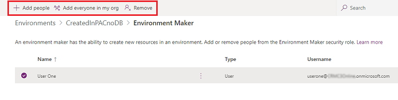
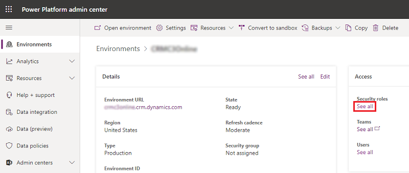
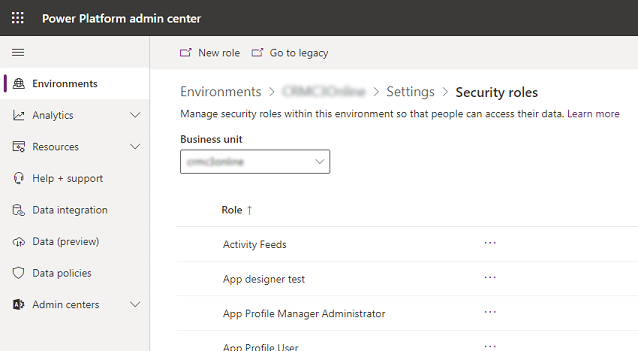
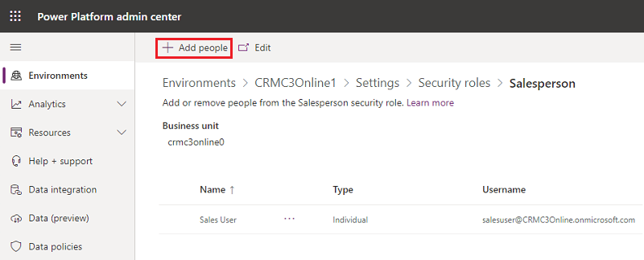
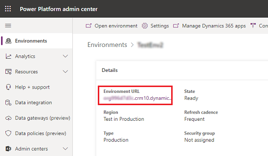

# Configure user security to resources in an environment

[!INCLUDE [cc-data-platform-banner](../includes/cc-data-platform-banner.md)]

Microsoft Dataverse uses a role-based security model to help secure access to the database. This topic explains how to create the security artifacts that you must have to help secure resources in an environment. Security roles can be used to configure environment-wide access to all resources in the environment, or to configure access to specific apps and data in the environment. Security roles control a user's access to an environment's resources through a set of access levels and permissions. The combination of access levels and permissions that are included in a specific security role governs the limitations on the user's view of apps and data, and on the user's interactions with that data. 

An environment can have zero or one Dataverse database. The process for assigning security roles for environments that have no Dataverse database differs from that for an environment that does have a Dataverse database. 

## Predefined security roles 
Environments include predefined security roles that reflect common user tasks with access levels defined to match the security best-practice goal of providing access to the minimum amount of business data required to use the app. 

These security roles can be assigned to the user, [owner team](manage-teams.md#about-owner-teams) and [group team](manage-group-teams.md). 

There is another set of security roles that is assigned to [application users](system-application-users.md). Those security roles are installed by our services and cannot be updated.

| Security role  | Database privileges*  | Description |
|---------|---------|---------|
| Environment Admin     |  Create, Read, Write, Delete, Customizations, Security Roles       | The Environment Admin role can perform all administrative actions on an environment, including the following:  <ul><li>Add or remove a user from either the Environment Admin or Environment Maker role.</li><li>Provision a Dataverse database for the environment. After a database is provisioned, the System Customizer role should also be assigned to an Environment Admin to give them access to the environment's data.</li><li>View and manage all resources created within an environment.</li><li>Set data loss prevention policies. More information: [Data loss prevention policies](prevent-data-loss.md)</li></ul>    |
| Environment Maker     |  Customizations       | Can create new resources associated with an environment, including apps, connections, custom APIs, gateways, and flows using Microsoft Power Automate. However, this role doesn't have any privileges to access data within an environment. More information: [Environments overview](https://docs.microsoft.com/power-platform/admin/environments-overview)        |
| System Administrator     |  Create, Read, Write, Delete, Customizations, Security Roles       | Has full permission to customize or administer the environment, including creating, modifying, and assigning security roles. Can view all data in the environment. More information: [Privileges required for customization](https://docs.microsoft.com/dynamics365/customer-engagement/customize/privileges-required-customization)        |
| System Customizer     | Create (self), Read (self), Write (self), Delete (self), Customizations         | Has full permission to customize the environment. However, users with this role can only view records for environment entities that they create. More information: [Privileges required for customization](https://docs.microsoft.com/dynamics365/customer-engagement/customize/privileges-required-customization)        |
| Common Data Service User     |  Read (self), Create (self), Write (self), Delete (self)       | Can run an app within the environment and perform common tasks for the records that they own. Note that this only applies to non-custom entities. More information: [Create or configure a custom security role](#create-or-configure-a-custom-security-role)   |
| Delegate     | Act on behalf of another user        | Allows code to *impersonate*, or run as another user.  Typically used with another security role to allow access to records. More information: [Impersonate another user](https://docs.microsoft.com/powerapps/developer/common-data-service/impersonate-another-user)        |
| Support User | Read Customizations, Read Business Management settings      | Has full Read permission to customization and business management settings to allow Support staff to troubleshoot environment configuration issues. Does not have access to core records.      |

*The scope of these privileges is global, unless specified otherwise.

> [!NOTE]
> - Environment Maker and Environment Admin are the only predefined roles for environments that have no Dataverse database. 
> - The Environment Maker role can create resources within an environment, including apps, connections, custom connectors, gateways, and flows using Power Automate. Environment makers can also distribute the apps they build in an environment to other users in your organization. They can share the app with individual users, security groups, or all users in the organization. More information: [Share an app in Power Apps](https://docs.microsoft.com/powerapps/maker/canvas-apps/share-app) 
> - For users who make apps that connect to the database and need to create or update entities and security roles, you need to assign the System Customizer role in addition to the Environment Maker role. This is necessary because the Environment Maker role doesn't have privileges on the environment's data. 
> - If the environment has a Dataverse database, a user must be assigned the System Administrator role instead of the Environment Admin role for full admin privileges, as described in the preceding table. 

## Assign security roles to users in an environment that has no Dataverse database 

For environments with no Dataverse database, security roles can be assigned to individual users or groups from Azure AD. A user who has the Environment Admin role in the environment can take these steps.

1. Sign in to the [Power Platform admin center](https://admin.powerplatform.microsoft.com).

2. Select **Environments** > [select an environment].

3. In the **Access** tile, select **See all** for **Environment admin** or **Environment maker** to add or remove people for either role.

   > [!div class="mx-imgBorder"] 
   > 

4. Select **Add people**, and then specify the name or email address of one or more users or groups from Azure AD to assign this role to.

   > [!div class="mx-imgBorder"] 
   > 

## Assign security roles to users in an environment that has a Dataverse database 

Security roles can be assigned to [owner teams](manage-teams.md#create-an-owner-team) and [Azure AD group teams](manage-group-teams.md), in addition to individual users. Before assigning a role to a user, [verify that the user is present in the environment in Enabled status](diagnose-user-access.md). [Add the user to the environment](add-users-to-environment.md) or [fix their status to become Enabled](diagnose-user-access.md) before assigning a role to them. You'll be able to assign a role as part of the process of adding the user. 

In general, a security role can only be assigned to users who have Enabled status. But if you need to assign a security role to users in the Disabled state, you can do so by enabling **allowRoleAssignmentOnDisabledUsers** in OrgDBOrgSettings. 

To add a security role to an owner team, group team, or a user who has Enabled status in an environment: 

1. Sign in to the [Power Platform admin center](https://admin.powerplatform.microsoft.com).

2. Select **Environments** > [select an environment]. 

3. In the **Access** tile, select **See all** under Security roles.

   > [!div class="mx-imgBorder"] 
   > 

4. Make sure the right Business unit is selected from the dropdown, and select a role from the list of roles in the environment.

   > [!div class="mx-imgBorder"] 
   > 

5. Select **Add people** to add a user, owner team, or group team to the role. If you do not find a user or team to assign the role to, make sure the user or team is present in the environment and the user has Enabled status before assigning a role to them. 

   > [!div class="mx-imgBorder"] 
   > 

## Create or configure a custom security role 

If your app uses a custom entity, its privileges must be explicitly granted in a security role before your app can be used. You can either add these privileges in an existing security role or create a custom security role.

> [!NOTE]
> Every security role must include a minimum set of privileges before it can be used. These are described [later in this article](#minimum-privileges-to-run-an-app). 

> [!TIP]
> The environment might maintain the records that can be used by multiple apps; therefore, you might need multiple security roles to access the data by using different privileges. For example: 
> - Some users (call them Type A) might only need to read, update, and attach other records, so their security role will have read, write, and append privileges. 
> - Other users might need all the privileges that Type A users have, plus the ability to create, append to, delete, and share. The security role for these users will have create, read, write, append, delete, assign, append to, and share privileges. 

For more information about access and scope privileges, see [Security roles and privileges](security-roles-privileges.md). 

1. Sign in to the [Power Platform admin center](https://admin.powerplatform.microsoft.com), and select the environment for which you want to update a security role. 

2. Select the environment's URL. 

   > [!div class="mx-imgBorder"] 
   > 

3. If you see published apps and tiles, select the gear icon () in the upper-right corner, and then select **Advanced settings**. 

4. In the menu bar, select **Settings** > **Security**. 

   > [!div class="mx-imgBorder"] 
   > 

5. Select **Security roles**.

   > [!div class="mx-imgBorder"] 
   > 

6. Select **New**.

7. From the security role designer, enter a role name on the **Details** tab. From the other tabs, you'll select the actions and the scope for performing that action.

8. Select a tab, and search for your entity. For example, select the **Custom Entities** tab to set permissions on a custom entity.

9. Select the privileges **Read, Write, Append**.

10. Select **Save and Close**.

## Minimum privileges to run an app
When you create a custom security role, you need to include a set of minimum privileges into the security role in order for a user to run an app. We've created a solution you can import that provides a security role that includes the required minimum privileges.  

Start by downloading the solution from the Download Center: [Dataverse minimum privilege security role](https://download.microsoft.com/download/6/5/5/6552A30E-05F4-45F0-AEE3-9BB01E13118A/MinprivilegeSecRole_1_0_0_0.zip). 

Then, follow these directions to import the solution: [Import solutions](/powerapps/maker/common-data-service/import-update-export-solutions).

When you import the solution, it creates the **min prv apps use** role, which you can copy (see: [Create a security role by Copy Role](create-edit-security-role.md#create-a-security-role-by-copy-role)). When the Copy Role process is completed, navigate to each tab&mdash;**Core Records**, **Business Management**, **Customization**, and so on&mdash;and set the appropriate privileges. 

> [!IMPORTANT]
> You should try out the solution in a development environment before importing it into a production environment. 

### See also
[Grant users access](grant-users-access.md)  
[Control user access to environments: security groups and licenses](control-user-access.md)  
[How access to a record is determined](how-record-access-determined.md)
