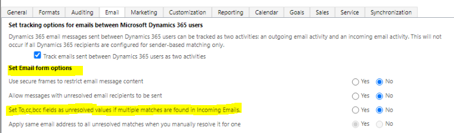

# Overview

Default environment routing is a premium, governance feature that allows Power Platform admins to automatically direct their *new makers* into their own, personal developer environments when they visit [make.powerapps.com](https://make.powerapps.com) for the first time. Default environment routing will offer new makers a personal, safe space to build with Microsoft Dataverse, without the fear of others' accessing their apps or data.

Unlike today, when the **Default environment routing** setting is enabled and a new maker visits [make.powerapps.com](https://make.powerapps.com) for the first time, the maker will land in their own, personal developer environment instead of the default environment. Personal, developer environments will be makers' own, personal [OneDrive](https://www.microsoft.com/microsoft-365/onedrive/online-cloud-storage) for personal productivity where they can start building apps and solutions in their own workspace. New makers won't need to learn about which environment to work in since this happens automatically.

Dataverse is available in personal, developer environments and these enviroments are Managed Environments with the admin settings already pre-configured, such as sharing limits and solution checker. Admins no longer need to worry that their makers working in the default environment, where other makers can step on others work or store sensitive data in a shared place.

## Prerequisites

Default environment routing is a tenant-level, admin setting that:

-   Can only be enabled by Power Platform admins.

-   Requires that the **Developer environment assignment** setting is enabled for **Everyone**.

    

-   Requires the default environment to be a [Managed Environment](managed-environment-overview.md).

## Enabling the Default environment routing setting

The **Default environment routing** setting is disabled by default and must be enabled using the command line tool or PowerShell.

## Before you begin

Before you enable the **Default environment routing** feature, consider the following effects:

-   This feature enables the automatic creation of a personal, developer environment for **all** of your Power Apps new makers when they first launch [make.powerapps.com](https://make.powerapps.com). The definition of a new maker is limited to the makers who visit [make.powerapps.com](https://make.powerapps.com) for the first time. Returning makers who have visited the site before won't be impacted.

-   New makers will be assigned the admin role in their newly created developer environments.

## Enable the feature

During this preview, you must get your Power Platform **tenant ID** on the allow-list for using this feature. To see your tenant ID, go to the Power Platform admin center > **Settings** > **Session details**, and copy your tenant ID from the **Session details** window.

1. Apply for the [private preview](https://forms.office.com/pages/responsepage.aspx?id=v4j5cvGGr0GRqy180BHbR5ggzcJ5zOhCu7m4ZkreWStUMk1INzNPWEdYTVQxNThZVkM4TFpWMTU5US4u). 
1. After you receive confirmation of having your tenant ID added to the allow-list for the private preview, login to Power Platform admin center as an admin and make sure your default enviornment is a Managed Environment.

  

1. Make sure the **Developer environment assignment** setting is enabled for **Everyone**. You can check / change this tenant level settings from PPAC (See below)

  

1. Run the following commands in Power Shell.

Run the following commands in Power Shell.

//login to your tenant account

$Add-PowerAppsAccount -Endpoint "prod" -TenantID &lt;Tenant\_ID&gt;

// retrieve and store your tenant setting in tenantSettings

$tenantSettings = Get-TenantSettings  

// setup the enableDefaultEnvironmentRouting flag to true

$tenantSettings.powerPlatform.governance.enableDefaultEnvironmentRouting = $True

Set-TenantSettings -RequestBody $tenantSettings

When trying to enable an environment routing tenant setting, 

1.  If Developer environment assignments is set for only "Specific admins", the command will not succeed and show error message. To change this, go to PPAC -&gt; Tenant Settings -&gt; Developer environment assignments and set it to everyone.

2.  If tenant default environment is not managed, the command will not succeed and show error message. TO change this, refer to [Enable Managed Environments - Power Platform \| Microsoft Learn](https://learn.microsoft.com/en-us/power-platform/admin/managed-environment-enable#enable-or-edit-managed-environments-in-the-admin-center)

## Disabling the feature

To **disable** environment routing for your tenant, running the following Power shell commands

$tenantSettings = Get-TenantSettings  

$tenantSettings.powerPlatform.governance.enableDefaultEnvironmentRouting = $False

Set-TenantSettings -RequestBody $tenantSettings

**Check if Environment Routing is On**

Admins can run the following Cmdlt to confirm if environment routing is enabled for their tenant default environment. The ***enableDefaultEnvironmentRouting** flag should be set to True*

$Get-TenantSettings

$tenantSettings = Get-TenantSettings

$tenantSettings.powerPlatform.governance

*disableAdminDigest : False*

*additionalAdminDigestEmailRecipients : AllanD@M365x95509069.OnMicrosoft.com*

*disableDeveloperEnvironmentCreationByNonAdminUsers : False*

***enableDefaultEnvironmentRouting** : **True***

*policy : @{enableDesktopFlowDataPolicyManagement=False}*

## Maker Experience

Please keep in mind that if the makers are testing the **<u>functionality before June 18th</u> , they will need to append the following flag "*?cdsCommon.enableNewHomePageExperience=false*** "next to the Power Maker Portal page URL in order to display the **legacy maker portal homepage** and activate the environment routing; otherwise, if you are testing after Jun 18th, this flag can be disregarded.

*New maker portal page is not supported before Jun 18th*

**Example URL with the maker home page flag** <https://make.powerapps.com/?cdsCommon.enableNewHomePageExperience=false>

## Feedback / Issue reporting 

Please capture your session details and share them using the [following form](https://forms.office.com/r/ppXNGHD8RX) or send us an email to report any problems you come across or to share your feedback. You can capture the session details by clicking on the gear icon at the top right corner of your maker portal page session details and then copy the session details from the popup window.

## FAQ

### Will the created developer environments be managed?

Yes, all the newly created developer environments will be managed by default.

### What environment types are created when the default environment routing is enabled?

The created environments are developer environments.

### What roles do the makers get assigned in the created developer environments?

The makers get assigned the admin security role in their created developer environments.

### Can the new makers switch to the default environment or any other environment they have access after landing into their own developer environment using the environment picker?

Yes, makers can always switch to other environments after landing into their own environment.

### Will the created Developer environment impact my tenant DV quota?

No, the developer environments should not impact your tenant DV quota.

### What will happen if the developer environment creation fails?

If some reason, the creation of the developer environment fails, makers will be automatically routed to the default environment.

### What DLP policies will be applied for the newly created developer environment?

During the private preview, no specific DLP policies will be assigned to the developer environment. Accordingly, the developer environment will inherit existing tenant level DLP policies.

### What are the preconfigured Managed Environment settings for the newly created developer environments?

All the newly created developer environments will have the following managed environment settings preconfigured:

Sharing limits: Set to exclude sharing with SG and preconfigured to share with 5 individuals.

Solution Checker: Set to Warn

Usage Insights: Is selected.

Maker welcome message: Not established.

### Is the default environment routing also available for Power Automate, PVA, and Power Pages?

During the private preview, the default environment routing is limited to Power Apps only.

### Do I need to be a Power Platfrom tenant admin to enable this feature?

Yes, you need to have a Power Platform tenant admin privilege to enable this feature in your tenant or you can ask your tenant admin to turn it on for you.

