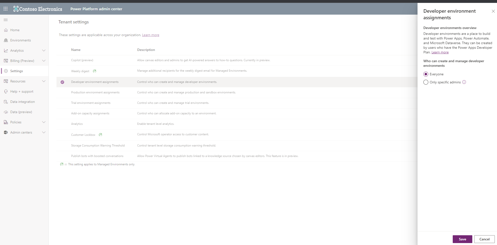
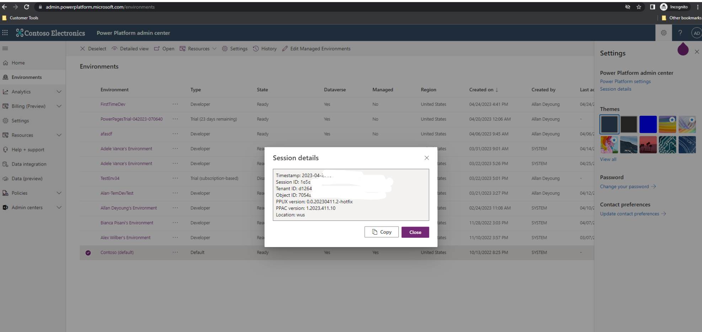
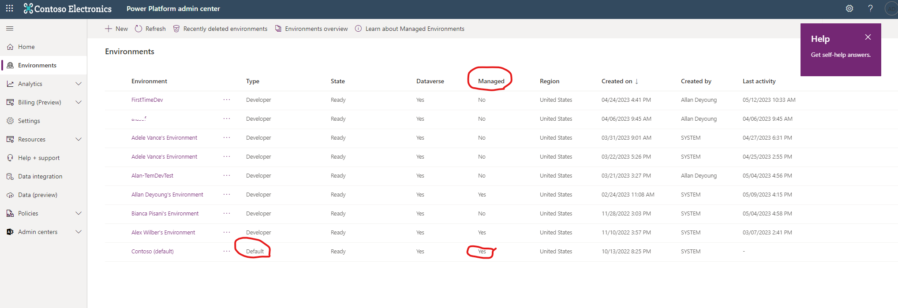
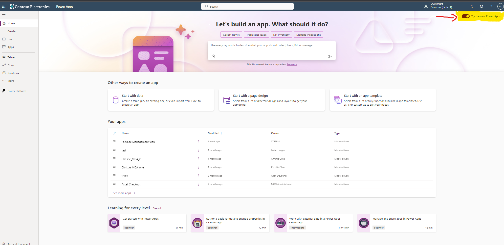

# Default environment routing

Default environment routing is a premium, governance feature. This feature allows Power Platform admins to automatically direct *new makers* into their own, personal developer environments when they visit [make.powerapps.com](https://make.powerapps.com) for the first time. Default environment routing offers new makers a personal, safe space to build with Microsoft Dataverse, without the fear of others accessing their apps or data.

Unlike today, when the **Default environment routing** setting is enabled and a new maker visits [make.powerapps.com](https://make.powerapps.com) for the first time, the maker opens their own, personal developer environment, instead of the default environment. Personal, developer environments are makers own, personal [OneDrive](https://www.microsoft.com/microsoft-365/onedrive/online-cloud-storage) for personal productivity where they can start building apps and solutions in their own workspace. New makers don't need to learn about which environment to work in since this happens automatically.

Dataverse is available in personal, developer environments and these environments are Managed Environments with the admin settings already preconfigured, such as sharing limits and solution checker. Admins no longer need to worry that their makers are working in the default environment, where their work can conflict with others.

## Prerequisites

Default environment routing is a tenant-level, admin setting that:

-   Is enabled by Power Platform admins only.

-   Requires that the **Developer environment assignment** setting is enabled for **Everyone**.

    

-   Requires the default environment to be a [Managed Environment](managed-environment-overview.md).

## Enable the Default environment routing setting

The **Default environment routing** setting is disabled by default and must be enabled using the command line tool or PowerShell.

### Before you begin

Before you enable the **Default environment routing** feature, consider the following effects:

-   This feature enables the automatic creation of a personal, developer environment for **all** of your Power Apps new makers when they first launch [make.powerapps.com](https://make.powerapps.com). The definition of a new maker is limited to the makers who visit [make.powerapps.com](https://make.powerapps.com) for the first time. Returning makers who have visited the site before aren't impacted.

-   New makers will be assigned the admin role in their newly created developer environments.

### Enable the feature

During this preview, you must get your Power Platform **tenant ID** on the allow-list for using this feature. To see your tenant ID, go to the Power Platform admin center > **Settings** > **Session details**, and copy your tenant ID from the **Session details** window.



1. Apply for the [private preview](https://forms.office.com/pages/responsepage.aspx?id=v4j5cvGGr0GRqy180BHbR5ggzcJ5zOhCu7m4ZkreWStUMk1INzNPWEdYTVQxNThZVkM4TFpWMTU5US4u). 
1. After you receive confirmation of having your tenant ID added to the allow-list for the private preview, login to Power Platform admin center as an admin and make sure your default environment is a Managed Environment.

  

1. Make sure the **Developer environment assignment** setting is enabled for **Everyone**. 

1. Run the following commands in PowerShell.

    1. Log in to your tenant account.

      ```PowerShell
      $Add-PowerAppsAccount -Endpoint "prod" -TenantID &lt;Tenant\_ID&gt;
      ```

    1. Retrieve and store your tenant setting in tenantSettings.

      ```PowerShell
      $tenantSettings = Get-TenantSettings  
      ```
    1. Set the **enableDefaultEnvironmentRouting** flag to **True**.

      ```PowerShell
      $tenantSettings.powerPlatform.governance.enableDefaultEnvironmentRouting = $True
      
      Set-TenantSettings -RequestBody $tenantSettings
      ```

When trying to enable an environment routing tenant setting, keep the following points in mind: 

1.  If the **Developer environment assignments** property is set for only _specific admins_, the command fails and an error message is displayed. To change this, go to Power Platform admin center > **Tenant settings** -> **Developer environment assignments** and set it to **Everyone**.

2.  If the tenant's default environment isn't managed, the command fails and an error message is displayed. See [Enable or edit Managed Environments in the admin center](managed-environment-enable.md#enable-or-edit-managed-environments-in-the-admin-center) for more information.

## Disable the feature

To disable environment routing for your tenant, run the following PowerShell commands:

```PowerShell
$tenantSettings = Get-TenantSettings  

$tenantSettings.powerPlatform.governance.enableDefaultEnvironmentRouting = $False

Set-TenantSettings -RequestBody $tenantSettings
```

## Check if environment routing is turned on

Admins can run the following cmdlet to confirm if environment routing is enabled for their tenant's default environment. The **enableDefaultEnvironmentRouting** flag should be set to **True**.

$Get-TenantSettings

$tenantSettings = Get-TenantSettings

$tenantSettings.powerPlatform.governance

*disableAdminDigest: False*

*additionalAdminDigestEmailRecipients: AllanD@M365x95509069.OnMicrosoft.com*

*disableDeveloperEnvironmentCreationByNonAdminUsers: False*

***enableDefaultEnvironmentRouting**: **True***

*policy: @{enableDesktopFlowDataPolicyManagement=False}*

## If testing before June 18, 2023

If makers are testing the functionality before June 18, 2023, they must append the flag, **?cdsCommon.enableNewHomePageExperience=false**, next to the [make.powerapps.com](https://make.powerapps.com) URL in order to display the legacy page and activate environment routing. Otherwise, if you're testing after Jun 18, 2023, this flag can be disregarded.



**Example URL with the maker home page flag:** `https://make.powerapps.com/?cdsCommon.enableNewHomePageExperience=false`

## Feedback and issue reporting 

[Report any problems you encounter or share your feedback with us](https://forms.office.com/r/ppXNGHD8RX) to help us improve this feature.

You can capture the session details by selecting the **Settings** icon at the top-right corner of the page. In Power Apps session details window, copy your session ID.


## Frequently asked questions (FAQs)

### Are the developer environments managed?

Yes, all the newly, created developer environments are Managed Environments, by default.

### What environment types are created when the default environment routing is enabled?

The created environments are developer environments.

### What roles do the makers get assigned in the developer environments?

The makers get assigned the admin security role in the developer environments.

### Can new makers switch to the default environment, or any other environment they have access to, after launching their own developer environment?

Yes, makers can always switch to other environments.

### Will the developer environment impact my tenant DV quota?

No, the developer environments don't impact your tenant DV quota.

### What happens if the developer environment creation fails?

If some reason, the creation of the developer environment fails, makers are automatically routed to the default environment.

### What data loss prevention (DLP) policies are applied for the developer environment?

During the private preview, no specific DLP policies are assigned to the developer environment. Accordingly, the developer environment inherits existing, tenant-level DLP policies.

### What are the preconfigured Managed Environment settings for the newly created developer environments?

All developer environments have the following Managed Environment settings preconfigured:

- **Sharing limits**: Set to exclude sharing with security groups, and preconfigured to share with five individuals.

- **Solution Checker**: Set to **Warn**.

- **Usage insights**: Is selected.

- **Maker welcome message**: Not established.

### Is the default environment routing also available for Power Automate, Power Virtual Agents, and Power Pages?

During the private preview, the default environment routing is limited to Power Apps only.

### Do I need to be a Power Platform tenant admin to enable this feature?

Yes, you need to have a Power Platform tenant admin privilege to enable this feature in your tenant or you can ask your tenant admin to turn it on for you.

