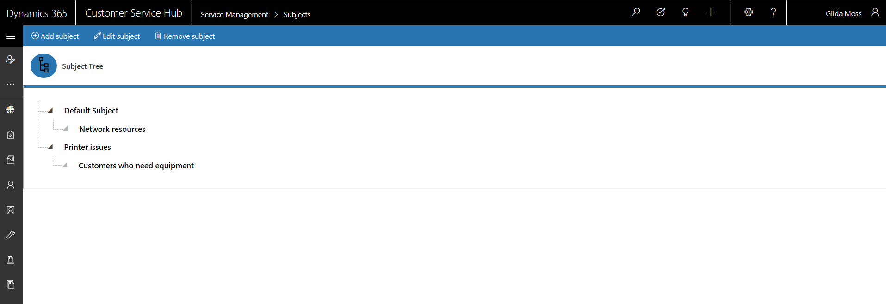

# Define subjects to categorize cases, products, and articles

The customer engagement apps (Dynamics 365 Sales, Dynamics 365 Customer Service, Dynamics 365 Field Service, Dynamics 365 Marketing, and Dynamics 365 Project Service Automation), include a subject organizational structure that lets you mark and categorize service cases, knowledge base articles, products, and sales literature. By using the subject hierarchy, you can classify service cases to quickly provide service to your customer. You can also provide the appropriate sales literature. You'll also be able to better understand gaps in your sales literature, evaluate service quality by subject area, and improve reporting on the performance of your products.  

> [!NOTE]
> With the version 9.1 release, subjects in service management are available in the Customer Service Hub based on the Unified Interface experience. We recommend that you manage subjects using the new experience.
  
## Create or edit a subject  (Customer Service Hub) 

1. In the Customer Service Hub app, go to **Service Management** and select **Case Settings** > **Subjects** in the sitemap to access subjects. 

2. In the command bar:
   - Select **Add subject** to add a subject. A quick create dialog box is displayed. Enter **Name** and **Description** for the subject.
      - You can choose default subject as parent in the **Parent Subject** drop-down. If you don't choose a parent subject, then your subject begins from the same node as default subject.
   - Select a subject from the tree and select **Edit subject** to edit a subject
   - Select a subject from the tree and select **Remove subject** to delete a subject

   

## Create or edit a subject  (Customer Service app) 
  
1. In the web app, go to **Settings** > **Business Management**. Select **Subjects**. You can also get there by going to **Settings** > **Service Management** > **Subjects**.  
  
2. To add a subject, under **Common Tasks**, select **Add a Subject**.  
  
    -OR-  
  
    To edit a subject, in the **Subject Tree**, select a subject, and then under **Common Tasks** select **Edit Selected Subject**.  
  
3. In the **Subject** dialog box, enter the required information:  
  
   - **Title**: Type a name for the subject. This is a required field.  
  
   - **Parent Subject**: To search for and select a parent subject for the new subject, select the **Lookup** button.  
  
        -OR-  
  
        To make the new subject a parent subject, leave the **Parent Subject** box empty.  
  
   - **Description**: Type a descriptive statement about the subject.  
  
4. Select **OK**.  
  
### See also 
