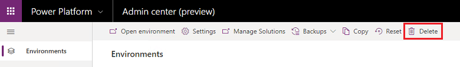

# Delete environment

You can delete an environment to recover storage space and to remove Personally Identifiable Information (PII). 

> [!NOTE]
> You can't delete the [default environment](environments-overview.md#the-default-environment).

1. Sign in to [https://admin.powerplatform.microsoft.com](https://admin.powerplatform.microsoft.com).  

2. Select an environment and then select **Delete**.

   > [!div class="mx-imgBorder"]
   > 

3. Provide the confirmation data and then select **Confirm**.

### See also 
[Back up and restore environments](backup-restore-environments.md)  
[Automatic environment cleanup](automatic-environment-cleanup.md)  
[Manage sandbox environments](sandbox-environments.md)  
[Environments overview](environments-overview.md)  
[Cmdlet list - Admin Cmdlets](powerapps-powershell.md#cmdlet-list---admin-cmdlets)  
[Licensing overview for Power Platform](pricing-billing-skus.md)

