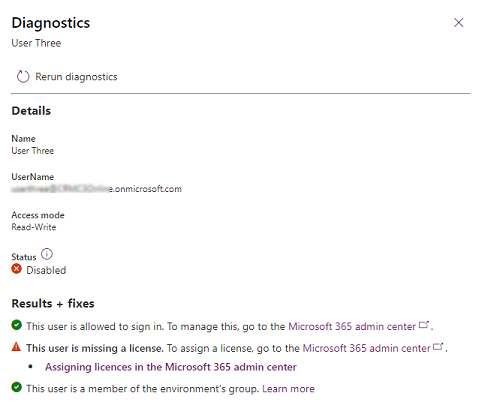

# Delete users

Users are deleted in the Microsoft 365 admin center as follows:

1. In the [Microsoft 365 admin center](https://admin.microsoft.com/), go to the **Users** > [**Active users**](https://go.microsoft.com/fwlink/p/?linkid=834822) page.

2. Select the names of the users you want to delete, and then select **Delete user**.

Although you deleted the user's account, you're still paying for the license. To stop paying for the license, follow the procedures in [Delete a user from your organization](/microsoft-365/admin/add-users/delete-a-user?view=o365-worldwide). Or, you can assign the license to another user. It won't be assigned to anyone automatically.

## About deleted users

When a user is deleted from the Microsoft 365 admin center, the user isn't removed from environments in which they're active. Instead, the user's status is set to **Disabled** in Dynamics 365.

The following lists the scenarios when a user is deleted:

- If the user is in the environment and has a status of **Enabled**, the status will be updated to **Disabled**.
- If the user is in the environment and has a status of **Disabled**, the status remains as **Disabled**.
- If the user isn't present in the environment, no action is taken.

It can take from 30 minutes to 6 hours for a user's status to be updated in an environment when the user is deleted from the Microsoft 365 admin center. If you need to update the user status immediately, you can follow the steps in [User diagnostics](troubleshooting-user-needs-read-write-access-organization.md#user-diagnostics) to see what needs to be done to restore the user.

> [!div class="mx-imgBorder"] 
> 

> [!NOTE]
> A user deleted from the Microsoft 365 admin center is put on the **Deleted user** list for 30 days and can be restored as directed in [Restore a user](/microsoft-365/admin/add-users/restore-user?view=o365-worldwide).

## View the list of disabled users

1. In the Power Platform admin center, select an environment.

2. Select **Settings** > **Users + permissions** > **Users**.

3. In the top menu bar, select **Manage users in Dynamics 365**. 

4. From the drop-down menu, select **Disabled users**. 

> [!NOTE]
> If a disabled user access Power Automate while the user is in the disabled state, the user will automatically be re-enabled in the environment.

## Restore deleted users

1. In the [Microsoft 365 admin center](https://admin.microsoft.com/), go to the **Users** > [**Deleted users**](https://go.microsoft.com/fwlink/p/?linkid=834822) page.

2. Select the name of the user you want to re-enable, select **Restore user**, and then proceed through various pages.

3. Reassign licenses as needed to the user in the Microsoft 365 admin center.

> [!NOTE]
> You can restore deleted users up to 30 days after deletion. When a deleted user is restored and a license is reassigned, the user's status is set to **Enabled** in the respective environments in which the user was disabled.

### See also

[Delete a user from your organization](/microsoft-365/admin/add-users/delete-a-user?view=o365-worldwide)  
[Troubleshooting: Common user access issues](troubleshooting-user-needs-read-write-access-organization.md)
