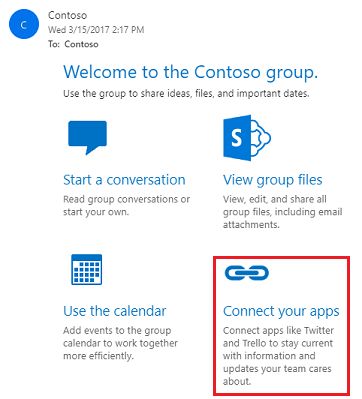

# Deploy Microsoft 365 groups 

[!INCLUDE [pn-dynamics-crm-online](../includes/pn-dynamics-crm-online.md)]

[!INCLUDE [cc-data-platform-banner](../includes/cc-data-platform-banner.md)]

Microsoft 365 Groups, available with Dynamics 365 apps, provides a new environment for collaboration with Microsoft 365 users who don't use customer engagement apps (Dynamics 365 Sales, Dynamics 365 Customer Service, Dynamics 365 Field Service, Dynamics 365 Marketing, and Dynamics 365 Project Service Automation), such as Dynamics 365 Sales and Customer Service. For example, use Microsoft 365 Groups when a sales team has a major opportunity requiring input from several people who don't have access to customer engagement apps. Microsoft 365 Groups provides a single location to share documents, conversations, meetings, and notes. You can enable Microsoft 365 Groups for any entity.  
  
> [!TIP]
>  Check out the following for a quick introduction to Microsoft 365 Groups:  
> 
> -  Video: [Introducing Groups in Microsoft 365](https://youtu.be/t3OLvYXepvE).  
> - [Learn more about groups](https://support.office.com/article/Learn-about-Office-365-groups-b565caa1-5c40-40ef-9915-60fdb2d97fa2)  

## Requirements  
 The following are required to use Microsoft 365 Groups with customer engagement apps:  
  
- Customer engagement apps
  
- This feature requires that you have an Microsoft 365 subscription or a subscription to an online service such as SharePoint Online or Exchange Online.

- To use document storage with Microsoft 365 Groups, you will need SharePoint Online and access to the group OneNote notebook.
  
- Exchange Online

- To use document storage with Microsoft 365 Groups, you will need SharePoint Online and access to the group OneNote notebook.  
  
   

## Provision Microsoft 365 groups  
 Microsoft 365 Groups is a solution you provision from your Microsoft 365 admin center.  
  
> [!NOTE]
>  Users must have an Exchange Online mailbox set up to use Microsoft 365 Groups. Exchange Online is already properly configured for organizations as a part of Microsoft 365. You also need to enable server-based SharePoint integration to see documents in an Microsoft 365 Group; you don't have to use SharePoint integration, only set up the connection to SharePoint Online.  Server-based SharePoint integration is also required to enable the group OneNote notebook.  
> 
> More information: [Set up customer engagement apps to use SharePoint Online](set-up-dynamics-365-online-to-use-sharepoint-online.md)  
  
1. Sign in to the [Power Platform admin center](https://admin.powerplatform.microsoft.com).

2. Select **Resources** > **Dynamics 365 apps**.
  
3. Select **Office365Groups** and then select **Install**.  
  
Once installation of the solution has completed, you can configure Microsoft 365 Groups.  
  
> [!NOTE]
> When you install a solution, your site is taken offline in maintenance mode for a short time. We recommend you install the solution when it's least disruptive to users.  

## Check required privileges  
 The security privilege, **ISV Extensions**, is required to use Microsoft 365 Groups. You can add or remove this privilege from custom or default security roles to meet your business needs. If a user doesn't have this privilege, they won't be able to see the Microsoft 365 Groups item in a record's navigation menu.  
  
1. Sign in to the [Power Platform admin center](https://admin.powerplatform.microsoft.com) as an admin (Service admin, Global admin, or Delegated admin).

2. From the left-side menu, select **Environments**, and then select an environment.
  
3. Select **Settings** > **Users + permissions** > **Security roles**.
  
4. Choose the security role to check and then select the **Customization** tab.  
  
5. In the **Miscellaneous Privileges** section, review the **ISV Extensions** privilege setting. If the security role doesn't have the **ISV Extensions** privilege, select it to set it to Organization.  
  
6. Select **Save and Close**.  
  
## Configure Microsoft 365 groups  
 Once you provision Microsoft 365 Groups, you can enable them for any entity. Security group membership is associated with the entity. You configure Microsoft 365 Groups in customer engagement apps.  
  
1. In the web app, go to **Settings** > **Microsoft 365 groups**. You may need to first select the **Gear** icon () > **Advanced settings**.
  
2. On the **Microsoft 365 Groups Integration Settings** page, select **Add entity** and choose an entity from the drop-down list. Repeat this step for each entity you want to enable, including custom entities.  
  
3. Optionally, you can select **Auto-create** for an entity to have a new group automatically created when a new record for that entity is created. However, we recommend you choose this option only for entities that typically require large groups to collaborate.  
  
4. When you have added all the entities you want to enable for Microsoft 365 Groups, select **Publish All**.  
  
All of your pending system customizations will be published, including those you may have saved but not published in another area.  
  
You're now ready to use Microsoft 365 Groups. See [Collaborate with your colleagues using Microsoft 365 groups](https://docs.microsoft.com/dynamics365/customerengagement/on-premises/basics/collaborate-with-colleagues-using-office-365-groups).  
  
## Use the Microsoft 365 Connectors for Groups  
 Use the Microsoft 365 Connectors for Groups to connect new or existing Microsoft 365 Groups with customer engagement apps so the group is notified when new activities are posted. To set it up, follow these steps:  
  
> [!TIP]
>  Check out the following Blog: [Dynamics CRM Online connector for Microsoft 365 groups](https://blogs.msdn.microsoft.com/crm/2016/04/01/dynamics-crm-online-connector-for-office-365-groups/)  
  
1. Sign in to your [Microsoft 365 Outlook](https://outlook.office365.com).  
  
2. Create or choose a Microsoft 365 Group.  
  
3. Select **Connect your apps**.  
  
   > [!div class="mx-imgBorder"] 
   > 
  
4. Scroll down to **Dynamics 365**, and then select **Add**.  
  
5. If you have access to more than one environment, choose which environment to connect to this Microsoft 365 Group. If you only have access to one environment, this step will be skipped and you will advance to the next step.  
  
6. Choose the record you want to connect this Microsoft 365 Group to, and then select **Save**.  
  
     
  
   Once connected, the connector shows up at the top of the connection list with a summary of connected records.  
  
     
  
   To delete a connected record, select **View**, and then select **Remove**.  
  
     
  
> [!NOTE]
>  Note the following about the Microsoft 365 Connectors for Groups:  
> 
> - Only account, lead, and opportunity records are supported.  
> - You can connect up to five records.  
> - Only task type activities are sent to the group as connector cards.  
> - The activity appears as a new conversation in a card format in the Group.  
> - The fields in the card shown in the Group conversation are not customizable.  
> - Nothing is required in customer engagement apps to make the connector work.  
> - For sensitive information, you should connect your record to a private group where only approved members can view contents. For public groups, everyone in the org has access to view contents. See "Public and private Microsoft 365 groups" in [Learn more about groups](https://support.office.com/article/Learn-about-Office-365-groups-b565caa1-5c40-40ef-9915-60fdb2d97fa2).  
  
## Privacy notice  
 When a user leverages the Microsoft 365 groups feature to connect an Office Group to customer engagement apps, data (including new conversations and documents) will be stored on the Exchange and/or SharePoint system and shared with the members of that Office Group, even if they are not licensed or authorized users. Users will only be able to share the data that they have access to, and Administrators can limit the data that is shared by limiting the access privileges of their users.  
  
### See also  
 [Collaborate with your colleagues using Microsoft 365 groups](https://docs.microsoft.com/dynamics365/customerengagement/on-premises/basics/collaborate-with-colleagues-using-office-365-groups)   
 [CRM Blog: Dynamics CRM Online connector for Microsoft 365 groups](https://blogs.msdn.microsoft.com/crm/2016/04/01/dynamics-crm-online-connector-for-office-365-groups/)   
 [Set up customer engagement apps to use Exchange Online](connect-exchange-online.md)   

