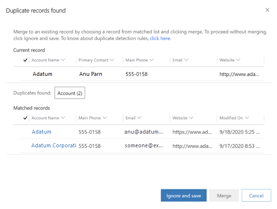
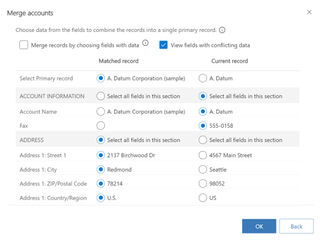
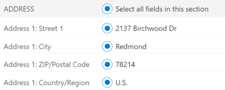
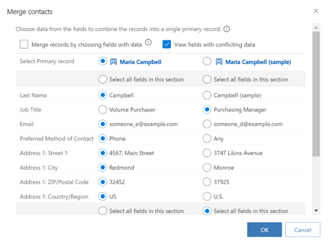
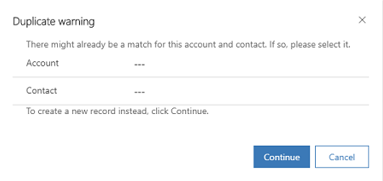
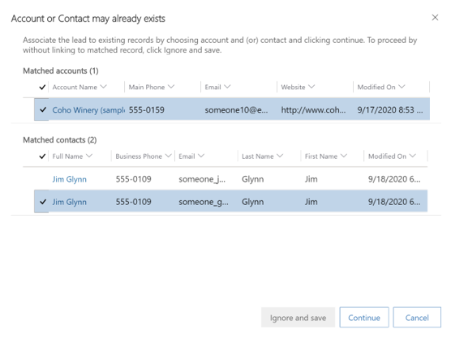

# Detect duplicate records and merge

[!INCLUDE [cc-data-platform-banner](../includes/cc-data-platform-banner.md)]

Duplicate records can creep into your data when you or others enter data manually or import data in bulk. Common Data Service helps you address potential duplicates by detecting duplicates for active records such as accounts and contacts.

After you know there are duplicate records, you can merge the duplicates and retain the record you want. When you merge a record, any related or child records are also merged. Your administrator might also set up duplicate detection rules so duplicates are detected at the time of entering or updating records or importing records.

> [!NOTE]
> The new experience of detecting duplicates and merging them is supported when duplicates are detected while manually entering data in the app and not during import.

## Resolve duplicates when creating or updating records

When duplicates are found while you create or update records, you can either ignore the duplicate detection dialog box and save the record or you can merge the duplicate records to keep your data clean.

> [!NOTE]
> The Merge option is available only for Account, Lead, and Contact entities.

When saving a new record or updated records, a **Duplicate records found** dialog box is shown if duplicates are found based on the duplicate detection rules set up for your organization. More information: [Set up duplicate detection rules to keep your data clean](set-up-duplicate-detection-rules-keep-data-clean.md)

> [!div class="mx-imgBorder"] 
> 

The dialog box shows the following details:

- The **Current record** section of the dialog box shows the record that’s being created or updated.

- The **Duplicates found** section shows the number of duplicate records found along with the record type.

- The **Matched records** section shows the possible duplicate records.

The columns in the grids are shown dynamically based on the duplicate detection rule, so that you see relevant information to identify why a record was considered as a duplicate. For example, based on the rule, if two accounts are found to be duplicate because of same account name and email address, the **Account Name** and **Email** columns are shown in the grid.

> [!NOTE]
> If the duplicate detection rule is not set to exclude inactive records, both active and inactive records are considered while detecting duplicates. More information: [Set up duplicate detection rules to keep your data clean](set-up-duplicate-detection-rules-keep-data-clean.md)

You have an option to ignore the duplicates and save the new or updated record or merge the duplicate records.

- To save the duplicate record, select **Ignore and save**.

  **- OR -**

- To merge the duplicate records, under the **Matched records** section, select the record that you want to merge, and then select **Merge**.

  The **Merge (record type)** dialog box appears.

  > [!div class="mx-imgBorder"] 
  > 

1. In the dialog box, select the primary record.

   > [!NOTE]
   > The option to select a primary record is available when both records are existing in the system. If a duplicate is detected when a new record is being saved, then the new record is always considered as the secondary record.

   The primary record is kept, and the secondary record is deactivated. Data from the secondary record is copied over to the primary record. When you select a primary record, by default, all the fields of the primary records are selected. This means that the data in these selected fields will be retained. You have an option to choose the fields from the secondary record, too. When you do that, data from the selected fields of the secondary record is copied over to the primary record and kept. All notes, activities, and details associated with the secondary record are linked to the primary record.

2. Use the following options to select the fields for which the data must be retained, and select **OK**:

   - **Merge records by choosing fields with data**: When you select this, all the fields that have data are selected regardless of whether the data is in the primary record or secondary record. If both primary and secondary records have data in the same fields, the fields of primary record are selected.

   - **View fields with conflicting data**: When you select this, only the fields that have conflicting data are shown so you can quickly select the fields from which you want to retain data. This is particularly useful when there’s data in multiple fields and you only want to look at data that’s different in the two records. This option is selected by default.

   - **Select all fields in this section**: When you select this, all fields available in that section of a record are selected so you don’t have to manually select the fields in that section. It works as a ‘Select all’ option for fields in a section.

      > [!div class="mx-imgBorder"] 
      > 

    > [!NOTE]
    > You can’t merge data into an inactive record.

## Merge records from a grid

You can merge two lead, account, or contact records.

**To merge two records**

In the list of accounts, contacts, or leads, select two records of the same record type, and on the command bar, select **Merge**.

> [!div class="mx-imgBorder"] 
> 

Follow the instructions from the [Resolve duplicates when creating or updating records](#resolve-duplicates-when-creating-or-updating-records) section of this topic.

## Enable the improved duplicate detection and merge experience

To let users in your organization use the improved duplicate detection and merge experience, you must first enable it.

**To enable**

1. In your app, on the nav bar, select the **Settings** icon, and then select **Advanced Settings**.

   The Business Management settings page opens in a new browser tab.

2. On the nav bar, select **Settings** \> **Data Management** \> **Duplicate Detection Settings**.

    **- OR -**

    In the Power Platform admin center, select **Environments** \> **Settings** \> **Data Management** \> **Duplicate Detection Settings**.

1. For **Enable improved duplicate detection and merge experience**, select **Yes** and then select **OK**.

   > [!div class="mx-imgBorder"] 
   > 

## What happens when duplicates are found while qualifying leads?

When qualifying a lead, if a duplicate account or contact is detected while creating new records, a duplicate warning is shown to you. Depending on whether your system administrator has enabled the improved duplicate detection and merge experience, you will see the options to resolve duplicates.

### Duplicate detection when improved duplicate detection and merge experience is disabled

When the improved duplicate detection experience is disabled, you will see the **Duplicate warning** dialog box.

> [!div class="mx-imgBorder"] 
> 

In the **Account** and **Contact** fields, select the matching account and contact record and select **Continue**. To ignore the duplicate warning and create new records, leave the Account and Contact fields blank, and select **Continue**.

The **Account** and **Contact** lookup fields are filtered with matched results and shown along with additional information to precisely identify the record to which the lead should be linked. For example, when you select the **Contact** lookup search icon, you'll see only matched contact records.

### Duplicate detection when improved duplicate detection and merge experience is enabled

When the improved duplicate detection and merge experience is enabled, you will see the **Account or Contact may already exist** dialog box.

> [!div class="mx-imgBorder"] 
> 

The **Matched accounts** and **Matched contacts** sections will show all the matching records (based on the duplicate detection rules) along with additional information to precisely identify the record to which the lead should be linked.

To associate the lead record to an existing matching record, select the record, and select **Continue**. To create a new account or contact record, select **Ignore and save** without selecting a matching record.

The lead is qualified.

### See also  
 [Detect duplicate data so you can fix or remove it](detect-duplicate-data.md)  
 [Import data (all record types)](../admin/import-data-all-record-types.md)   
 [Check for duplicates](set-up-duplicate-detection-rules-keep-data-clean.md)   
 [Set up duplicate detection rules](set-up-duplicate-detection-rules-keep-data-clean.md)   
 [Run system jobs to detect duplicates](run-bulk-system-jobs-detect-duplicate-records.md)   
 [Delete bulk records](../admin/delete-bulk-records.md)
