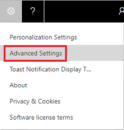
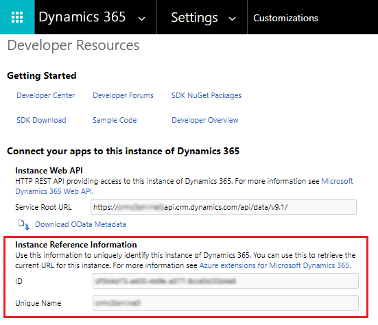

# Determine your environment's organization ID and name

There are two ways to find your organization ID and name. 

## Using Advanced Settings

1. Go to **Settings** () > **Advanced Settings**.

   > [!div class="mx-imgBorder"] 
   > 

2. Go to **Settings** > **Customizations** > **Developer Resources**.
3. Under **Instance Reference Information**, make note of **ID** and **Unique Name**. **Unique Name** is the organization name.

## Using the web app

1. In the web app, go to **Settings** > **Customizations** > **Developer Resources**.
2. Under **Instance Reference Information**, make note of **ID** and **Unique Name**. **Unique Name** is the organization name.

## The organization ID and unique name

> [!div class="mx-imgBorder"] 
> 
