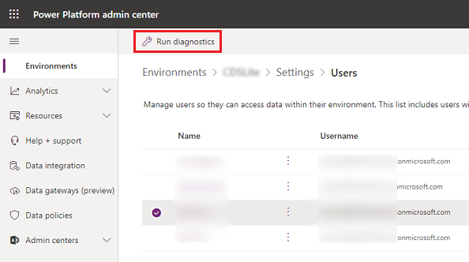
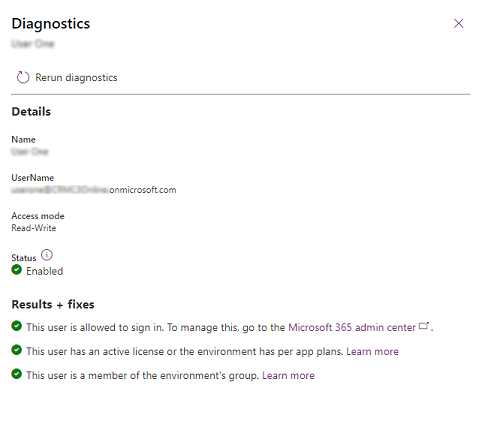

# Diagnose user access in an environment 

Multiple factors affect user access to Microsoft Dataverse environments. Administrators can use the **Run diagnostics** command to assess user access to a Dataverse environment, and get details and mitigation suggestions as to why a user can or can't access the environment.

To access a Dataverse environment, a user must meet the following criteria:

1. Be enabled for sign-in in Azure Active Directory (Azure AD).
2. Have a valid license that has a Dynamics 365 or Microsoft Power Platform recognized service plan, or the environment must have active per-app plans.
3. Be a member of the environment's Azure AD group (if one has been associated with the environment).
4. Have at least one Dataverse security role assigned directly to them or to a [group team](manage-group-teams.md) they're a member of.

A user's level of access within the environment and to the resources (apps and data) in the environment is determined by the privileges defined in the security roles assigned to that user. Their access mode being [Administrative](create-users-assign-online-security-roles.md#create-an-administrative-user-account) or [Read-Write](create-users-assign-online-security-roles.md#create-a-read-write-user-account) also determines their level of access within an environment.

Use the following steps to run user access diagnostics on a user in a Dataverse environment.

1. In the [Power Platform admin center](https://admin.powerplatform.microsoft.com), select an environment. 

2. Select **Settings** > **Users + permissions** > **Users**.  

3. Select a user. 

4. Select **Run diagnostics**.

   > [!div class="mx-imgBorder"] 
   >  

5. Review the details for the user, and take any needed corrective actions.

   > [!div class="mx-imgBorder"] 
   > 

> [!NOTE]
> The action of running or rerunning diagnostics will force the user information in Azure AD to synchronize to the environment's Dataverse database to provide up-to-date status on the user's properties. If the diagnostic run doesn't eliminate the root cause of a user access issue, please provide the results of the diagnostic run in the support ticket you create; this will greatly help Microsoft Support engineers to resolve your issue faster.

## Known issue

The check for the presence of security roles assigned to a user only checks for roles directly assigned to the user and can't currently check for roles inherited through group team memberships.
