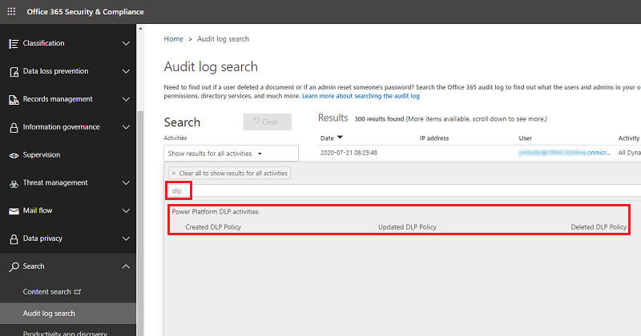

# Data loss prevention activity logging

Data Loss Protection (DLP) policy activities are now tracked from the [Microsoft 365 Security & Compliance Center](https://go.microsoft.com/fwlink/?LinkID=824876). 

Follow these steps.

1. Sign in to the [Security & Compliance Center](https://protection.office.com) as a tenant admin.

2. Select **Search** > **Audit log search**. 

3. Under **Search** > **Activities**, enter "dlp". You'll see a list of activities for Power Platform DLP.

   > [!div class="mx-imgBorder"] 
   > 

4. Select an activity, click outside the search window to close it, and then select **Search**.

Within the Audit log search screen, Power Platform admins can search audit logs across many popular services including eDiscovery, Exchange, Power BI, Azure AD, Microsoft Teams, customer engagement apps (Dynamics 365 Sales, Dynamics 365 Customer Service, Dynamics 365 Field Service, Dynamics 365 Marketing, and Dynamics 365 Project Service Automation), and Power Platform. 

Once the Audit log search screen is accessed, an administrator can filter for specific activities by pulling down the **Activities** dropdown. By scrolling down the list, a section dedicated to Microsoft Power Platform activities can be found. 

## What DLP events are audited 

The following are the user actions you can audit:

|Event  |Description  |
|---------|---------|
|Created DLP Policy      | When a new DLP policy is created         |
|Updated DLP Policy      | When an existing DLP policy is updated          |
|Deleted DLP Policy      | When a DLP policy is deleted         |
 
## Base schema for DLP audit events 

Schemas define which fields are sent to the Microsoft 365 Security and Compliance Center. Some fields are common to all applications that send audit data to Microsoft 365, while others are specific to DLP policies. In the below table, Name and Additional Info are the DLP policy specific columns. 

|Field name  |Type  |Mandatory  |Description  |
|---------|---------|---------|---------|
|Date     |Edm.Date|No         |Date and time of when the log was generated in UTC          |
|App Name   |Edm.String         |No         |Unique Identifier of the PowerApp        |
|Id     |Edm.Guid         |No         |Unique GUID for every row logged          |
|Result Status     |Edm.String         |No         |Status of the row logged. Success in most cases.          |
|Organization Id     |Edm.Guid         |Yes        |Unique identifier of the organization from which the log was generated.       |
|CreationTime     |Edm.Date         |No         |Date and time of when the log was generated in UTC          |
|Operation     |Edm.Date         |No         |Name of operation         |
|UserKey     |Edm.String         |No         |Unique Identifier of the User in Azure AD       |
|UserType     |Self.UserType         |No         |The audit type (Admin, Regular, System)         |
|Additional Info     |Edm.String        |No         |Additional information if any (e.g. the environment name)       |

### Additional Info 

The Additional Info field is a JSON object that contains operation-specific properties. For a DLP policy operation, it contains the following properties: 


|Field name   |Type  |Mandatory  |Description  |
|---------|---------|---------|---------|
|PolicyId     | Edm.Guid         | Yes        | Unique identifier of the policy (GUID)         |
|PolicyType     | Edm.String         | Yes        | Policy type. Allowed values are AllEnvironments, SingleEnvironment, OnlyEnvironments, ExceptEnvironments         |
|DefaultConnectorClassification     | Edm.String         | Yes        | Default connector classification. Allowed values are General, Blocked, Confidential         |
|EnvironmentName     | Edm.String         | No        | Name (GUID) of the environment. Only present for SingleEnvironment policies.         |
|ChangeSet     | Edm.String         | No        | Changes made to the policy. Only present for “Update” operations.         |

Here’s what the Additional Info JSON might look like for a “Create” or “Delete” event: 

```json
{ 
  "policyId": "eb1e0480-0fe9-434e-9ad8-df4047a666ec", 
  "policyType": "SingleEnvironment", 
  "defaultConnectorClassification": "General", 
  "environmentName": "8a11a4a6-d8a4-4c47-96d7-3c2a60efe2f5" 
} 
```

Here’s what the Additional Info JSON might look like for an “Update” operation that: 

- Changes the policy name from “oldPolicyName” to “newPolicyName” 
- Changes the default classification from “General” to “Confidential” 
- Changes the policy type from “OnlyEnvironments” to “ExceptEnvironments” 
- Moves the Azure Blob Storage connector from the General to the Confidential bucket 
- Moves the Bing Maps connector from the General to the Blocked bucket 
- Moves the Azure Automation connector from the Confidential to the Blocked bucket 

```json
{ 
  "policyId": "eb1e0480-0fe9-434e-9ad8-df4047a666ec", 
  "policyType": "ExceptEnvironments", 
  "defaultConnectorClassification": "Confidential", 
  "changeSet": { 
    "changedProperties": [ 
      { 
        "name": "ApiPolicyName", 
        "previousValue": "oldPolicyName", 
        "currentValue": "newPolicyName" 
      }, 
      { 
        "name": "DefaultConnectorClassification", 
        "previousValue": "General", 
        "currentValue": "Confidential" 
      }, 
      { 
        "name": "DlpPolicyType", 
        "previousValue": "OnlyEnvironments", 
        "currentValue": "ExceptEnvironments" 
      } 
    ], 
    "connectorChanges": [ 
      { 
        "name": "Azure Blob Storage", 
        "id": "/providers/Microsoft.PowerApps/apis/shared_azureblob", 
        "previousValue": { 
          "classification": "General" 
        }, 
        "currentValue": { 
          "classification": "Confidential" 
        } 
      }, 
      { 
        "name": "Bing Maps", 
        "id": "/providers/Microsoft.PowerApps/apis/shared_bingmaps", 
        "previousValue": { 
          "classification": "General" 
        }, 
        "currentValue": { 
          "classification": "Blocked" 
        } 
      }, 
      { 
        "name": "Azure Automation", 
        "id": "/providers/Microsoft.PowerApps/apis/shared_azureautomation", 
        "previousValue": { 
          "classification": "Confidential" 
        }, 
        "currentValue": { 
          "classification": "Blocked" 
        } 
      } 
    ] 
  } 
} 
```

### See also
[Data loss prevention policies](wp-data-loss-prevention.md)