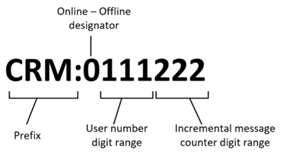

# Use Email message filtering and correlation to specify which emails are tracked 

[!INCLUDE [cc-data-platform-banner](../includes/cc-data-platform-banner.md)]

Server-side synchronization, [!INCLUDE[pn_microsoft_dynamics_crm_for_outlook](../includes/pn-microsoft-dynamics-crm-for-outlook.md)], or the Email Router can automatically create email activities in customer engagement apps (Dynamics 365 Sales, Dynamics 365 Customer Service, Dynamics 365 Field Service, Dynamics 365 Marketing, and Dynamics 365 Project Service Automation), which are based on received email messages. This type of automation is known as email message tracking. Users can select a filtering option that determines what email messages will be tracked. Filtering is set on the **Email** tab of the **Set Personal Options** dialog box in the client applications. Users can set the following options:  

- **All email messages**. All email messages received by the user are tracked (will have activities created).  

- **Email messages in response to email**. Only replies to email messages that have already been tracked will be saved as email activities. This option uses [smart matching](../admin/email-message-filtering-correlation.md#BKMK_smartmatching), a correlation method that uses the existing properties contained in the email to relate email messages to activities.  

- **Email messages from Leads, Contacts, and Accounts**. Only email messages sent from leads, contacts, and accounts in the database are saved as activities.  

- **Email messages from records that are email enabled**. Email messages are tracked from any record type that contains an email address, including customized record types (entities).  

By default, the **Email messages in response to email** option is enabled. Correlation occurs after an email message is filtered. System administrators can turn off all message tracking for a particular user by setting **Incoming Email** under **Synchronization Method** to **None** on the Mailbox form.  

Email correlation is set on the **Email** tab of the System Settings page and can be enabled or disabled for the entire organization. Customer engagement apps uses two kinds of correlation, tracking tokens and smart matching. By default, both correlation types are enabled.  

> [!IMPORTANT]
>  Tracking tokens are the only supported correlation method that can be used when you use [!INCLUDE[pn_crm_for_outlook_short](../includes/pn-crm-for-outlook-short.md)] connected to an SMTP server and send email to a non-Exchange recipient. In this situation, if tracking tokens are not enabled, then correlation events, such as the automatically creating records based on the regarding object, may not work.  

## How customer engagement apps uses conversations to track emails  
 Use [!INCLUDE[pn_Exchange](../includes/pn-exchange.md)] conversations to increase the probability for email identification and matching. [!INCLUDE[pn_Exchange](../includes/pn-exchange.md)] groups together related email and assigns them an id (conversation id), to identify emails that are part of one conversation.  

1. In the Power Platform admin center, select an environment. 

2. Select **Settings** > **Email** > **Email tracking**.  

3. In the **Configure folder-level tracking and email correlation** area, turn on **Use correlation**.  

   If enabled, this option uses the conversation id to identify all the emails that replied to a tracked email.  

## How customer engagement apps associates email addresses with records

When customer engagement apps tracks an email, it associates the email address to a record within customer engagement apps. The contents of the email **From** field can only be associated with one record. If there are duplicate records within customer engagement apps with the same email address, the contents of the email **From** field will resolve to the first active record in the following order:

1. SystemUser
2. Contact
3. Account
4. Lead
5. Equipment
6. Team
7. Business unit
8. Email-enabled entities (for example: Queues, custom, etc.)

In the email **To** field, all of the records of email-enabled entities with the email address will be listed.

   

## How customer engagement apps use tracking tokens  
 Tracking tokens increase the probability for email identification and matching. You can use the tracking token feature to improve email message tracking. A tracking token is an alphanumeric string generated by customer engagement apps and appended to the end of an email subject line. It matches email activities with email messages.  

 Tracking tokens add an additional correlation component to smart matching. When customer engagement apps generates an outgoing email activity, a resulting email response arriving in the Dynamics 365 apps system is then correlated to the originating activity.  

 By default, the tracking token feature is turned on.  

### Tracking token structure  
 By default, customer engagement apps uses the following token structure, that consists of a 4 character prefix and a 7 digit identifier.  

   

 The following table lists tracking token parts and descriptions.  

|                  Part                   |                                                                                                                                                                                                                                                                                Description                                                                                                                                                                                                                                                                                |
|-----------------------------------------|---------------------------------------------------------------------------------------------------------------------------------------------------------------------------------------------------------------------------------------------------------------------------------------------------------------------------------------------------------------------------------------------------------------------------------------------------------------------------------------------------------------------------------------------------------------------------|
|                 Prefix                  |                                                                                               Configurable from 1-20 characters. The default value is *Dynamics 365 apps:*. The prefix can be unique for each organization or environment. For example, in a multi-tenant deployment of customer engagement apps, we recommend that each organization configure and use a unique prefix.                                                                                               |
|     Deployment base tracking number     |                                                                                                                                                                                 Configurable from 0-2,147,483,647. Default value is 0. Can be used as an identifier for a specific environment.                                                                                                                                                                                  |
|         User number digit range         |                                                                                                                          Configurable from 1-9. The default range is three (3) digits. This value determines how many digits to use when customer engagement apps generates the numeric identifier for the user who generated the email activity.                                                                                                                          |
| Incremental message counter digit range | Configurable from 1-9. Default range is three (3) digits. This value determines how many digits to use when customer engagement apps generates the numeric identifier for the email activity (not the individual messages that the activity contains). If you use the default value to generate a token with a three-digit number, it will increment the number through 999, and then restart the number at 000. You can use a larger order of digits to reduce the possibility of assigning duplicate tokens to active email threads. |

 Although we don't recommend it because it can significantly reduce the probability for accurate email activity to email message correlation, you can turn tacking tokens off. To enable, disable, or configure tracking tokens, do the following:  

1.  Go to **Settings** > **Administration** > **System Settings**.  

2.  Click the **Email** tab.  

3.  In the **Configure email correlation** area you can disable, enable, or change the default tracking token structure.  

   
## What is smart matching?  
 When an incoming email message is processed by the Email Router, the system extracts information associated with the email message subject, sender address, and recipients' addresses that link the email activity to other records. This correlation process, also known as smart matching, uses the following criteria to match received email message information to email activities:  

- **Subject matching**. Prefixes, such as RE: or Re:, and letter case are ignored. For example, email message subjects with *Re: hello* and *Hello* would be considered a match.  

- **Sender and recipient matching**. The system calculates the number of exact sender and recipient email addresses in common.  

When the matching process is complete, the system selects the owner and the object of the incoming email message.  

By default, smart matching is turned on.  

> [!NOTE]
>  You can disable, enable, and tune smart-matching settings in the [System Settings dialog box – Email tab](system-settings-dialog-box-email-tab.md).  

### See also  
 [Forward mailbox vs. individual mailboxes](../admin/forward-mailbox-vs-individual-mailboxes.md)
