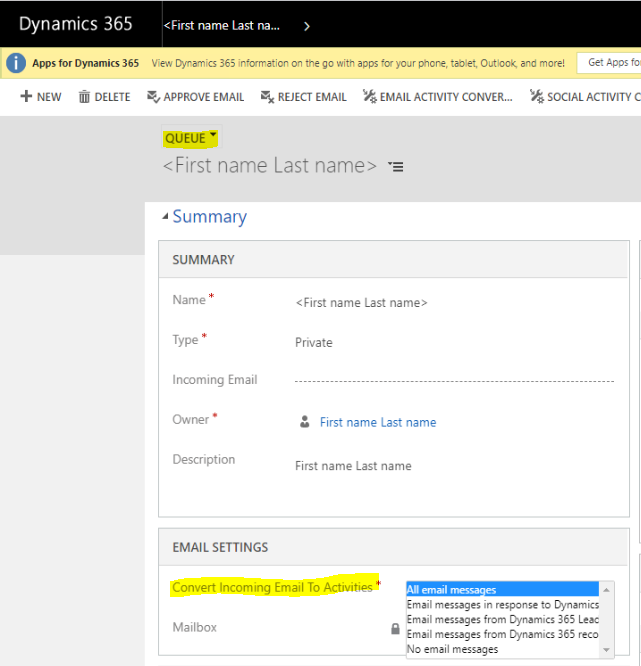

# Use email message filtering and correlation to specify which emails are tracked 

With server-side synchronization and Dynamics 365 App for Outlook, you can automatically create email activities in customer engagement apps (such as [Dynamics 365 Sales](/dynamics365/sales-professional/help-hub), [Dynamics 365 Customer Service](/dynamics365/customer-service/help-hub), [Dynamics 365 Marketing](/dynamics365/marketing/help-hub), [Dynamics 365 Field Service](/dynamics365/field-service/overview), and [Dynamics 365 Project Service Automation](/dynamics365/project-operations/psa/overview)). These apps are based on received email messages. 

With automation to track email messages users can select a filter option that determines which email messages are tracked. 

Users can set the following email filter options in the **Set Personal Options** dialog box on the **Email** tab. For more information, see [Set personal options that affect tracking and synchronization between customer engagement apps and Outlook or Exchange](set-personal-options-affect-tracking-synchronization-between-dynamics-365-outlook-exchange.md).

- **All email messages**: All email messages received by the user are tracked in Dynamics 365 as an email activity.

- **Email messages in response to email**: Only replies to email messages that have already been tracked are saved as email activities in Dynamics 365.

- **Email messages from Leads, Contacts, and Accounts**: Only email messages sent which resolve to a lead, contact, or account row in Dynamics 365 is saved as activities.

- **Email messages from records that are email enabled**: Email messages are tracked from any row  that resolves to an email address in Dynamics 365, including custom tables.

- **No email messages**: No email messages received by the user are tracked (will have activities created). This option only affects auto tracked emails.

> [!NOTE]
> These options are configurable to automatically track sent items and can also be configured for queues and queue mailboxes.

   > [!div class="mx-imgBorder"] 
   > 

Emails that are manually tracked by a user in Outlook via [Dynamics 365 App for Outlook](/dynamics365/outlook-app/dynamics-365-app-outlook-user-s-guide), [folder-level tracking](configure-outlook-exchange-folder-level-tracking.md), or [Outlook category](use-outlook-category-track-appointments-emails.md) are synchronized with Dynamics 365 regardless of the configured filter options, as the user wants to manually track the email into Dynamics 365.

The **Email messages sent in response to email** options is turned on by default. Correlation occurs after an email message is filtered. An administrator can turn off all message tracking for a particular user by setting **Incoming Email** under **Synchronization Method** to **None** on the **Mailbox** form. This means server-side synchronization won't process the mailbox for incoming emails, so no incoming emails from the mailbox will be tracked in Dynamics 365.

An administrator can by enable or disable email correlation from the **[System Settings](system-settings-dialog.md)** dialog box on the **Email** tab at the organization level.

## Use conversations to track emails  

Dynamics 365 uses the following information from an email to determine if a new email correlates to an existing email message in Dynamics 365:

- **MessageId** (hidden in email client user interface but stamped on the email message header): Uniquely identifies an email message which is stamped on every email message.

- **InreplyTo** (hidden in email clien tuser interface but stamped on the email message header): Contains the **messageId** that the email message is in reply to.

- **ConversationIndex** (hidden in email client user interface but stamped on the email message headerr): Contains data that associates an email message to an email thread.

- **Tracking token in subject** (visible in the email subject): Dynamics 365 concept that's stamped directly in the subject line.

- **Subject words and recipients** (visible in the header): Smart matching which is a Dynamics 365 concept that uses this information based on configuration.

The email correlation logic goes through each of theses correlation options, in this order:

1. **In reply to correlation**: When an email message is analyzed for correlation, if the **inreplyto** header is present and contains a **messageId** of an email message that's already in Dynamics 365, the email is correlated to existing email message. This is set to **ON** by default, which is recommended. The email correlation is accurate, there is no false positives.

    > [!div class="mx-imgBorder"] 
    > 

2. **Tracking token correlation**: When an email message is analyzed for correlation, if the subject contains a tracking token, then the system searches for existing emails in Dynamics 365 looking the same tracking token. If there's a match, then the new email message is tracked and related to it the exiting email. This is option is set to **On** by default.

   > [!NOTE]
   > Tracking token information is visible to the user and it can be changed which can cause an email to correlate with the wrong email.

     > [!div class="mx-imgBorder"] 
     > 

3. **Conversation Index:** When an email message is analyzed for correlation, if a conversationIndex is present in the headers, and another email message is found in dynamics with the same conversationIndex header, the email message will be correlated

    > [!div class="mx-imgBorder"] 
    > 

4. **Smart matching**: When an email message is analyzed for correlation, the recipients and the words in the subject are extracted, email messages with similar recipients and enough matching subject words will be correlated to it. For more information, see [Smart matching](email-message-filtering-correlation.md#smart-matching).

   > [!NOTE]
   > Smart matching can cause email correlation to hit false positives, hence it is not recommended to enable it. However, it is available in case you need to correlate emails which don't belong to the same email thread. 

    > [!div class="mx-imgBorder"] 
    > 

   

## How customer engagement apps use tracking tokens  
A tracking token is an alphanumeric string generated by customer engagement apps and appended to the end of an email subject line. It matches email activities with email messages.

Tracking tokens add an additional correlation component. When your app generates an outgoing email activity, a resulting email response arriving in the Dynamics 365 apps system is then correlated to the originating activity.

By default, the tracking token feature is turned on.

### Tracking token structure  

By default, customer engagement apps use the following token structure, that consists of a four character prefix and a 7-digit identifier.

   

 The following table lists tracking token parts and descriptions.  

|                  Part                   |                                                                                                                                                                                                                                                                                Description                                                                                                                                                                                                                                                                                |
|-----------------------------------------|---------------------------------------------------------------------------------------------------------------------------------------------------------------------------------------------------------------------------------------------------------------------------------------------------------------------------------------------------------------------------------------------------------------------------------------------------------------------------------------------------------------------------------------------------------------------------|
|                 Prefix                  |                                                                                               Configurable from 1-20 characters. The default value is *Dynamics 365 apps*:. The prefix can be unique for each organization or environment. For example, in a multi-tenant deployment of customer engagement apps, we recommend that each organization configure and use a unique prefix.                                                                                               |
|     Deployment base tracking number     |                                                                                                                                                                                 Configurable from 0-2,147,483,647. Default value is 0. Can be used as an identifier for a specific environment.                                                                                                                                                                                  |
|         User number digit range         |                                                                                                                          Configurable from 1-9. The default range is three (3) digits. This value determines how many digits to use when customer engagement apps generates the numeric identifier for the user who generated the email activity.                                                                                                                          |
| Incremental message counter digit range | Configurable from 1-9. Default range is three (3) digits. This value determines how many digits to use when customer engagement apps generates the numeric identifier for the email activity (not the individual messages that the activity contains).   [!NOTE] If you use the default value to generate a token with a three-digit number, it will increment the number through 999, and then restart the number at 000. You can use a larger order of digits to reduce the possibility of assigning duplicate tokens to active email threads.|

 To enable, disable, or configure tracking tokens, do the following::  

1.  Go to **Settings** > **Administration** > **System Settings**.  

2.  Click the **Email** tab.  

3.  In the **Configure email correlation** area you can disable, enable, or change the default tracking token structure.  

   

## Smart matching  
 When an incoming email message is processed by server-side sync, the system extracts information associated with the email message subject, sender address, and recipients' addresses that link the email activity to other rows. This correlation process, also known as smart matching, uses the following criteria to match received email message information to email activities:

- **Subject matching**: Prefixes, such as RE: or Re:, and letter case are ignored. For example, email message subjects with *Re: hello* and *Hello* would be considered a match..  
- **Sender and recipient matching**: The system calculates the number of exact sender and recipient email addresses in common.

When the matching process is complete, the system selects the owner and the object of the incoming email message.

By default, smart matching is turned off.  

> [!NOTE]
>  You can disable, enable, and modify smart-matching settings in the [System Settings dialog box – Email tab](system-settings-dialog-box-email-tab.md).  

### How does smart matching work

Smart matching relies completely on the existence of similarity between emails. The subject and recipients (from, to, cc and bcc) list are the two important components that are considered with checking for similarity.

When an email is sent from Dynamics 365, there is two sets of hashes that are generated and stored in the database.

- **Subject hashes**: To generate subject hashes, the subject of the email, which may include the Dynamics 365 token if its usage is enabled in system settings, is first checked for noise words like RE: FW: etc. The noise words are stripped off the subject and then tokenized. All the non empty tokens (words) are then hashed to generate subject hashes.

- **Recipient hashes**: To generate the recipient hashes the recipient (from, to, cc, bcc) list is analyzed for unique email addresses. For each unique email address an address hash is generated.

Next when an incoming email is tracked (arrived) in Dynamics 365, the same method is followed to create the subject and recipient hashes.

To find the correlation between the incoming email and the outgoing email the stored subject and recipient hashes are searched for matching values. Two emails are correlated if they have the same count of subject hashes and at least two matching recipient hashes.

### How can smart matching be configured?

There are advanced settings that allow you to manipulate the smart matching behavior.

-  **HashFilterKeywords**: This is a regular expression that is used to cancel out the noise in the subject line. All matching instances of the regular expression present in the subject line are replaced with empty strings before generating the subject hashes.  **Default value**: ^\[\\s\]\*(\[\\w\]+\\s?:\[\\s\]\*)+

Basically it indicate that we internally (by default) will ignore any word at (multiples of it) at the start of the subject line that has a ":" at the end of it example:

|     | **Subject**  | **Ignored words** |
|-----|--------------|-------------------|
| 1   | Test         | None              |
| 2   | RE: Test     | RE:               |
| 3   | FW: RE: Test | FW: RE:           |

> [!NOTE]
>  By default we do not ignore starting phrases in the subject line like "Out of office:" as this does not have the first word with the ":" next to it. For ignoring this phrase you can update the regular expression in the registry as "^\[\\s\]\*(\[\\w\]+\\s?:\[\\s\]\*)+\|Out of office:". Do not place the double quote that I have around the string in the example into the registry. The text in the registry should only be the regular expression you want to use for ignoring words from the subject line.

- **HashMaxCount**:This is the max number of hashes that are generated for any subject or recipient list. For example, if the subject after noise cancellation contains more than 20 words only the first 20 words are considered.   **Default value**: 20

- **HashDeltaSubjectCount**: This is the maximum delta allowed between subject hash counts of the emails to be correlated.   **Default value**: 0

- **HashMinAddressCount**: This is the minimum hash count matches required on the recipients list for the emails to be correlated.   **Default value**: 2

### See also  
 [Forward mailbox vs. individual mailboxes](../admin/forward-mailbox-vs-individual-mailboxes.md)  
 [Associate an email address with a row](associate-email-address .md)

[!INCLUDE[footer-include](../includes/footer-banner.md)]
