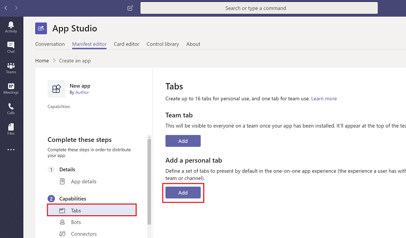
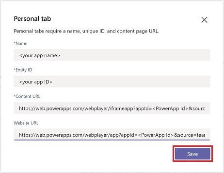
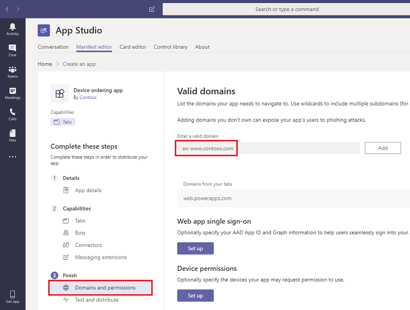
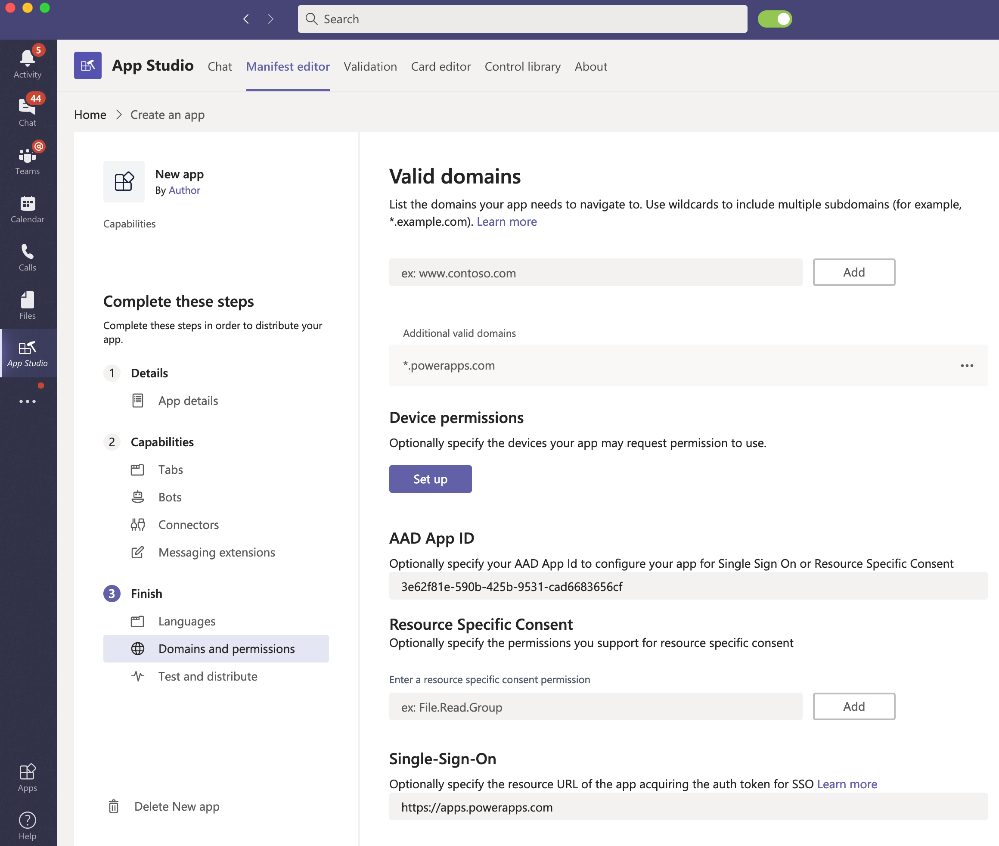
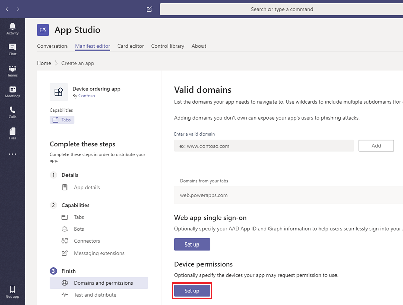
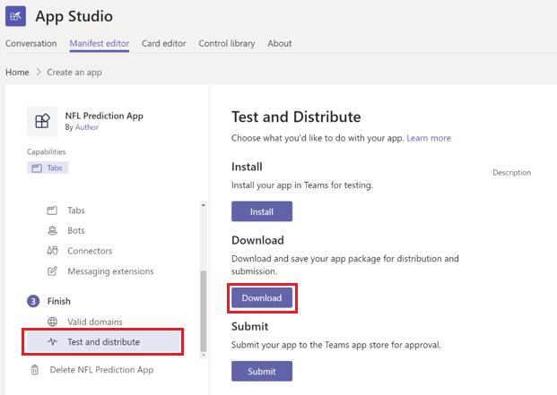
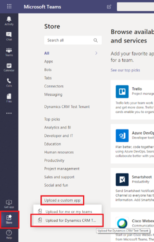
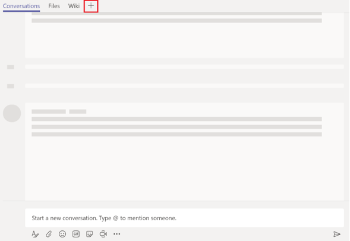

# Embed an app in Microsoft Teams

As an admin, you can share apps created in Power Apps to users in your tenant through Microsoft Teams. Upload the apps so they show up for **all** teams in your tenant under the **All tabs section**. 

Individuals can share an app they've created in Power Apps in a Team they are a member of by following these [instructions](https://docs.microsoft.com/powerapps/maker/canvas-apps/share-app). 

> [!NOTE]
> Team custom app policies must be set to allow uploading custom apps. Check out [custom app settings](https://docs.microsoft.com/MicrosoftTeams/teams-custom-app-policies-and-settings#custom-app-policy-and-settings). 

## Prerequisites

- [Have a Power Apps license](pricing-billing-skus.md)
- Be a Power Platform service admin 
- Created a canvas app

## Locate your app's GUID

Find and make note of your app's GUID to use in a later step.

1. Sign in to [https://make.powerapps.com](https://make.powerapps.com), and then select **Apps** in the menu.

   > [!div class="mx-imgBorder"] 
   > 

2. Select **More Commands** (...) for the app you want to share in Teams, and then select **Details**.

   > [!div class="mx-imgBorder"] 
   > 

3. Record the **App ID** for later use.

   > [!div class="mx-imgBorder"] 
   > 

## Install App Studio

You can skip these steps if App Studio is already installed. 

1. In Teams, select **Apps** in the lower-left of the Teams menu ().

2. Search for "App Studio" in the search box and then select it.

   > [!div class="mx-imgBorder"] 
   > 

3. Select **Install**. 

   > [!div class="mx-imgBorder"] 
   > 

4. Select **Open** for the App feature.

   > [!div class="mx-imgBorder"] 
   > 

## Create a Teams app

1. In Teams, open App Studio.

   > [!div class="mx-imgBorder"] 
   > 

2. Select the **Manifest editor** tab, and then select **Create a new app** under Welcome.

   > [!div class="mx-imgBorder"] 
   > 

3. Fill in information about your app in the **App Details** page.  For the App ID GUID, you should use your app's ID GUID you recorded above.  This will avoid duplication of Teams apps for a particular app.
 
   > [!div class="mx-imgBorder"] 
   > 

   |Fields  |Description  |
   |---------|---------|
   |**App names** |    |
   |Short name     | Required. The short display name for the app. 30 character limit.        |
   |Long name     | The full name of the app, used if the full app name exceeds 30 characters.       | 
   |**Identification**     |         |
   |App ID     | Required. The unique Microsoft-generated identifier for this app.        |
   |Package Name     | Required. A unique identifier for this app in reverse domain notation; for example, com.example.myapp.       |
   |Version     | Required. The version of the specific app. If you update something in your manifest, the version must be incremented as well.     |
   |**Descriptions**    |     |
   | Short description    | Required. A short description of your app experience, used when space is limited. 80 character limit.   |
   | Long description    | Required. The full description of your app.     |
   | **Developer information**    |     |
   | Name    | Required. The display name for the company or developer.     |
   | Website    | Required. The https:// URL to the website for your app via powerapps.com. When someone clicks to install and sees the About page, it should link to the web version of your app.   |
   | **App URLs**    | These links will show up in the **About** page along with the website URL.     |
   | Privacy statement    | Required. The https:// URL to the developer's privacy policy. [Example](https://go.microsoft.com/fwlink/p/?LinkID=698505).   |
   | Terms of use    | Required. The https:// URL to the developer's terms of use.  [Example](https://go.microsoft.com/fwlink/p/?LinkID=698507).  |
   | **Branding**    |     |
   | Full color    | A relative file path to a full color 192x192 PNG icon.    |
   | Transparent outline    |A relative file path to a transparent 32x32 PNG outline icon.     |
   | Accent color    | A color to use in conjunction with and as a background for your outline icons.     |

For more information, see [Manifest Editor](https://docs.microsoft.com/microsoftteams/platform/get-started/get-started-app-studio#manifest-editor) and [Manifest schema](https://docs.microsoft.com/microsoftteams/platform/resources/schema/manifest-schema).

4. Scroll down to the Branding section and add your logos and the accent color desired for your app.  These are the logos that will appear for your app in Teams. 

   > [!div class="mx-imgBorder"] 
   > 

5. Under **Capabilities**, select **Tabs**.

**Add a Team tab (Steps 6 and 7) or a Personal tab (Steps 8 and 9)**

6. Under **Team tab** select **Add**.

   > [!div class="mx-imgBorder"] 
   > 

7. Add your app's configuration URL in the "Configuration URL" input field, using the following format: `https://apps.powerapps.com/play/<your app ID>?source=teamstab&locale={locale}&channelId={channelId}&channelType=&{channelType}&chatId=${chatId}&groupId={groupId}&hostClientType={hostClientType}&isFullScreen={isFullScreen}&subEntityID={subEntityID}&teamId={teamId}&teamType={teamType}&theme={theme}&userTeamRole={userTeamRole}`

   Replace `<App ID>` with the App ID GUID you recorded above.

   Select the [scope](https://docs.microsoft.com/microsoftteams/platform/concepts/tabs/tabs-overview) for your app to appear in. Ensure **Can update configuration** is checked, select **Save**, and then skip to Step 10.

   > [!div class="mx-imgBorder"] 
   > 

**--OR--**

8. To configure the Teams manifest, under **Add a personal tab** select **Add**.

   > [!div class="mx-imgBorder"] 
   > 

9. Fill in the following fields, and then select **Save**.

   **Name**: your app name 
   **Entity ID**: your app ID  
   **Content URL**: `https://apps.powerapps.com/play/<your app ID>?source=teamstab&locale={locale}&channelId={channelId}&channelType=&{channelType}&chatId=${chatId}&groupId={groupId}&hostClientType={hostClientType}&isFullScreen={isFullScreen}&subEntityID={subEntityID}&teamId={teamId}&teamType={teamType}&theme={theme}&userTeamRole={userTeamRole}`  
   **Website URL**: `https://apps.powerapps.com/play/<your app ID>?source=teamsopenwebsite&locale={locale}&channelId={channelId}&channelType=&{channelType}&chatId=${chatId}&groupId={groupId}&hostClientType={hostClientType}&isFullScreen={isFullScreen}&subEntityID={subEntityID}&teamId={teamId}&teamType={teamType}&theme={theme}&userTeamRole={userTeamRole}`

   > [!div class="mx-imgBorder"] 
   > 

**Add the app to all teams in your tenant**

10. Under **Finish**, select **Domains and permissions**. Add ***.powerapps.com** as a valid domain for the Teams application.

    > [!div class="mx-imgBorder"] 
    > 

11. To enable single sign-on, set the **AAD App ID** to `3e62f81e-590b-425b-9531-cad6683656cf` and the resource URL to `https://apps.powerapps.com`

    > [!div class="mx-imgBorder"] 
    > 

12. To set device permissions for your app, under **Device permissions** select **Set up**.

    > [!div class="mx-imgBorder"] 
    > 

13. Under **Finish**, select **Test and distribute**, and then select **Download**.

    > [!div class="mx-imgBorder"] 
    > 

14. Go to **Store** > **Upload a custom app** > **Upload for** [your tenant name].

    > [!div class="mx-imgBorder"] 
    > 

15. Locate your app file and select it. Then, navigate to your team and select **+**.

    > [!div class="mx-imgBorder"] 
    > 

16. You app will appear as a tile under **All Tabs**. Search for your app, select it, and then select **Save**.

    > [!div class="mx-imgBorder"] 
    > 

The app now appears as a tab for all teams in your tenant.

> [!div class="mx-imgBorder"] 
> 

