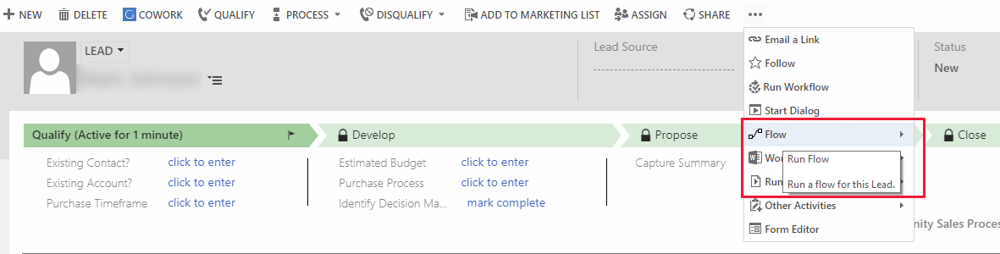

# Enable Power Automate integration to automate processes

Microsoft Power Automate lets you create automated processes between your favorite apps and services. The ability to run flows from within customer engagement apps (Dynamics 365 Sales, Dynamics 365 Customer Service, Dynamics 365 Field Service, Dynamics 365 Marketing, and Dynamics 365 Project Service Automation), such as Dynamics 365 Sales and Customer Service, make it simple for users to combine a broad spectrum of services that can be initiated from within Dynamics 365 apps, such as messaging, social engagement, and document routing services.  

Environments use the same environment in which the environment resides. For more information about Power Automate environments, see [Using environments within Power Automate](/power-automate/environments-overview-admin)
  
The Power Automate integration feature isn't available in the following service or geographic regions.

- Microsoft Power Apps US Government
- Germany

Once the Power Automate integration feature is enabled, the following privileges are added in the **Miscellaneous** section of the **Customization** tab for security roles.  
  
- Name: prvFlow
- Name: prvFlow  
  
## Prerequisites  
  
- A Power Automate connection for customer engagement apps (recommended). [!INCLUDE[proc_more_information](../includes/proc-more-information.md)] [Connectors](/connectors/)  
  
- One or more flows created in the Power Automate environment to use with customer engagement apps. [!INCLUDE[proc_more_information](../includes/proc-more-information.md)] [Create a flow by using customer engagement apps](/power-automate/connection-dynamics365)  
  
## Action required: Enable Power Automate in your organization

By default, all security roles allow users to run flows on the records that they have access to.  
  
> [!IMPORTANT]
>
> Conditional access and multifactor authentication might require you to apply certain changes. This section describes scenarios that can require your action.

- Once the Power Automate integration option is enabled, it can't be disabled.
- If you're using Conditional Access polices to limit access to Power Automate and its features, the following apps must be included in **Cloud apps** policy application:

    - Microsoft PowerApps
    - Microsoft Flow

- Currently, *having conditional access to only Microsoft Flow isn't enough*. Learn how to set up Conditional Access policies in the following articles:

    - [Plan a Conditional Access deployment](/azure/active-directory/conditional-access/plan-conditional-access)
    - [Control Access to Power Apps and Power Automate with Microsoft Entra Conditional Access Policies](https://devblogs.microsoft.com/premier-developer/control-access-to-power-apps-and-power-automate-with-azure-ad-conditional-access-policies/#:~:text=Control%20Access%20to%20Power%20Apps%20and%20Power%20Automate,a%20Conditional%20Access%20Policy.%20...%204%20Summary.%20)

- If your organization uses Conditional Access policies that require multifactor authentication (MFA), ensure that your policies apply consistent MFA requirements to both the embedding application (such as SharePoint, Microsoft Teams, or Excel) and **Microsoft Flow Service** (Application ID: `7df0a125-d3be-4c96-aa54-591f83ff541c`).

- Flow Service is the API that host applications call when users view or run flows from embedded surfaces. If MFA requirements differ between the host application and Microsoft Flow Service, the token exchange fails and users see an authentication error when they try to access flows from SharePoint, Teams, or Excel.

- The simplest approach is to target **All cloud apps** in your Conditional Access policy, or explicitly add Microsoft Flow Service alongside the host applications. For more information, see [Conditional access and multifactor authentication in Power Automate](/troubleshoot/power-platform/power-automate/administration/conditional-access-and-multi-factor-authentication-in-flow).

> [!NOTE]
> **Microsoft Flow Portal** (the Power Automate maker portal) is included in the **Office 365** application target in Conditional Access, but **Microsoft Flow Service** (the API) isn't. If your policy targets only the Office 365 app, you must also explicitly add Microsoft Flow Service to ensure consistent MFA enforcement for embedded flow experiences.

To enable Power Automate integration in your organization, follow these steps.  

1. Sign in to the [Power Platform admin center](https://admin.powerplatform.microsoft.com).

1. In the navigation pane, select **Manage**.

1. In the **Manage** pane, select **Environments**.

1. On the **Environments** page, select an environment.  

2. Select **Settings** > **Product** > **Behavior**.   
  
3. Under **Display behavior**, select **Show Power Automate on forms and in the site map** to enable Power Automate. Once enabled, this setting can't be disabled.

4. Select **Save**.

   > [!TIP]
   >  The Power Automate menu only lists flows that begin with the *When a record is selected* Microsoft Dataverse trigger and contain at least one trigger or action that references that record.

### See also
  
- [Create and edit web resources](/powerapps/maker/model-driven-apps/create-edit-web-resources)
- [Recommendations for conditional access and multifactor authentication](/troubleshoot/power-platform/power-automate/administration/conditional-access-and-multi-factor-authentication-in-flow)
- [Conditional Access: Target resources
](/entra/identity/conditional-access/concept-conditional-access-cloud-apps?tabs=powershell)

[!INCLUDE[footer-include](../includes/footer-banner.md)]
