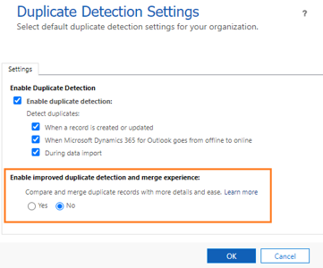

# Enable the improved duplicate detection and merge experience 

To let users in your organization use the improved duplicate detection and merge experience, you must first enable it.

**To enable**

1. In your app, on the nav bar, select the **Settings** icon, and then select **Advanced Settings**.

   The Business Management settings page opens in a new browser tab.

2. On the nav bar, select **Settings** \> **Data Management** \> **Duplicate Detection Settings**.

    **- OR -**

    In the Power Platform admin center, select **Environments** \> **Settings** \> **Data Management** \> **Duplicate Detection Settings**.

1. For **Enable improved duplicate detection and merge experience**, select **Yes** and then select **OK**.

   > [!div class="mx-imgBorder"] 
   > 

### See also
[What happens when duplicates are found while qualifying leads?](https://docs.microsoft.com/dynamics365/sales-enterprise/qualify-lead-convert-opportunity-sales#what-happens-when-duplicates-are-found-while-qualifying-leads)

