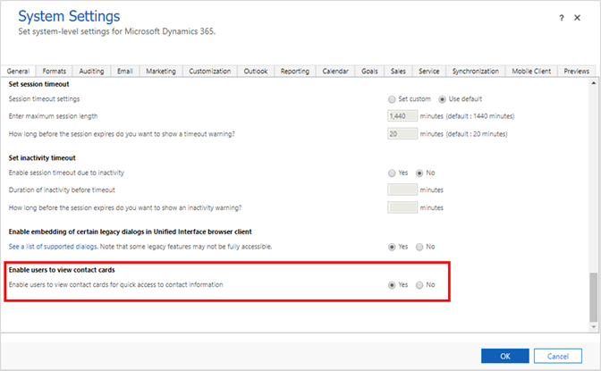

# Enable viewing profile cards

<!-- legacy procedure -->

Microsoft's people experience is centered around profile cards that have been around in Microsoft Outlook and other Office apps and services on the web. When you select someone's name or picture in Outlook or other Office apps, you can find information related to them on their profile card. The profile card is also sometimes referred to as contact card or people card. Profile cards are available on contacts and users in any Unified Interface app.

> [!NOTE]
> If multi-factor authentication has been enabled for Microsoft 365 services and not enabled for customer engagement apps (Dynamics 365 Sales, Dynamics 365 Customer Service, Dynamics 365 Field Service, Dynamics 365 Marketing, and Dynamics 365 Project Service Automation), profile cards will not be rendered for users in Unified Interface.
>
> The profile card feature involves a network call to the Microsoft 365 service to display the card. Please make sure that following endpoints are reachable, by configuring and updating network perimeter devices such as firewalls and proxy servers.
> 
> - *.loki.delve.office.com
> - loki.delve.office.com
> - loki.delve-gcc.office.com
> - lpcres.delve.office.com 
> - Port: TCP:443 
> 
> To view the complete endpoint requirements for connectivity from a user's machine to Microsoft 365 for profile cards to be displayed in Unified Interface, see [Microsoft 365 URLs and IP address ranges](https://docs.microsoft.com/office365/enterprise/urls-and-ip-address-ranges#microsoft-365-common-and-office-online) ID 130.

## Prerequisites

The following settings/environment are required for profile cards to be enabled in customer engagement apps.

1. Microsoft 365 (Exchange Online)
2. Unified Interface Build 9.1.0.4626 or higher
3. Enable Admin setting
   1. In the web app, navigate to **Settings** > **Administration** > **System Settings**
   2. Select the **General** tab.
   3. For **Enable users to view contact cards**, select **Yes**, and then **OK**.

> [!div class="mx-imgBorder"] 
> 

For information on how to use profile cards, see [View the profile card for a contact or user](https://docs.microsoft.com/powerapps/user/profile-cards).

