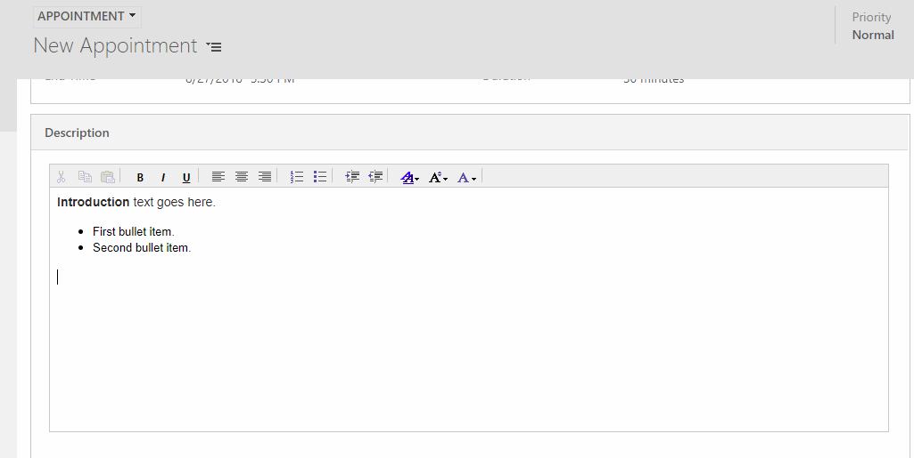

# Rich text experience for appointment activities

[!INCLUDE [cc-data-platform-banner](../includes/cc-data-platform-banner.md)]

When you enable the rich text experience, server-side synchronization and appointment activities support rich text. With the rich text editor, appointment descriptions can contain rich text. 



With rich text enabled you get the following benefits:

- Create and synchronize appointments with rich text content in the description for an improved experience in both web and the Unified Interface. 
- Include content from an HTML web page right into the description field or create your own custom markup using the appointment editor. Appointments tracked from Outlook will also render rich text content in customer engagement apps (Dynamics 365 Sales, Dynamics 365 Customer Service, Dynamics 365 Field Service, Dynamics 365 Marketing, and Dynamics 365 Project Service Automation). 
- Server-side synchronization synchronizes the rich-text HMTL content of appointment descriptions into customer engagement apps.


> [!IMPORTANT]
> To enable rich text, your version must be version 9.0, or a later version.
> 
> After enabling, if you choose to disable the setting, the appointment editor  description field will reset to the plain-text field. Previously synchronized  appointments’ description will still contain rich-text HTML markup.
>
> Although the rich text editor can be used with appointment activities, it can’t be used with recurring appointments. When an appointment that contains rich text is converted to a recurring appointment, the description field for the activity is converted to a plain-text field containing rich text content.

## Enable the rich text editor for appointments
To enable the rich text editor on appointments, you need to configure the AppointmentRichEditorExperience organization setting for your environment by running the PowerShell sample below. 

The PowerShell cmdlets require the Microsoft.Xrm.Data.PowerShell module. The sample below includes the cmdlet to install the module. 

```powershell
#Install the module
Install-Module Microsoft.Xrm.Data.PowerShell -Scope CurrentUser

# Connect to the organization
Connect-CrmOnPremDiscovery -InteractiveMode #(or Connect-CrmOnlineDiscovery -InteractiveMode)

# Retrieve the organization entity
$entities = $organizationEntity = Get-CrmRecords -conn $conn -EntityLogicalName organization -Fields appointmentricheditorexperience -TopCount 1
$organizationEntity = $entities.CrmRecords[0]

Write-Host "Appointment RTE existing value: " $organizationEntity.appointmentricheditorexperience

# Set the appointmentricheditorexperience field
$organizationEntity.appointmentricheditorexperience = $true #(or $false)

# Update the record
Set-CrmRecord -conn $conn -CrmRecord $organizationEntity  
$entities = $organizationEntity = Get-CrmRecords -conn $conn -EntityLogicalName organization -Fields appointmentricheditorexperience -TopCount 1
$organizationEntity = $entities.CrmRecords[0]

Write-Host "Appointment RTE updated value: " $organizationEntity.appointmentricheditorexperience
```


## See also
[Create or edit an appointment](https://docs.microsoft.com/dynamics365/customerengagement/on-premises/basics/create-edit-appointment)


