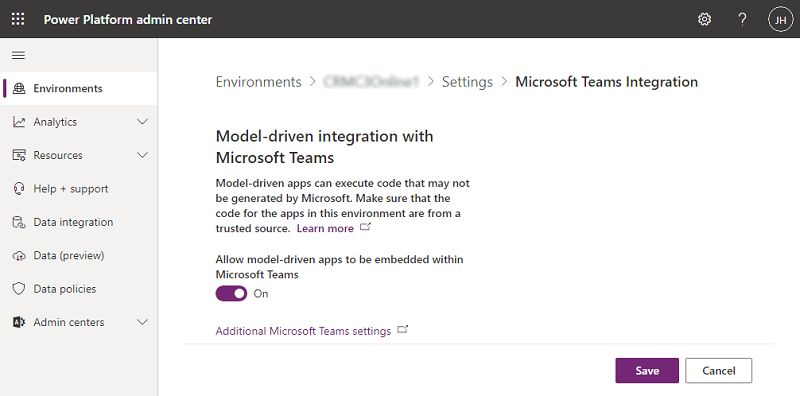
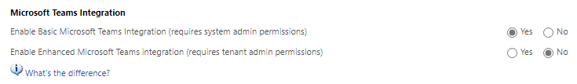

# Enable Microsoft Teams Integration for model-driven apps 

Tenant admins can select Microsoft Teams Integration to enable embedding model-driven apps into Teams. After making this selection, users can use model-driven apps in Teams without using customer engagement apps (Dynamics 365 Sales, Dynamics 365 Customer Service, Dynamics 365 Field Service, Dynamics 365 Marketing, and Dynamics 365 Project Service Automation).

> [!IMPORTANT]
> Model-driven apps can execute code that might not be generated by Microsoft. Make sure that the code for the apps in this environment are from a trusted source.

To enable embedding model-driven apps into Teams, do the following:

1. In the [Power Platform admin center](https://admin.powerplatform.microsoft.com), select **Environments** in the left pane, and then select an environment.

2. Select **Settings**.

3. Under **Integration**, select **Microsoft Teams Integration**.

4. Set **Allow model-driven apps to be embedded within Microsoft Teams** to **On**.

   > [!div class="mx-imgBorder"] 
   > 

5. Before selecting **Save**, you should consider making additional settings changes. Please review:

   - [Install and set up Microsoft Teams integration](/dynamics365/teams-integration/teams-install-app)

   Select **Additional Microsoft Teams settings** > **System Settings** > **General tab** to get to the settings described in the above link.

   > [!div class="mx-imgBorder"] 
   > 

## Next steps

After enabling this setting, follow the instructions here to embed your model-driven apps in Teams: [Embed a model-driven app as tab app in Teams](/powerapps/teams/embed-model-driven-teams-tab).

[!INCLUDE[footer-include](../includes/footer-banner.md)]