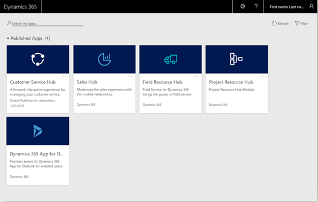
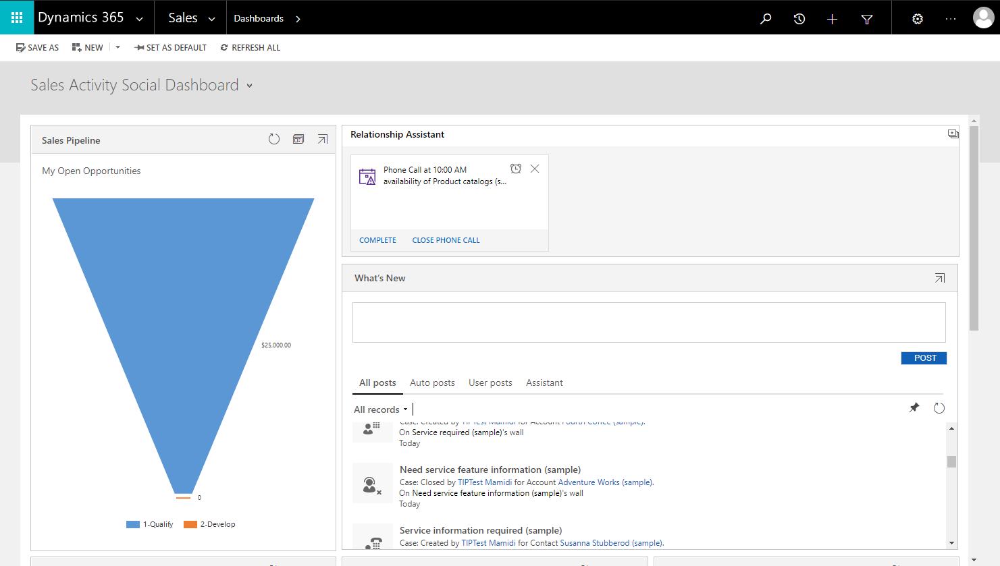
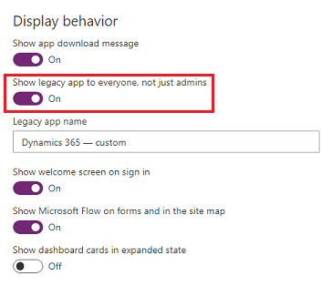
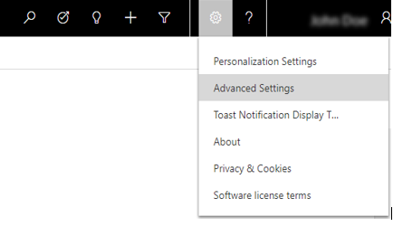

# Enable Unified Interface Only

[!INCLUDE[new-PPAC-banner](~/includes/new-PPAC-banner.md)]

In 2018, we introduced [Unified Interface](/powerapps/user/unified-interface), the latest generation of web app design for the Power Apps model-driven apps and customer engagement apps (Dynamics 365 Sales, Dynamics 365 Customer Service, Dynamics 365 Field Service, Dynamics 365 Marketing, and Dynamics 365 Project Service Automation). It brings the best in usability, accessibility, functionality, and speed to every user. Improve how your business applications run by using only Unified Interface. To learn how to enable it, see [How to enable Unified Interface Only](#how-to-enable-unified-interface-only-mode). For more information, see [What experiences are available in Unified Interface Only](#what-experiences-are-available-in-unified-interface-only-mode) and [FAQs](#faqs).

## When does the Unified Interface Only experience become available, and which environments are affected?

### New environments

All new environments with a Dataverse database, including those created in existing tenants, will be provisioned in Unified Interface Only mode per the schedule below. 

**Note**: Some geographical regions will get the changes ahead of schedule by as much as 2-3 weeks. 

|Environment types  |Release date  |
|---------|---------|
|New trial environments     | December 12, 2018         |
|New trial and production environments with a Dataverse database     | February 2, 2019        |
|New production and sandbox environments     | June 8, 2019       |

### Existing environments

Environments created before the scheduled release dates will not get this change automatically. Version 9.1.0.3448 onwards, administrators will have the option to change the environment settings to get the Unified Interface Only experience. It's recommended to switch to this mode by following the steps at [How to enable Unified Interface Only](#how-to-enable-unified-interface-only-mode).

> [!IMPORTANT]
> For existing environments, it's recommended that you:
>
> - Read [What experiences are available in Unified Interface Only](#what-experiences-are-available-in-unified-interface-only-mode) and understand how it affects end users in your environment. 
> - Test the changes in your trial or sandbox environments before applying to your production environment.

## What experiences are available in Unified Interface Only mode 

### New immersive home page experience on web

Unified Interface Only mode provides easier and quicker access to apps, and gives users the ease of working in simple purpose-built apps. Users with just one app available to their security roles land directly in the app after signing in using the environment URL (for example: https://contoso.crm.dynamics.com/). The first page they see is determined by the first page of the app. 

Users with multiple apps see the list of apps available to them, and can navigate to them by selecting the app tile. 

> [!div class="mx-imgBorder"] 
> 

> [!NOTE]
> This change applies to environment URL based sign-in (for example, https://contoso.crm.dynamics.com/) on the web. It doesn't affect users who sign in using other portals. The sign-in and home page experience for [!INCLUDE[pn_dyn-365_phones](../includes/pn-dyn-365-phones.md)] and [!INCLUDE [pn-dyn-365-tablets](../includes/pn-dyn-365-tablets.md)] remains unchanged. You can learn more at [Sign in and sign out](/dynamics365/mobile-app/dynamics-365-phones-tablets-users-guide#sign-in-and-sign-out).

### Run all apps in Unified Interface Only mode

Unified Interface is centered around the concept of modular applications known as [model-driven apps](/powerapps/maker/model-driven-apps/model-driven-app-overview). These apps allow developers and admins to streamline the data and functionality to provide exactly what end users need. 

In Unified Interface Only mode, all model-driven apps, including those created for the legacy web client, run in Unified Interface to provide superior performance and usability. 

### Deep linking apps and pages

With Unified Interface Only mode, all URLs (or deep links) open in Unified Interface in the context of the app being referenced. For more information on constructing links, see [Open forms, views, dialogs, and reports with a URL](/powerapps/developer/model-driven-apps/open-forms-views-dialogs-reports-url).

If no app is referenced in the URL, the record or page opens without any navigation elements on the page. Navigation elements like sitemap are defined using an app; URLs without apps don't have them. Users can use the app switcher to navigate to an app and continue their work.

### Dynamics 365 - custom (hidden for users)

The legacy web client app, also known as *Dynamics 365 - custom*, is hidden from end users when a new environment is provisioned. The legacy web client app should only be used temporarily for backwards compatibility with custom and third-party legacy functionality that you have not migrated to Unified Interface. It's not designed for Unified Interface and can cause unexpected errors and experience. For the best user experience, port all custom and third-party functionality to model-driven apps for Unified Interface.

> [!div class="mx-imgBorder"] 
> 

When Unified Interface Only mode is enabled, *Dynamics 365 - custom* opens in Unified Interface and not in the legacy web client. If users only have access to the Dynamics 365 – custom app and no other model-driven apps, they won't be redirected automatically when signing in using the environment URL (for example, https://contoso.crm.dynamics.com/). Access to this app can be enabled in one of two ways:

- In the Microsoft Power Platform admin center, go to **Environments** and select an environment. Go to **Settings** > **Product** > **Behavior** and then turn on **Show legacy app to everyone, not just admins**.

> [!div class="mx-imgBorder"] 
> 

### Dynamics 365 - custom (hidden for admins)

As part of removing the legacy web client app, a new environment property has been added to allow gradual hiding of the app for those with System Administrator and System Customizer roles, and to other custom roles with similar privileges. In the Microsoft Power Platform admin center, go to **Environments** and select an environment. Go to **Settings** > **Product** > **Behavior** and then set the **Show legacy app for admins** option.

:::image type="content" source="media/ppac-show-legacy-app-for-admins.png" alt-text="Show legacy app for admins":::

| Value | Behavior |
| -- | -- |
| Auto (default) | Default value which behaves like **On** initially, and then gradually changes to **Off**. |
| On | Legacy web client app is shown for admins. |
| Off | Legacy web client app is hidden for admins. |

The gradual hiding happens in the following steps. Admins can explicitly set to **On** for environments that still need the legacy web client app.

1. Starting in May 2024 when new environments are provisioned, this property will be defaulted to **Off**.
1. Starting with 2406 monthly channel release, admins in monthly channel will have **Auto** treated as **Off**.
1. Starting with 2024 Release Wave 2, admins in semi-annual channel will have **Auto** treated as **Off**.

### Advanced settings

When Unified Interface Only mode is enabled, environment settings can be accessed via a menu on the navigation bar. Follow these steps to navigate to **Advanced Settings**:

1. Select **Settings** () on the navigation bar. 
2. Select **Advanced Settings**.

   > [!div class="mx-imgBorder"] 
   > 

> [!NOTE]
> You need to select Advanced Settings from a customer engagement apps page that's displayed in Unified Interface such as Sales Hub or Customer Service Hub pages.

## How to enable Unified Interface Only mode

In the Power Platform admin center, go to **Environments** and select an environment. Go to **Settings** > **Product** > **Behavior** > **Interface settings** and then turn on **Use Unified Interface only**.

## FAQs

### Why is the Unified Interface setting disabled?

The **Unified Interface only** setting may be disabled for some organizations that have made the transition to the Unified Interface Only experience. If you wish to make a change to this setting prior to October 1, 2020, please raise a [support request](get-help-support.md). 

### Is there any downtime while applying this change?

No, this change applies immediately, upon reloading the page. If it doesn't, clear cache and retry.

### Business users in my environment are still using the legacy web client for all or some of the scenarios, and our business is not completely ready to move to Unified Interface. How does the Unified Interface Only setting impact my environment after the April 2019 release?

This setting is preset to Off for your environment, and you are unaffected by the April 2019 release. It's recommended that you take advantage of the benefits of Unified Interface early by turning Unified Interface Only mode on.

### I want to use Unified Interface for all the apps, but still want *Dynamics 365 – custom* to open in the legacy web client. Is that possible?

You can achieve this by [setting all apps to be Unified Interface apps](update-apps-to-unified-interface.md). Note that this won't change the home page experience to Unified Interface. Unified Interface Only mode is a prerequisite to get the [new home page experience](#new-immersive-home-page-experience-on-web).

### How do I resolve errors seen while using a *Dynamics 365 - custom* legacy app in Unified Interface?
If there are issues with Unified Interface, [please let us know](./get-help-support.md).

### How does it impact my Unified Service Desk deployment?

To learn about the impact of Unified Service Desk, see [Impact of Unified Interface Only availability with Unified Service Desk](/dynamics365/customer-engagement/unified-service-desk/admin/unified-service-desk-system-requirements#impact-of-unified-interface-only-availability-with-unified-service-desk).

[!INCLUDE[footer-include](../includes/footer-banner.md)]
