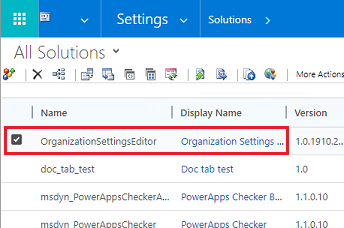
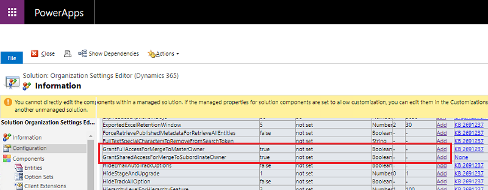
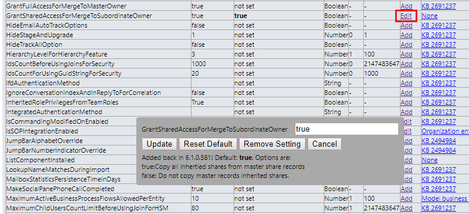

# Environment database settings

There is a set of database settings for each environment that provides default option behavior.  You can update these default options through a special OrgDBSettings tool. This tool allows the system admin to override the default database settings. You can find the list of database settings in the [OrgDBOrgSettings tool for Microsoft Dynamics CRM](https://support.microsoft.com/help/2691237/orgdborgsettings-tool-for-microsoft-dynamics-crm). 

## Install the OrganizationSettingsEditor tool 

1. Download the latest [OrganizationSettingsEditor tool](https://github.com/seanmcne/OrgDbOrgSettings/releases) and save it to your local drive. 
2. Go to the environment where you need to update database settings. 
3. Go to **Settings** > **Solution**. 
4. Select **Import** > **Choose File**, and then select the .zip file that you downloaded. 
6. Select **Open** > **Next** > **Import**.
7. When the import is complete, close the **Import Solution** window.

## Override database settings 

1. Go to **Settings** > **Solution**. 
2. Locate the **OrganizationSettingsEditor** solution and double-click the **OrganizationSettingsEditor** row. 

   > [!div class="mx-imgBorder"] 
   > 

3. Select **Add** on a setting. The **Add** link changes to **Edit**. 

   > [!div class="mx-imgBorder"] 
   > 

4. Select **Edit** to change the values.

   > [!div class="mx-imgBorder"] 
   > 

5. Type in the value, for example true or false, or ‘0’ or ‘1’, based on the **Option** value as listed in the dialog box .
6. Select **Update**. 

For the updates to take effect, sign out of the environment and sign in again. 

> [!NOTE]
> Updating environment database settings impacts the environment and should be done with caution. You should first test out the database settings in a non-production environment. 

[!INCLUDE[footer-include](../includes/footer-banner.md)]
