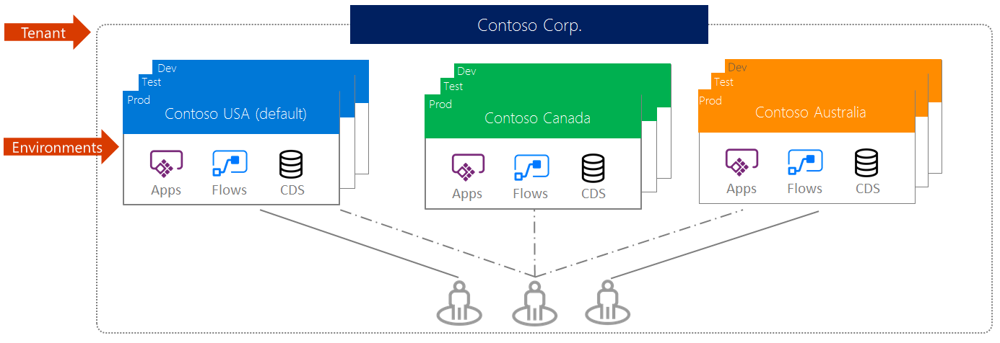
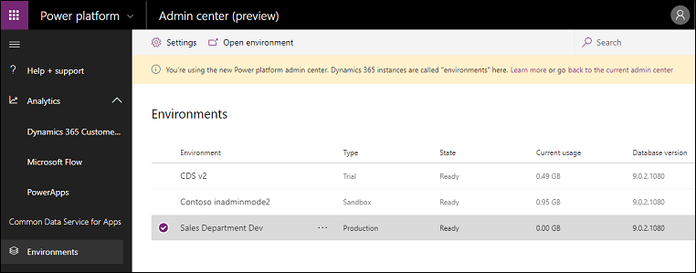
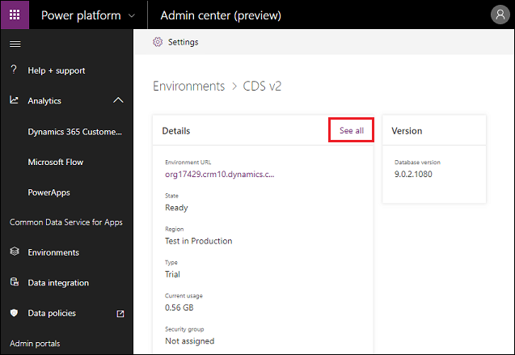
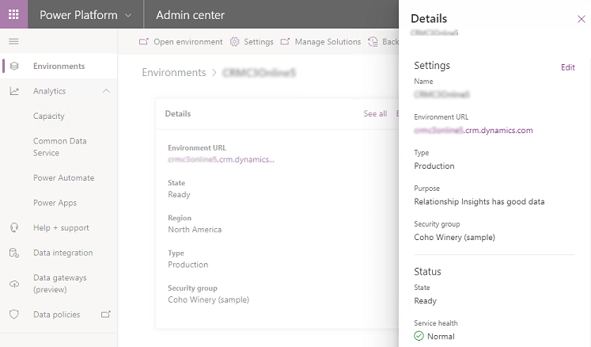

# Environments overview
An *environment* is a space to store, manage, and share your organization's business data, apps, and flows. It also serves as a container to separate apps that might have different roles, security requirements, or target audiences. How you choose to use environments depends on your organization and the apps you're trying to build. For example:

* You can choose to only build your apps in a single environment.
* You might create separate environments that group the test and production versions of your apps.
* You might create separate environments that correspond to specific teams or departments in your company, each containing the relevant data and apps for each audience.
* You might also create separate environments for different global branches of your company.  

> [!NOTE]
> You can get early access to upcoming Power Apps functionality by joining the [Power Apps Preview program](preview-environments.md).

## Environment scope
Each environment is created under an Azure Active Directory (Azure AD) tenant, and its resources can only be accessed by users within that tenant. An environment is also bound to a geographic location, like the United States. When you create an app in an environment, that app is routed only to datacenters in that geographic location. Any items that you create in that environment (including connections, gateways, flows using Microsoft Power Automate, and more) are also bound to their environment's location.

Every environment can have zero or one Microsoft Dataverse database, which provides storage for your apps. Whether you can create a database for your environment depends on the license you purchase for Power Apps and your permissions within that environment. More information: [Pricing info](pricing-billing-skus.md)

When you create an app in an environment, that app is only permitted to connect to the data sources that are also deployed in that same environment, including connections, gateways, flows, and Dataverse databases. For example, consider a scenario where you've created two environments named Test and Dev, and created a Dataverse database in each of the environments. If you create an app in the Test environment, it will only be permitted to connect to the Test database; it won't be able to connect to the 'Dev' database.

You can also move resources between environments. More information: [Migrate resources](../alm/environment-and-tenant-migration.md)

## Environment permissions
Environments have two built-in roles that provide access to permissions within an environment:

* The *Environment Admin* role can perform all administrative actions on an environment, including the following:

    * Add or remove a user or group from either the Environment Admin or Environment Maker role.

    * Provision a Dataverse database for the environment.

    * View and manage all resources created within the environment.

    * Set data loss prevention policies. More information: [Manage data loss prevention policies](prevent-data-loss.md)

    After creating the database in the environment, you can use the System Administrator role instead of the Environment Admin role.

* The *Environment Maker* role can create resources within an environment including apps, connections, custom connectors, gateways, and flows using Power Automate.

Environment makers can also distribute the apps they build in an environment to other users in your organization by sharing the app with individual users, security groups, or all users in the organization. More information: [Share an app in Power Apps](/powerapps/maker/canvas-apps/share-app)

Users or groups assigned to these environment roles aren't automatically given access to the environment's database (if it exists) and must be given access separately.

Users or security groups can be assigned to either of these two roles by an environment admin by following the steps described in [Configure user security to resources in an environment](database-security.md). 

## Types of environments

There are multiple types of environments. The type indicates the purpose of the environment and determines its characteristics. The following table summarizes the current types of environments that you might encounter.

<table style="width:100%">
<tr>
<th>Type</th>
<th>Description</th>
<th>Security</th>
</tr>
<tr>
<td width="20%"> Production</td>
<td width="50%">  This is intended to be used for permanent work in an organization. It can be created and owned by an administrator or anyone with a Power Apps license, provided there is 1&nbsp;GB available database capacity. These environments are also created for each existing Dataverse database when it is upgraded to version 9.0 or later. Production environments are what you should use for any environments on which you depend.        </td>
<td width="30%"> Full control.  </td>
</tr>
<tr>
<td width="20%"> Default</td>
<td width="50%"> These are a special type of production environment. Each tenant has a default environment that's created automatically. Its characteristics are discussed in the following section, <a href="#the-default-environment">The default environment</a>. </td>
<td width="30%">  Limited control&mdash;all licensed users* have the Environment Maker role.</td>
<tr>
<td width="20%"> Sandbox</td>
<td width="50%">   These are non-production environments, which offer features like copy and reset. Sandbox environments are used for development and testing, separate from production. Provisioning sandbox environments can be restricted to admins (because production environment creation can be blocked), but converting from a production to a sandbox environment can't be blocked. </td>
<td width="30%">  Full control.  If used for testing, only user access is needed.  Developers require Environment Maker access to create resources.</td>
</tr>
<tr>
<td width="20%"> Trial</td>
<td width="50%">  Trial environments are intended to support short-term testing needs and are automatically cleaned up after a short period of time. They expire after 30 days and are limited to one user. Provisioning trial environments can be restricted to admins.</td>
<td width="30%">  Full control.</td>
</tr>
<tr>
<td width="20%"> Developer</td>
<td width="50%">  Developer environments are created by users who have the Community Plan license. They're special environments intended only for use by the owner, and they can't be shared with other users. Provisioning developer environments can't be restricted unless through a support ticket. </td>
<td width="30%">  Only a single user account with the Community Plan has access.</td>
</tr>
<tr>
<td width="20%"> Microsoft Dataverse for Teams</td>
<td width="50%">  Dataverse for Teams environments are automatically created for the selected team when you create an app in Teams using the Power Apps app for the first time or install a Power Apps app from the app catalog. See <a href="about-teams-environment.md">About the Dataverse for Teams environment</a>. </td>
<td width="30%">  Tenant admins and/or Power Platform admins will not be able to access any of the core customer data in the Teams environment. However, they will be able to perform all system management operations, including customizations and updating user records, among other options. </td>
</tr>
<tr><td colspan="3">*&#8202;Users licensed for Power Apps, Power Automate, Microsoft 365, and Dynamics 365, standalone licenses, and free and trial licenses.</td></tr>
</table>

## The default environment
A single default environment is automatically created by Power Apps for each tenant and shared by all users in that tenant. Whenever a new user signs up for Power Apps, they're automatically added to the Maker role of the default environment. The default environment is created in the region closest to the default region of the Azure AD tenant.

> [!NOTE]
> - No users will be added to the Environment Admin role of the default environment automatically. More information: [Administer environments in Power Apps](environments-administration.md)
> - You can't delete the default environment.
> - You can't backup and restore the default environment.
> - The default environment is limited to 32 GB of storage capacity. In case you need to store more data, you can create a production environment. More information: [Provisioning a new environment](create-environment.md#provisioning-a-new-environment)

The default environment is named as follows: "{Azure AD tenant name} (default)"

## Production and trial environments
You can create environments for different purposes. A trial environment is for trying out the environment and the experience of using a database with Dataverse. It expires after a certain period. 

## Manage environments in the Power Platform admin center

You can view and manage your environments on the **Environments** page. 

> [!div class="mx-imgBorder"] 
> 

You can sort and search the list of environments; this is useful if you have a large number of environments to manage.

### Environment details

You can see some the details of your environments by selecting an environment. Select **See all** to see more environment details.

> [!div class="mx-imgBorder"] 
> 

Select **Edit** to review and edit environment details.

> [!div class="mx-imgBorder"] 
> 

### See also
[Microsoft Learn: Create and manage environments in Dataverse](https://docs.microsoft.com/learn/modules/create-manage-environments/) 

