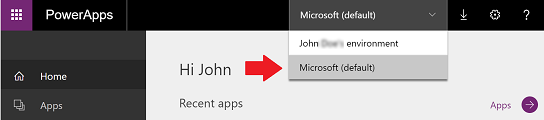
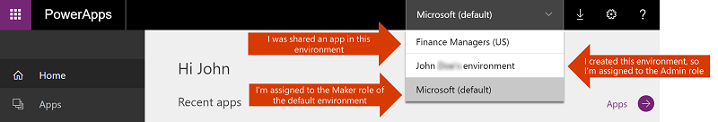

# Environments overview
An environment is a space to store, manage, and share your organization’s business data, apps, and flows. They also serve as containers to separate apps that may have different roles, security requirements, or target audiences. How you choose to leverage environments depends on your organization and the apps you are trying to build. For example:

* You may choose to only build your apps in a single environment.
* You might create separate environments that group the Test and production versions of your apps.
* You might create separate environments that correspond to specific teams or departments in your company, each containing the relevant data and apps for each audience.
* You might also create separate environments for different global branches of your company.  
* Get early access to the upcoming PowerApps functionalities by joining [PowerApps Preview Program](preview-environments.md).

## Environment scope
Each environment is created under an Azure AD tenant, and its resources can only be accessed by users within that tenant. An environment is also bound to a geographic location, like the US. When you create an app in an environment, that app is routed to only datacenters in that geographic location. Any items that you create in that environment (including connections, gateways, flows using Microsoft Power Automate, and more) are also bound to their environment’s location.

Every environment can have zero or one Common Data Service databases, which provides storage for your apps. The ability to create a database for your environment will depend on the license you purchase for PowerApps and your permission within that environment. For more information, see [Pricing info](pricing-billing-skus.md).

When you create an app in an environment, that app is only permitted to connect to the data sources that are also deployed in that same environment, including connections, gateways, flows, and Common Data Service databases.  For example, let’s consider a scenario where you have created two environments named ‘Test’ and ‘Dev’ and created a Common Data Service database in each of the environments. If you create an app in the ‘Test’ environment, it will only be permitted to connect to the ‘Test’ database, it won't be able to connect to the ‘Dev’ database.

There is also a process to move resources between environments. For more information, see [Migrate resources](environment-and-tenant-migration.md).

## Environment permissions
Environments have two built-in roles that provide access to permissions within an environment:

* The Environment Admin role can perform all administrative actions on an environment including the following:

    * Add or remove a user or group from either the Environment Admin or Environment Maker role

    * Provision a Common Data Service database for the environment

    * View and manage all resources created within an environment

    * Set data loss prevention policies. For more information see [Data loss prevention policies](prevent-data-loss.md).

    After creating the database in the environment, you can use System Administrator role instead of Environment Admin role.

* The Environment Maker role can create resources within an environment including apps, connections, custom connectors, gateways, and flows using Power Automate.

Environment Makers can also distribute the apps they build in an environment to other users in your organization by sharing the app with individual users, security groups, or to all users in the organization. For more information, see [Share an app in PowerApps](/powerapps/maker/canvas-apps/share-app).

Users or groups assigned to these environment roles are not automatically given access to the environment’s database (if it exists) and must be given access separately by a Database owner. For more information, see [Configure database security](database-security.md).

Users or security groups can be assigned to either of these two roles by an Environment Admin from the [Power Platform Admin center](https://admin.powerplatform.microsoft.com) or [PowerApps Admin center](https://admin.powerapps.com). For more information, see [Administer environments in PowerApps](environments-administration.md).

## The default environment
A single default environment is automatically created by PowerApps for each tenant and shared by all users in that tenant. Whenever a new user signs up for PowerApps, they are automatically added to the Maker role of the default environment. The default environment is created in the closest region to the default region of the Azure AD tenant.

> [!NOTE]
> No users will be added to the Environment Admin role of the default environment automatically. For more information, see [Administer environments in PowerApps](environments-administration.md).

The default environment is named as follows: “{Azure AD tenant name} (default)”

## Production and Trial environments
You can create environments for different purpose. A Trial environment is for trying out the environment and database with Common Data Service experience. It expires after certain period. For more information, see [Administer environments in PowerApps](environments-administration.md).

## Choosing an environment
With the introduction of environments, you will now see a new experience when you come to [https://web.powerapps.com](https://web.powerapps.com/?utm_source=padocs&utm_medium=linkinadoc&utm_campaign=referralsfromdoc).  The apps, connections, and other items that are visible in the site will now be filtered based on the current environment that is selected.  Your current environment is specified in the environment picker near the right edge of the header. To choose a different environment, click or tap the picker, and a list of available environments appears. Click or tap the one you wish to enter.

An environment will show up in your picker if you meet one of the following conditions:

* You are a member of the Environment Admin role for the environment.
* You are a member of the Environment Maker role for the environment.
* You are not an Environment Admin or Environment Maker of the environment, but you have been given ‘Contributor’ access to at least one app within the environment. For more information, see [share an app](/powerapps/maker/canvas-apps/share-app). In this case, you will not be able to create apps in this environment. You will only be able to modify the existing apps that have been shared with you.

### See also
[Microsoft Learn: Create and manage environments in Common Data Service](https://docs.microsoft.com/learn/modules/create-manage-environments/)
