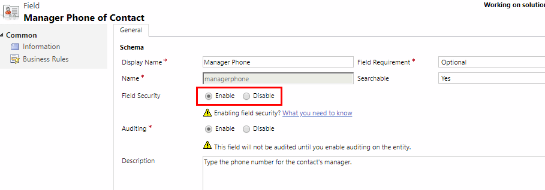

# Field-level security to control access

[!INCLUDE [cc-data-platform-banner](../includes/cc-data-platform-banner.md)]

<!-- legacy procedure -->

Record-level permissions are granted at the entity level, but you may have certain fields associated with an entity that contain data that is more sensitive than the other fields. For these situations, you use field-level security to control access to specific fields.  
  
 The scope of field-level security is organization-wide and applies to all data access requests including the following:  
  
- Data access requests from within a client application, such as web browser, mobile client, or [!INCLUDE[pn_microsoft_dynamics_crm_for_outlook](../includes/pn-microsoft-dynamics-crm-for-outlook.md)].  
  
- Web service calls using the [!INCLUDE[pn_sdk](../includes/pn-sdk.md)] (for use in plug-ins, custom workflow activities, and custom code)  
  
- Reporting (using Filtered Views)  
  
   
## Overview of field-level security  
 Field-level security is available for the default fields on most out-of-box entities, custom fields, and custom fields on custom entities. Field-level security is managed by the security profiles. To implement field-level security, a system administrator performs the following tasks.  
  
1.  Enable field security on one or more fields for a given entity.  
  
2.  Associate one more existing security profiles, or create one or more new security profiles to grant the appropriate access to specific users or teams.  
  
A security profile determines the following:  
  
- Permissions to the secure fields  
  
- Users and Teams  
  
  A security profile can be configured to grant user or team members the following permissions at the field level:  
  
- **Read**. Read-only access to the field's data.  
  
- **Create**. Users or teams in this profile can add data to this field when creating a record.  
  
- **Update**. Users or teams in this profile can update the field's data after it has been created.  
  
A combination of these three permissions can be configured to determine the user privileges for a specific data field.  
  
> [!IMPORTANT]
>  Unless one or more security profiles are assigned to a security enabled field, only users with the system administrator security role will have access to the field.  
  
   
## Example for restricting the mobile phone field for the Contact entity  
 Imagine your company's policy is that sales members should have different levels of access to contact mobile phone numbers as described here.  
  
|User or Team|Access|  
|------------------|------------|  
|Vice presidents|Full. Can create, update, and view mobile phone numbers for contacts.|  
|Sales Managers|Read-only. Can only view mobile phone numbers for contacts.|  
|Salespersons and all other users|None. Cannot create, update or view mobile phone numbers for contacts.|  
  
 To restrict this field, you would perform the following tasks.  
  
 Secure the field.  
  
1. In the web app, go to **Settings** > **Customizations**.
  
2. Select **Customize the System**.  
  
3. Select **Entities** > **Contact** > **Fields**.  
  
4. Select **mobilephone**, select **Edit**.  
  
5. Next to **Field Security**, select **Enable**, select **Save and Close**.  
  
6. Publish the customization.  

Configure the security profiles.  
  
1. Create the field security profile for sales managers.  
  
   1. In the web app, go to **Settings** > **Security**.
  
   2. Select **Field Security Profiles**.  
  
   3. Select **New**, enter a name, such as *Sales Manager access contact mobile phone*, and select **Save**.  
  
   4. Select **Users**, select **Add**, select the users that you want to grant read access to the mobile phone number on the contact form, and then select **Add**.  
  
      > [!TIP]
      >  Instead of adding each user, create one or more teams that include all users that you want to grant read access.  
  
   5. Select **Field Permissions**, select **mobilephone**, select **Edit**, select **Yes** next to **Allow Read**, and then select **OK**.  
  
2. Create the field security profiles for vice presidents.  
  
   1.  Select **New**, enter a name, such as *VP access contact mobile phone*, and select **Save**.  
  
   2.  Select **Users**, select **Add**, select the users that you want to grant full access to the mobile phone number on the contact form, and then select **Add**.  
  
   3.  Select **Field Permissions**, select **mobilephone**, select **Edit**, select **Yes** next to **Allow Read**, **Allow Update**, and **Allow Create**, and then select **OK**.  
  
3. Select **Save and Close**.  
  
Any users not defined in the previously created field security profiles will not have access to the mobile phone field on contact forms or views. The field value displays  ********, indicating that the field is secured.  
  
   
## Which fields can be secured?  
 Every field in the system contains a setting for whether field security is allowed. You can view this in the field definition from Solution Explorer. In Solution Explorer expand **Entities**, expand the entity that you want, select **Fields**, and then open the field that you want. If **Enable** can be selected, the field can be enabled for field security. 

> [!div class="mx-imgBorder"] 
> 
 
Although most attributes can be secured, there are system attributes, such as IDs, timestamps, and record tracking attributes, that can't. Below are a few examples of attributes that can't be enabled for field security. 
-    ownerid, processid, stageid, accountid, contactid
-    createdby, modifiedby, OwningTeam, OwningUser
- createdon, EntityImage_Timestamp, modifiedon, OnHoldTime, overriddencreatedon
-    statecode, statuscode

You can view the entity metadata for your organization including which fields can be enabled for field security, by installing the Metadata Browser solution described in [Browse the Metadata for Your Organization](https://docs.microsoft.com/powerapps/developer/common-data-service/browse-your-metadata). You can also view the metadata for an uncustomized organization in the [!INCLUDE[pn_MS_Excel_Full](../includes/pn-ms-excel-full.md)] file called EntityMetadata.xlsx included in the top-level folder of the SDK. [Download the SDK](https://go.microsoft.com/fwlink/p/?LinkId=691153)  
   
   
## Best practices when you use field security  
 When you use calculated fields that include a field that is secured, data may be displayed in the calculated field to users that don't have permission to the secured field. In this situation, both the original field and the calculated field should be secured.  
  
 Some data, such as addresses, are actually made up of multiple fields. Therefore, to completely secure data that includes multiple fields, such as addresses, you must secure and configure the appropriate field security profiles on multiple fields for the entity. For example, to completely secure addresses for an entity, secure all relevant address fields, such as address_line1, address_line2, address_line3, address1_city, address1_composite, and so on.  
  
### See also  
 [Video: Field Level Security in Microsoft Dynamics CRM 2015](https://www.youtube.com/watch?v=Czc9sKvWd9k&list=UUem1HuioGqKEn8Li3l4DIYQ)   
 [Create a field security profile](set-up-security-permissions-field.md)   
 [Add or remove security from a field](enable-disable-security-field.md)   
 [Hierarchy security](../admin/hierarchy-security.md)
