# Free up storage space

[!INCLUDE [cc-data-platform-banner](../includes/cc-data-platform-banner.md)]

These are ways to reduce the amount of storage space used by removing or deleting different types of information from customer engagement apps (Dynamics 365 Sales, Dynamics 365 Customer Service, Dynamics 365 Field Service, Dynamics 365 Marketing, and Dynamics 365 Project Service Automation). Use one or more of these methods to control your total data storage usage. You can delete certain categories of data as the need arises, or you can set up bulk deletion jobs to reoccur at set intervals.  
  
> [!WARNING]
>  The suggestions in this topic include deleting notes, attachments, import history, and other data. Before you delete data, be sure that the data is no longer needed because you cannot retrieve deleted data. There is no "undo" to restore your data once it has been deleted. This means it may make more sense for you to increase the amount of storage space you have with your [!INCLUDE[pn_Online_Subscription](../includes/pn-online-subscription.md)] instead of reducing the amount of storage space used.  
> 
> [!NOTE]
>  - Except for methods 3 and 5, all these methods require that you have an administrator security role, such as System Administrator. This gives you permission to delete records in bulk and to delete system jobs.  
>  - After performing actions to free up storage, the system can take up to 24 hours to update storage information. We recommend waiting up to 24 hours and monitoring your storage.  
>  - Storage consumed does not directly correspond to the size reported in Microsoft Dataverse for Apps; consumption includes additional storage for metadata and encryption. For example, removing 10MB of storage from a file does not mean the file size is reduced by 10MB.
>  - Some platform operations require you to wait 24-36 hours to confirm data size changes. Such operations include but are not limited to upgrades to new versions and introduction of new workflows. Such operations require system adjustments that might result in a momentary size increase report.

## Freeing storage for Dataverse

Use the following methods to free up storage for each of the capacity types.

| Storage | Method  |
|---------|---------|
|**File**     |        |
|     | **Method 3**: Remove email attachments using Advanced Find         |
|     | **Method 4**: Remove email messages with attachments using a bulk deletion job        |
|     | **Method 5**: Remove notes with attachments using Advanced Find        |
|     | **Method 6**: Remove notes with attachments using a bulk deletion job        |
|**Log**     |         |
|     | **Method 10**: Delete audit logs        |
|     | Delete plug-in trace logs using a [bulk deletion job](delete-bulk-records.md) |
|**Database**     |         |
|     | **Method 1**: Delete bulk email and workflow environments using a bulk deletion job        |
|     | **Method 2**: Evaluate and delete suspended workflows        |
|     | **Method 7**: Remove bulk duplicate detection jobs and associated copies of duplicate records        |
|     | **Method 8**: Delete bulk import environments using a bulk deletion job        |
|     | **Method 9**: Delete bulk deletion job environments using a bulk deletion job        |
|     | **Method 11**: Remove unrequired entities and fields from Relevance Search        |

## Reduce file storage

### Method 3: Remove email attachments using Advanced Find  
  
> [!WARNING]
>  If you delete this data, the attachments will no longer be available in customer engagement apps. However, if you have them saved in [!INCLUDE[pn_MS_Outlook_Full](../includes/pn-ms-outlook-full.md)], they will still be there.  
  
1. Choose **Advanced Find** ().  
  
2. In the **Look for** list, select **Email Messages**.  
  
3. In the search criteria area, add criteria similar to the following:  
  
   **Attachments (Item)**  
  
   **File Size (Bytes)** – **Is Greater Than** - In the text box, type a byte value, such as 1,048,576 (1MB in binary).  
 
> [!div class="mx-imgBorder"] 
> 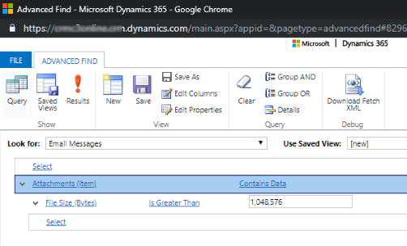  
 
4. Choose **Results**.  
  
5. You will now have a list of email messages that have attachments that are larger than 'X' bytes. Review the emails and delete the attachments as needed.  
  
> [!div class="mx-imgBorder"] 
> 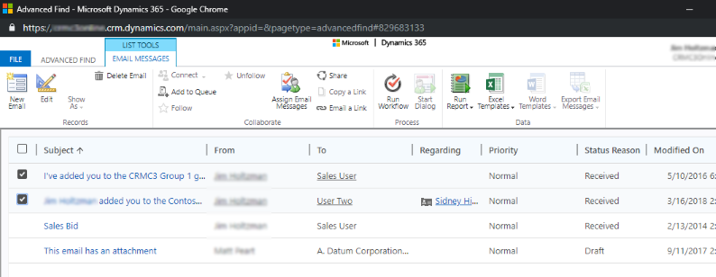  

### Method 4: Remove email messages with attachments using a bulk deletion job  
  
> [!WARNING]
>  If you delete this data, the email messages and their associated attachments will no longer be available in customer engagement apps. However, if you have them saved in [!INCLUDE[pn_MS_Outlook_Full](../includes/pn-ms-outlook-full.md)], they will still be there.  
  
1. [!INCLUDE[proc_settings_datamanagement](../includes/proc-settings-datamanagement.md)]  
  
2. Choose **Bulk Record Deletion**, and then in the menu bar, choose **New**. This opens the Bulk Deletion Wizard.  
  
3. Choose **Next**.  
  
4. In the **Look for** list, select **Email Messages**.  
  
5. In the search criteria area, add criteria similar to the following:  
  
   **Status Reason** – **Equals** – **Completed**  
  
   **Actual End** – **Older Than X Months** – 1  
  
   **Attachments (Item)**  
  
   **File Size (Bytes)** – **Is Greater Than** – In the text box, type a byte value, such as 1,048,576 (1MB in binary).  
  
6. Group the first two criteria rows:  
  
   1.  Choose the arrow next to each criteria row, and then choose **Select Row**.  
  
   2.  With both rows selected, choose **Group AND**.  
  
   > [!div class="mx-imgBorder"] 
   > 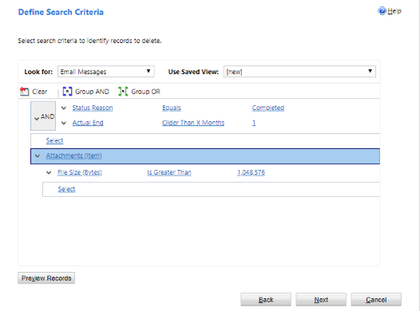  

7. Choose **Next**.  
  
8. In the **Name** text box, type a name for the bulk deletion job.  
  
9. Select a date and time for the job start time; preferably a time when users are not in customer engagement apps.  
  
10. Select the **Run this job after every** check box, and then in the **days** list, select the frequency you want the job to run.  
  
11. If you want a notification e-mail sent, select the **Send an email to me (email@domain.com) when this job is finished** check box.  
  
> [!div class="mx-imgBorder"] 
> 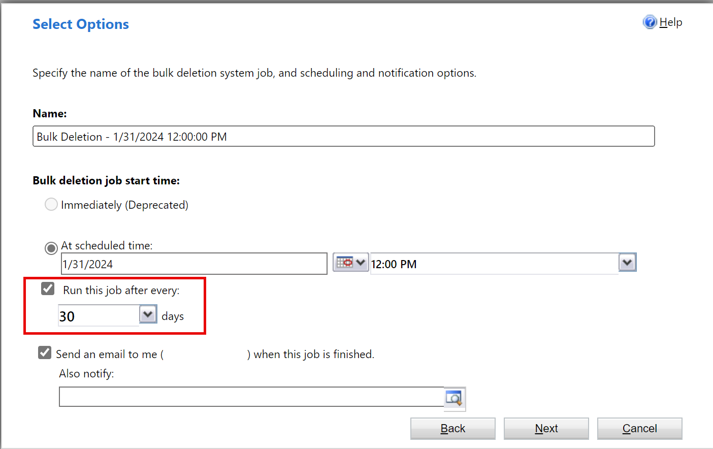  

12. Choose **Next**, review the bulk deletion job, and then choose **Submit** to create the recurring job.  
  
### Method 5: Remove notes with attachments using Advanced Find  
  
> [!WARNING]
>  If you delete this data, notes and their associated attachments will no longer be available in customer engagement apps.  
  
1. Choose **Advanced Find**.  
  
2. In the **Look for** list, select **Notes**.  
  
3. In the search criteria area, add criteria similar to the following:  
  
   **File Size (Bytes)** – **Is Greater Than** – In the text box, type a byte value, such as 1048576.  

> [!div class="mx-imgBorder"] 
> 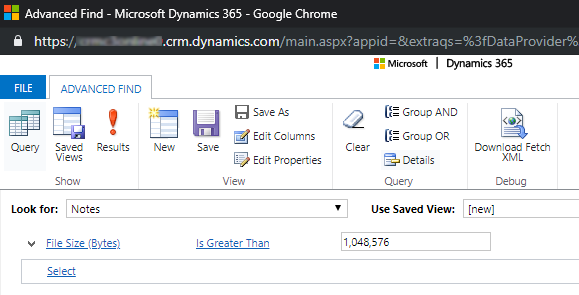
  
4. Choose **Results**.  
  
5. You will now have a list of attachments that are larger than the size you specified.  
  
> [!div class="mx-imgBorder"] 
> 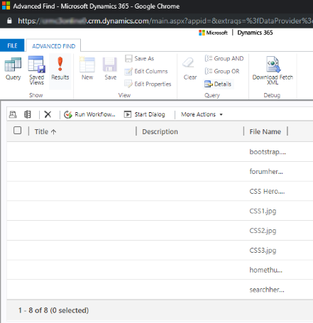

6. Select individual or a multiple attachments, and then choose **Delete** (X).  
  
> [!div class="mx-imgBorder"] 
> 

### Method 6: Remove notes with attachments using a bulk deletion job  
  
> [!WARNING]
>  If you delete this data, notes and their associated attachments will no longer be available in customer engagement apps.  
  
1. [!INCLUDE[proc_settings_datamanagement](../includes/proc-settings-datamanagement.md)]  
  
2. Choose **Bulk Record Deletion**, and then in the menu bar, choose **New**. This opens the Bulk Deletion Wizard.  
  
3. Choose **Next**.  
  
4. In the **Look for** list, select **Notes**.  
  
5. In the search criteria area, add criteria similar to the following:  
  
   **File Size (Bytes)** – **Is Greater Than** – In the text box, type a byte value, such as 1048576.  
  
   **Created On** – **Older Than X Months** – 1  
  
6. Group the two criteria rows:  
  
   1.  Choose the arrow next to each criteria row, and then choose **Select Row**.  
  
   2.  With all three rows selected, choose **Group AND**.  

   > [!div class="mx-imgBorder"] 
   > 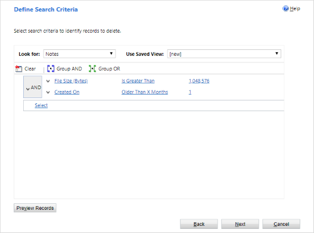  
  
7. Choose **Next**.  
  
8. In the **Name** text box, type a name for the bulk deletion job.  
  
9. Select a date and time for the job start time; preferably a time when users are not in customer engagement apps.  
  
10. Select the **Run this job after every** check box, and then in the **days** list, select the frequency you want the job to run.  
  
11. If you want a notification e-mail sent, select the **Send an email to me (email@domain.com) when this job is finished** check box.  
  
> [!div class="mx-imgBorder"] 
>   
  
12. Choose **Next**, review the bulk deletion job, and then choose **Submit** to create the recurring job.  

## Reduce log storage

### Method 10: Delete audit logs  

 When you enable auditing, customer engagement apps create audit logs to store the audit history of the records. You can delete these audit logs to free space when they are no longer needed.  
  
> [!WARNING]
>  When you delete an audit log, you can no longer view the audit history for the period covered by that audit log.  
  
1. [!INCLUDE[proc_settings_auditing](../includes/proc-settings-auditing.md)]  
  
2. In the **Audit** area choose **Audit Log Management**.  
  
3. Select the oldest audit log, then choose **Delete Logs**.  
 
> [!div class="mx-imgBorder"] 
> 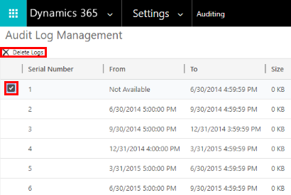  
 
4. In the confirmation message choose **OK**.  
  
> [!NOTE]
>  You can only delete the oldest audit log in the system. To delete more than one audit log repeat deleting the oldest available audit log until you have deleted enough logs.  
  

## Reduce database storage

### Method 1: Delete bulk email and workflow environments using a bulk deletion job  
  
> [!WARNING]
>  If you delete this data, you will no longer be able to tell if an email was sent through bulk email or if a workflow rule ran against a record. The emails that were sent and the actions that ran against the record in the workflow will remain.  
  
1. [!INCLUDE[proc_settings_datamanagement](../includes/proc-settings-datamanagement.md)]  
  
2. Choose **Bulk Record Deletion**. In the menu bar, choose **New**. This opens the Bulk Deletion Wizard.  
  
3. Choose **Next**.  
  
4. In the **Look for** list, select **System Jobs**.  
  
5. In the search criteria area, add criteria similar to the following:  
  
   **System Job Type** – **Equals** – **Bulk E-mail**; **Workflow**;  
  
   **Status Reason** – **Equals** – **Succeeded**  
  
   **Completed On** – **Older Than X Months** – 1  
  
6. Group the three criteria rows:  
  
   1.  Choose the arrow next to each criteria row, and then choose **Select Row**.  
  
   2.  With all three rows selected, choose **Group AND**.  

   > [!div class="mx-imgBorder"] 
   > 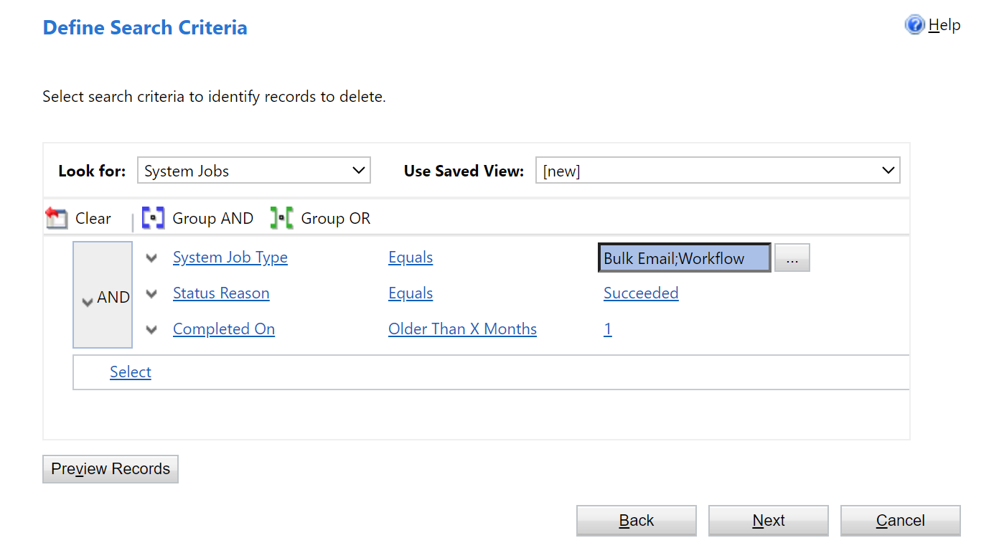  
  
7. Choose **Next**.  
  
8. In the **Name** text box, type a name for the bulk deletion job.  
  
9. Select a date and time for the job start time; preferably a time when users are not in customer engagement apps.  
  
10. Select the **Run this job after every** check box, and then in the **days** list, select the frequency you want the job to run.  
  
11. If you want a notification e-mail sent, select the **Send an e-mail to me (email@domain.com) when this job is finished** check box.  
 
> [!div class="mx-imgBorder"] 
>   
 
12. Choose **Next**, review the bulk deletion job, and then choose **Submit** to create the recurring job.  
  
### Method 2: Evaluate and delete suspended workflows  

 Sometimes workflows will enter a suspended state because there is a condition that will never be met or some other reason that will not allow the workflow to continue.  
  
> [!WARNING]
>  Some workflows will be in a suspended state because they are waiting for a condition that has not yet been met, which is expected. For example, a workflow may be waiting for a task to be completed.  
  
1. Choose **Advanced Find**.  
  
2. In the **Look for** list, select **System Jobs**.  
  
3. In the search criteria area, add criteria similar to the following:  
  
   **System Job Type** – **Equals** – **Workflow**  
  
   **Status Reason** – **Equals** – **Waiting**  
  
4. Group the two criteria rows:  
  
   1.  Choose the arrow next to each criteria row, and then choose **Select Row**.  
  
   2.  With both rows selected, choose **Group AND**.  
  
   > [!div class="mx-imgBorder"] 
   > 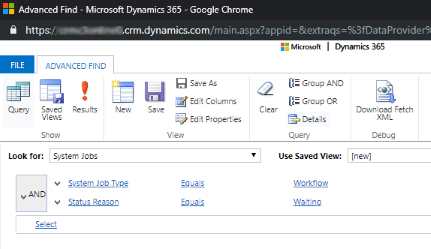  

5. Choose **Results**.  
  
6. In the results window, you can open each item to determine whether the workflow can be deleted.  
  
### Method 7: Remove bulk duplicate detection jobs and associated copies of duplicate records  

 Every time that a duplicate detection job runs, a copy of each duplicate record is stored in the database as part of the duplicate detection job. For example, if you have 100 duplicate records, every time that you run a duplicate detection job that finds these duplicates, whether it is manual or reoccurring, those 100 duplicate records will be stored in the database under that environment of that duplicate job until the duplicates are merged or deleted, or until the environment of that duplicate detection job is deleted.  
  
1. [!INCLUDE[proc_settings_datamanagement](../includes/proc-settings-datamanagement.md)]  
  
2. Choose **Duplicate Detection Jobs**.  
  
3. Select the duplicate detection job environments you want to delete and then choose **Delete** (X).  
  
   To avoid wasting storage space, make sure duplicates are resolved promptly so that they are not reported in multiple duplicate detection jobs.  

> [!div class="mx-imgBorder"] 
> 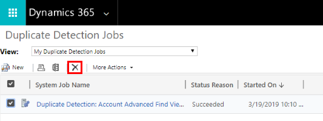  
  
### Method 8: Delete bulk import environments using a bulk deletion job  

 Every time you perform a bulk import, there is a system job associated with that import. The system job details show which records imported successfully and which records failed.  
  
> [!WARNING]
>  After you delete these bulk import jobs, you will not be able to see what data was imported and you cannot roll back the import.  
  
1. [!INCLUDE[proc_settings_datamanagement](../includes/proc-settings-datamanagement.md)]  
  
2. Choose **Bulk Record Deletion**, and then in the menu bar, choose **New**. This opens the Bulk Deletion Wizard.  
  
3. Choose **Next**.  
  
4. In the **Look for** list, select **System Jobs**.  
  
5. In the search criteria area, add criteria similar to the following:  
  
   **System Job Type** – **Equals** – **Import**  
  
   **Status Reason** – **Equals** – **Succeeded**  
  
   **Completed On** – **Older Than X Months** – 1  
  
6. Group the three criteria rows:  
  
   1.  Choose the arrow next to each criteria row, and then choose **Select Row**.  
  
   2.  With all three rows selected, choose **Group AND**.  
 
   > [!div class="mx-imgBorder"] 
   > 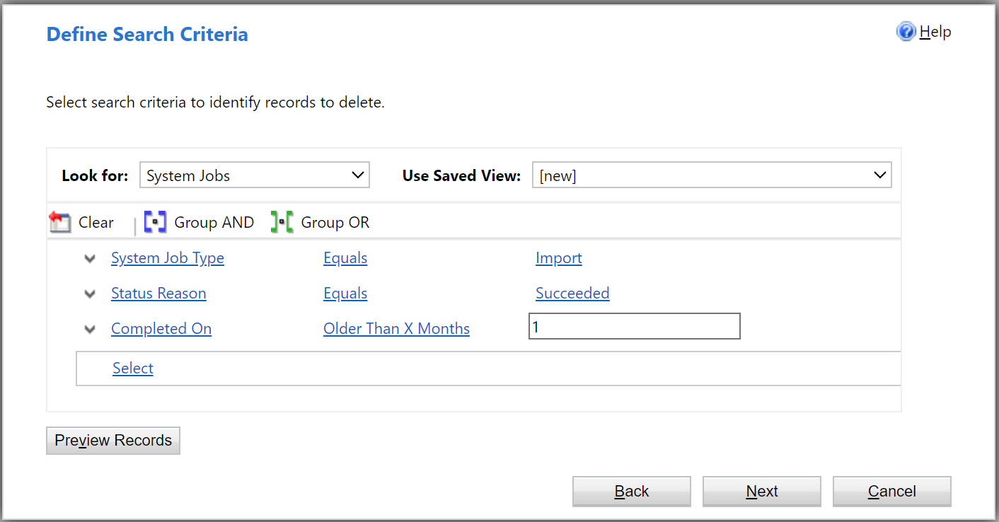  
 
7. Choose **Next**.  
  
8. In the **Name** text box, type a name for the bulk deletion job.  
  
9. Select a date and time for the job start time; preferably a time when users are not in customer engagement apps.  
  
10. Select the **Run this job after every** check box, and then in the **days** list, select the frequency you want the job to run.  
  
11. If you want a notification e-mail sent, select the **Send an email to me (email@domain.com) when this job is finished** check box.  
  
> [!div class="mx-imgBorder"] 
>   

12. Choose **Next**, review the bulk deletion job, and then choose **Submit** to create the recurring job.  
  
### Method 9: Delete bulk deletion job environments using a bulk deletion job  

 When you are bulk deleting data, such as in many of the methods described in this article, a bulk deletion system job is created and can be deleted.  
  
> [!WARNING]
>  After you delete these jobs, you will lose the history of the prior bulk deletion jobs that you've run.  
  
1. [!INCLUDE[proc_settings_datamanagement](../includes/proc-settings-datamanagement.md)]  
  
2. Choose **Bulk Record Deletion**, and then in the menu bar, choose **New**. This opens the Bulk Deletion Wizard.  
  
3. Choose **Next**.  
  
4. In the **Look for** list, select **System Jobs**.  
  
5. In the search criteria area, add criteria similar to the following:  
  
   **System Job Type** – **Equals** – **Bulk Delete**  
  
   **Status Reason** – **Equals** – **Succeeded**  
  
   **Completed On** – **Older Than X Months** – 1  
  
   > [!NOTE]
   >  You could also delete jobs that have failed or been canceled.  
  
6. Group the three criteria rows:  
  
   1.  Choose the arrow next to each criteria row, and then choose **Select Row**.  
  
   2.  With all three rows selected, choose **Group AND**.  

   > [!div class="mx-imgBorder"] 
   > 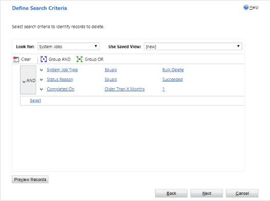  
  
7. Choose **Next**.  
  
8. In the **Name** text box, type a name for the bulk deletion job.  
  
9. Select a date and time for the job start time; preferably a time when users are not in customer engagement apps.  
  
10. Select the **Run this job after every** check box, and then in the **days** list, select the frequency you want the job to run.  
  
11. If you want a notification e-mail sent, select the **Send an email to me (email@domain.com) when this job is finished** check box.  
  
> [!div class="mx-imgBorder"] 
>   

12. Choose **Next**, review the bulk deletion job, and then choose **Submit** to create the recurring job.  

### Method 11: Remove unrequired entities and fields from Relevance Search

Entities and entity fields enabled for Relevance Search have an impact on the database storage capacity. 

- To revise the list of entities selected for Relevance Search results, see [Select entities for Relevance Search](configure-relevance-search-organization.md#select-entities-for-relevance-search).
- To revise the list of fields selected for each entity for Relevance Search results, see [Configure searchable fields for Relevance Search](configure-relevance-search-organization.md#configure-searchable-fields-for-relevance-search). 

## Free up storage used by flow approvals

See [Delete approval history from Power Automate](https://docs.microsoft.com/power-automate/gdpr-dsr-delete#delete-approval-history-from-power-automate).

### See also
[Dataverse storage capacity](capacity-storage.md)
