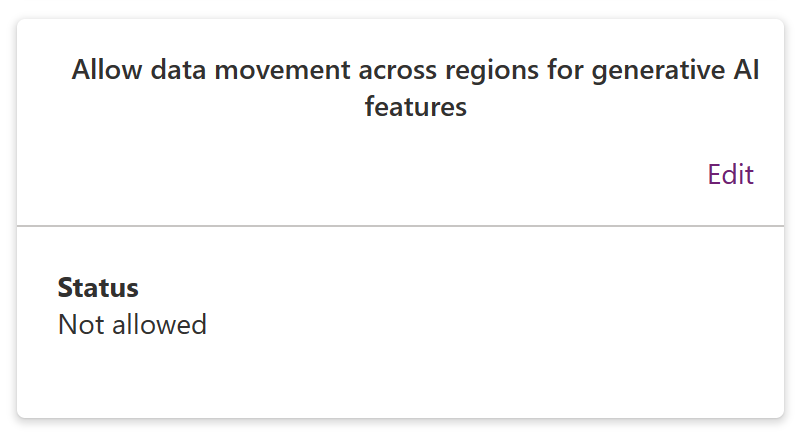

# Allow copilots and generative AI features outside the United States and Switzerland

With copilots and generative AI features in [Microsoft Power Platform](/power-platform/) and [Microsoft Dynamics 365](/dynamics365/), you can build apps, flows, pages, chatbots, ask questions about your data, summarize information, reply to chat and email messages, generate content ideas, get general answers related to the product, and do more.

All these capabilities are currently available in environments in the United States and support the English language. They're starting to be available in Switzerland progressively. With this feature, you can try the copilots and generative AI features across Power Platform and Dynamics 365 customer engagement environments outside the United States and Switzerland.

> [!NOTE]
> - The underlying infrastructure for copilots is currently available only in the Power Platform environment regions located in the United States and Switzerland. Accessing copilots or generative AI features from regions outside the United States and Switzerland results in **data movement across regional boundaries**. Once enabled, any data movement that already happened while this feature was enabled cannot be reversed by [removing your consent](#disable-copilots-and-generative-ai-outside-the-united-states-and-switzerland).
> - All data from the copilots and generative AI features in the Europe region (including France and Germany) are handled by the underlying infrastructure hosted in the Switzerland region. For all other Power Platform environment regions, the requests are handled by the infrastructure hosted in the United States region.
> - This setting is only available in a Power Platform environment that is created in regions other than **United States - Default**, **Preview (United States)**, and **Switzerland**. To enable or disable copilot features in environments created in **United States – Default**, **Preview (United States)**, or **Switzerland** regions, refer to the respective product documentation for the applicable product.
> - To enable copilot for Dynamics 365 Customer Service outside the United States, refer to [Copilot data movement across geographies (preview)](/dynamics365/customer-service/copilot-data-movement).
> - To enable copilot for Dynamics 365 Sales outside North America and Europe, refer to [Sales Copilot data movement across geographies (preview)](/dynamics365/sales/sales-copilot-data-movement).

You can allow copilots in your Power Platform environments outside the United States or Switzerland regions by following these steps:

1. Open [Power Platform admin center](https://admin.powerplatform.microsoft.com).

1. Select **Environments** in the navigation pane.

1. Select your environment.

1. From the right side of the screen, select **Edit** on the **Allow data movement across regions for AI features** card.

    

1. Read the information in the panel and select the check mark to consent to the terms of use.

    

1. Select **Enable**.

    After you consent, the status on the **Allow data movement across regions for AI features** card shows **Allowed** and copilots and generative AI features are enabled in the environment.

## Disable copilots and generative AI outside the United States and Switzerland

You can disable copilots and generative AI features in Power Platform environment regions outside the United States and Switzerland by following these steps.

> [!IMPORTANT]
> Any data movement that happened while this feature was enabled cannot be reversed by removing your consent.

1. Open [Power Platform admin center](https://admin.powerplatform.microsoft.com).

1. Select **Environments** in the navigation pane.

1. Select your environment.

1. From the right side of the screen, select **Edit** on the **Allow data movement across regions for AI features** card.

1. Clear the terms of use check mark.

1. Select **Disable**.

    After you remove your consent, the status on the **Allow data movement across regions for AI features** card shows **Not allowed** disabling copilots and generative AI features in the environment.

## Available copilot and generative AI features outside the United States and Switzerland

Currently all the Power Platform and Dynamics 365 copilots and generative AI features are available only in the United States and Switzerland regions. As the required infrastructure is available across other regions, copilots and generative AI features can be accessed from the same data boundary and opt-in consent isn't required.

The following table lists all copilot and generative AI features available in Power Platform environments outside the United States and Switzerland regions with consent set.

> [!NOTE]
> Copilot and generative AI features only work with the English language.

| Product | Feature  | Documentation
|-------------------------|-------------------------|-------------------------|
| Microsoft Dataverse | Excel to table for new makers | [Upload an Excel file (preview)](/power-apps/maker/data-platform/create-edit-entities-portal#upload-an-excel-file-preview) |
| Power Automate | Power Automate designer copilot | [Understand AI-powered cloud flows designer (preview)](/power-automate/flows-designer) |

### See also

[Troubleshoot missing environments](troubleshoot-missing-environments.md)
