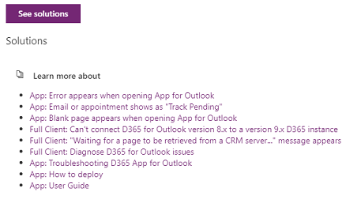
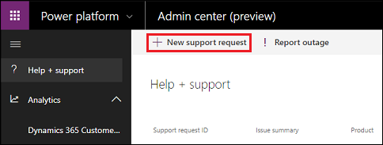
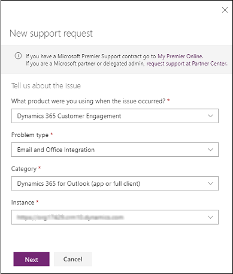
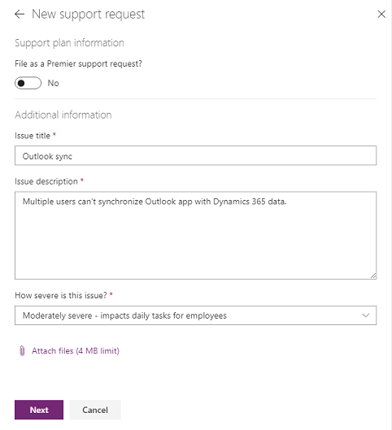
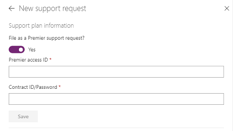
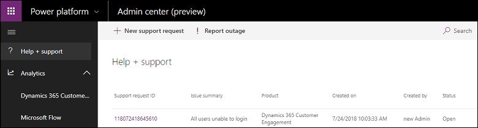
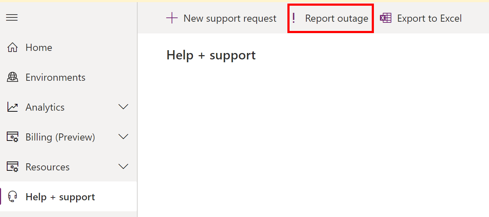
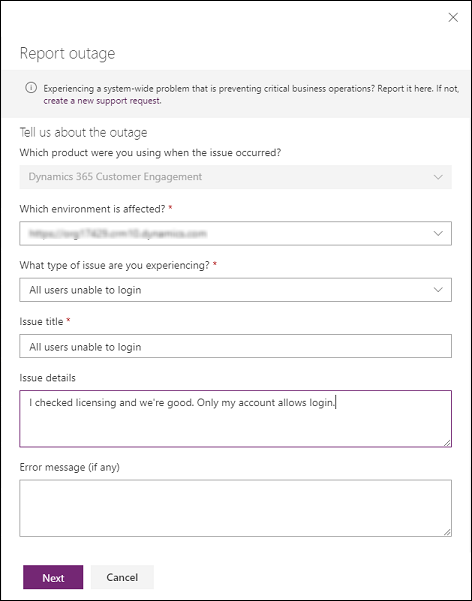

# Get Help + Support 

Admins can use the **Help + support** experience in the [Power Platform admin center](admin-documentation.md) to get self-help solutions in ***real-time*** for their issue. If the issue can't be resolved through self-help, you can use the same **Help + support** experience to contact a Microsoft support representative. 

An example of solutions provided for Dynamics 365 App for Outlook issues:

> [!div class="mx-imgBorder"] 
> 

### Prerequisites

- You have a security role that is enabled for creating support requests. Users having one of these security roles can create support requests:

  - AAD Role Admin
  - Power Apps Full Admin
  - Power Apps Environment Admin (Environment Admin, System Admin)
  - Company Admin
  - Billing Admin
  - Service Admin
  - CRM Service Admin
  - Power Platform Admin    `
  - Security Admin
  - CRM Organization Admin
  - Partner Delegated Admin
  - SharePoint Admin
  - Teams Admin
  - Exchange Admin
  - Power BI Admin
  - Compliance Admin
  - Helpdesk Admin

- For the following [support plans](https://www.microsoft.com/dynamics365/support):
   
  - Subscription Support
  - Enhanced Support
  - Professional Direct Support
  - Premier Support
  - Unified Support

> [!NOTE]
> In the following cases, you might not be able to create a support request or we can't provide relevant solutions:
> 
> - There is an issue with your Premier Support contract. Please contact your Technical Account Manager (TAM).
> - Your Support subscription has expired. Please renew.
> - We couldn't find your Support plan. 
>   - If you have a Premier Support plan, please contact your Technical Account Manager (TAM).
>   - If you have a non-Premier Support plan, please verify the plan is active. For support information, see [Community Forums](https://community.dynamics.com/f).

### View solutions or enter a support request through the new support center

1. Sign in to the [Power Platform admin center](https://admin.powerplatform.microsoft.com/) with your admin credentials.

2. Select **Help + support** > **New support request**.

   

3. Select the product with the issue. Fill in the problem type, a description of the issue, and then select **See solutions**.

   > [!div class="mx-imgBorder"] 
   > 

   Based on the information you provided, you'll see a list of possible solutions to your issue. Select the relevant solution and see if the content can successfully guide you to a fix. 

4. If the guidance doesn't resolve your issue, scroll down and select **Create a support request** and fill in the fields in the form pages.

   > [!NOTE]
   > If you have one of the plans listed in [Prerequisites](#prerequisites), you can set the severity to a higher level than **Minimal**.

   > [!div class="mx-imgBorder"] 
   > 

5. If you have a **Premier** support plan, select **Yes** for **File as a Premier support request?** and fill in the fields. If you don't know your access or contract ID, please contact your service admin or Technical Account Manager (TAM).

   > [!div class="mx-imgBorder"] 
   > 

> [!NOTE]
> - For **Contract ID/Password**, please enter your Premier contract ID. 
> - The **Contract ID/Password** defaults to the Premier contract ID. If you have changed the password when registering online in the Premier portal, you should use the updated password instead of the contract ID.

Once you submit your request it will appear in the list of support requests.

You can check the status and edit your request on this page.
  
## Limited Preview: Report outage
We're rolling out a new Preview feature to a limited set of customers to try out. If you're experiencing a service outage, we want your support request to get more timely review and action. Select the **Report outage** link to report the outage. If you don't see this link, don't worry! We'll be bringing this feature to all customers in the future.

Fill out the pages and then submit to have your support request receive an expedited review.

We'd love to know your thoughts on the new outage reporting process. Or, if you'd like to be considered for this limited Preview, please fill out this [form](https://forms.office.com/Pages/ResponsePage.aspx?id=v4j5cvGGr0GRqy180BHbR-5Axi2KMXdNi_1eF9P36tZUN1FUQkJLNVBZVVlOSVk0T0tIQTBIMk9VOC4u).

### See also
[Support overview](support-overview.md) 
[How do I check my online service health?](check-online-service-health.md)
