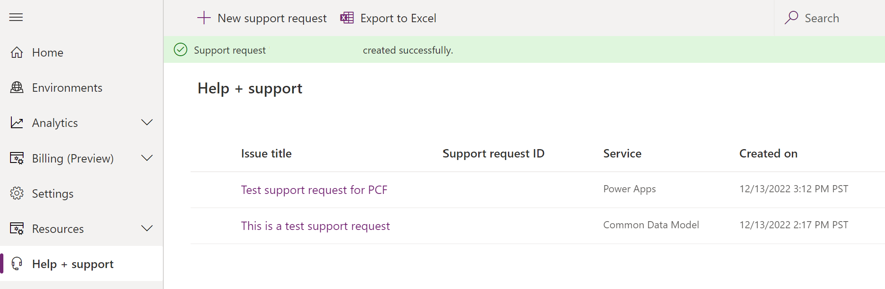

# Get Help + Support

Admins can use the **Help + support** experience in the [Power Platform admin center](admin-documentation.md) to get self-help solutions in ***real-time*** for their issue. If the issue can't be resolved through self-help, you can use the same **Help + support** experience to contact a Microsoft support representative.

An example of solutions provided for Dynamics 365 App for Outlook issues:

> [!div class="mx-imgBorder"] 
> 

### Prerequisites

- You have a security role that is enabled for creating support requests. Users having one of these security roles can create support requests:

  - AAD Role Admin
  - Power Apps Full Admin
  - Power Apps Environment Admin (Environment Admin, System Admin)
  - Company Admin
  - Billing Admin
  - Service Admin
  - CRM Service Admin
  - Power Platform Admin  
  - Security Admin
  - CRM Organization Admin
  - Partner Delegated Admin
  - SharePoint Admin
  - Teams Admin
  - Exchange Admin
  - Power BI Admin
  - Compliance Admin
  - Helpdesk Admin

- For the following [support plans](https://www.microsoft.com/dynamics365/support):
   
  - Subscription Support
  - Professional Direct Support
  - Unified Support

> [!NOTE]
> In the following cases, you might not be able to create a support request or we can't provide relevant solutions:
> 
> - There is an issue with your Unified or Premier Support contract. Please contact your Incident Manager or Customer Success Account Manager (CSAM).
> - Your Support subscription has expired. Please renew.
> - We couldn't find your Support plan. 
>   - If you have a Unified or Premier Support plan, please contact your Incident Manager or Customer Success Account Manager (CSAM).
>   - If you have a non-Unified/Premier Support plan, please verify the plan is active. For support information, see [Community Forums](https://community.dynamics.com/f).

### View solutions or enter a support request through the new support center

1. Sign in to the [Power Platform admin center](https://admin.powerplatform.microsoft.com/) with your admin credentials.

2. Select **Help + support** > **New support request**.

   

3. Select the product with the issue. Fill in the problem type, a description of the issue, and then select **See solutions**.

   > [!div class="mx-imgBorder"] 
   > 

   > [!div class="mx-imgBorder"] 
   > 

   Based on the information you provided, you'll see a list of possible solutions to your issue. Select the relevant solution and see if the content can successfully guide you to a fix. 

4. If the guidance doesn't resolve your issue, scroll down and select **Next**, and fill in the fields in the form pages.

   > [!NOTE]
   > If you have one of the plans listed in [Prerequisites](#prerequisites), you can set the severity to a higher level than **Minimal**.

   > [!div class="mx-imgBorder"] 
   > 

5. If you have a **Unified or Premier** support plan that is not listed, select **Add new contract** and fill in the fields. If you don't know your access or contract ID, please contact your service admin or Incident Manager or Customer Success Account Manager (CSAM).

   > [!div class="mx-imgBorder"] 
   > 

> [!NOTE]
> - For **Contract ID/Password**, please enter your Unified or Premier contract ID. 
> - The **Contract ID/Password** defaults to the Unified or Premier contract ID. If you have changed the password when registering online in the Unified/Premier portal, you should use the updated password instead of the contract ID.

Once you submit your request it will appear in the list of support requests.

You can check the status and edit your request on this page.

## Advisory services and premium support plan

A [premium support plan](https://dynamics.microsoft.com/support) includes advisory services. You can submit a request to get answers relative to recommendations, best practices, general advice or guidance on the usage of the products.

Without a premium support plan, you can only submit request on technical issues. Progressively, such restriction will be enforced and you won't be able to create a support request for advisory services unless you have a premium support plan.

## Limited Preview: Report outage
We're rolling out a new Preview feature to a limited set of customers to try out. If you're experiencing a service outage, we want your support request to get more timely review and action. Select the **Report outage** link to report the outage. If you don't see this link, don't worry! We'll be bringing this feature to all customers in the future.

Fill out the pages and then submit to have your support request receive an expedited review.

We'd love to know your thoughts on the new outage reporting process. Or, if you'd like to be considered for this limited Preview, please fill out this [form](https://forms.office.com/Pages/ResponsePage.aspx?id=v4j5cvGGr0GRqy180BHbR-5Axi2KMXdNi_1eF9P36tZUN1FUQkJLNVBZVVlOSVk0T0tIQTBIMk9VOC4u).

## For app-specific issues
To get the fastest response time for issues you encounter with a preview or production release of a specific customer engagement app or add-on, create a support request for the specific application from the **Application and Add-ons** menu.   

> [!div class="mx-imgBorder"] 
> 

Do **not** select topics from **Administration Center** as this can result in lost time in routing your support request properly. 

> [!div class="mx-imgBorder"] 
> 

## Model driven apps and support environments
For some support requests, you’ll be asked to request a support environment. Currently, support environments can’t be created for the Power Apps or Power Automate product options in the **What product where you using when the issue occurred?** field. To create a support request which includes a support environment for Power Platform issues, select the **Dynamics 365 Customer Engagement** product for that field.

> [!div class="mx-imgBorder"] 
> 

### See also
[Support overview](support-overview.md) 
[How do I check my online service health?](check-online-service-health.md)  
[Video: How to get the best support for Power Apps, Power Automate, and Dynamics 365](https://youtu.be/An3IfFdZlT8)

[!INCLUDE[footer-include](../includes/footer-banner.md)]
