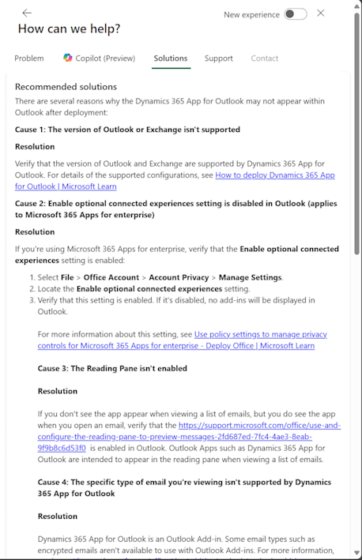

# Get Help + Support 

[!INCLUDE [cc-beta-prerelease-disclaimer](../includes/cc-beta-prerelease-disclaimer.md)]

Admins you can use the **Help + support** experience in the [Power Platform admin center](admin-documentation.md) to get self-help solutions in ***real-time*** for your issue. If the issue can't be resolved through self-help, you can use the same **Help + support** experience to contact a Microsoft support representative. 

An example of solutions provided for Dynamics 365 for Outlook issues:

> [!div class="mx-imgBorder"] 
> 

### Prerequisites

-  You have one of the following Office 365 admin roles to enter support requests:
 
   - Global
   - Tenant
   - Service
   - Support
   - Billing

-  For the following [support plans](https://www.microsoft.com/en-us/dynamics365/support).
   
   - Subscription Support
   - Enhanced Support
   - Professional Direct Support
   - Premier Support

   We're working to add the Unified Support plan to the **Help + support** experience. For now, you can go to [My Premier Online](https://support.microsoft.com/en-us/premier).  
   Microsoft Partners or delegated admins can go to [Partner Center](https://partnercenter.microsoft.com/en-us/partner/home).

### View solutions or enter a support request through the new support center

1. Sign in to the [Power Platform admin center](https://admin.powerplatform.microsoft.com/) with your admin credentials.

2. Select **Help + support** > **New support request**.

   

3. Select the product with the issue.

   > [!div class="mx-imgBorder"] 
   > 

4. To get immediate help with your issue, fill in the rest of the information on the page, and then select **See solutions**.

   > [!div class="mx-imgBorder"] 
   > 

   Based on the information you provided, you'll see a list of possible solutions to your issue. Select the relevant solution and see if the content can successfully guide you to a fix. 

5. If the guidance doesn't resolve your issue, select **Create a support request** and fill in the fields in the form pages.

   > [!div class="mx-imgBorder"] 
   > 

6. If you have a **Premier** support plan, select **Yes** for **File as a Premier support request?** and fill in the fields. If you don't know your access or contract ID, please contact your service admin or Technical Account Manager (TAM).

   > [!div class="mx-imgBorder"] 
   > 

> [!NOTE]
> - For **Contract ID/Password**, please enter your Premier contract ID. 
> - The **Contract ID/Password** defaults to the Premier contract ID. If you have changed the password when registering online in the Premier portal, you should use the updated password instead of the contract ID.

Once you submit your request it will appear in the list of support requests.

You can check the status and edit your request on this page.
  
## Limited Preview: Report outage
We're rolling out a new Preview feature to a limited set of customers to try out. If you're experiencing a service outage, we want your support request to get more timely review and action. Select the **Report outage** link to report the outage. If you don't see this link, don't worry! We'll be bringing this feature to all customers in the future.

Fill out the pages and then submit to have your support request receive an expedited review.

We'd love to know your thoughts on the new outage reporting process. Or, if you'd like to be considered for this limited Preview, please fill out this [form](https://forms.office.com/Pages/ResponsePage.aspx?id=v4j5cvGGr0GRqy180BHbR-5Axi2KMXdNi_1eF9P36tZUN1FUQkJLNVBZVVlOSVk0T0tIQTBIMk9VOC4u).