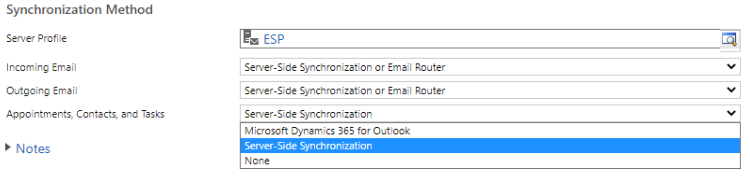

# Introduction

Use Server-Side Sync to synchronize Exchange Online mailboxes that reside on different Exchange Online tenants.

# Configuration

Sign in to the [Azure portal](https://portal.azure.com/), create the App registration and then configure the email server profile.

## 1. Register your app

Register your app on Azure portal on the tenant where Microsoft Exchange Online resides. Follow the steps in this topic to create the app registration: [Register an application](https://docs.microsoft.com/azure/active-directory/develop/quickstart-register-app#register-an-application).

**Note**: You don't need to enter anything for **Redirect URI** as this is not needed.

When you register your app, note the **Application (client) ID** and **Directory (tenant) ID** because you will need this information later to configure the email server profile.

## 2. Add a Client Secret

A client secret is a string value your app uses to identity itself. This will be used by Dynamics 365 to authenticate to your app.

To create a client secret, follow the steps in this topic, [Add a client secret](https://docs.microsoft.com/azure/active-directory/develop/quickstart-register-app#add-a-client-secret). Remember to note the **Secret Value**, as you will need this information later to configure the email server profile.

## 3. Add API permissions 

To allow your app to have access to Exchange Online you need to grant **Office 365 Exchange Online** API permission. To do this, follow these steps:

1.  Select **API permissions** &gt; **Add a permission**.

2.  Select the **APIs my organization uses** tab and then look for and select **Office 365 Exchange Online.**

3.  For type of permissions, select **Application permissions** and then select the checkbox for **full\_access\_to\_app**. When you're done, select **Add permissions**.

Note, if having an app with full access on all mailboxes that doesn't not align with your business requirements, then the Exchange online admin can scope the mailboxes the App can access using Application Access Policy or configuring the Application Impersonation role on Exchange. More information:

-   [Scoping application permissions to specific Exchange Online mailboxes](https://docs.microsoft.com/graph/auth-limit-mailbox-access)

-   [Configure impersonation](https://docs.microsoft.com/exchange/client-developer/exchange-web-services/how-to-configure-impersonation)

4.  On the **Configured permissions** screen, select **Grand admin content for (tenant name)**.

5.  On the consent confirmation dialog, select **Yes**.

Now let's collect all the information required from the Azure Portal before configuring the email server profile on Dynamics 365:

-   TenantId: This is the tenantId of the tenant where the Exchange online is configured.

-   Application Id: This is the appId used by Dynamics to connect to Exchange Online.

-   Client Secret: This is the client secret used by Dynamics 365 to authenticate as the app.

# Dynamics 365 Configuration

Create a new Exchange Online email server profile using OAuth(cross tenant) authentication.

This feature is available for private preview in Power Platform Admin center under **emailServerProfiles**. This feature is not available for the legacy web client.

1.  Sign in to the [Power Platform admin center](https://admin.powerplatform.microsoft.com) with admin credentials.

2.  Select an environment and on the command bar, select **Settings**.

3.  From the list of settings, select **Email** &gt; **Server profiles**.

4.  On the command bar, select **New server profile.**

5.  On the **Set up server profile** page, fill in the required information. Use the information that you noted down to fill in the tenant ID, application ID, and client secret details on the form.

6.  When you're done, select **Save**.

# Configure mailboxes

Now that the email server profile is configured, you can configure a mailbox. For more information: [Configure mailboxes](https://docs.microsoft.com/power-platform/admin/connect-exchange-online#configure-mailboxes)
