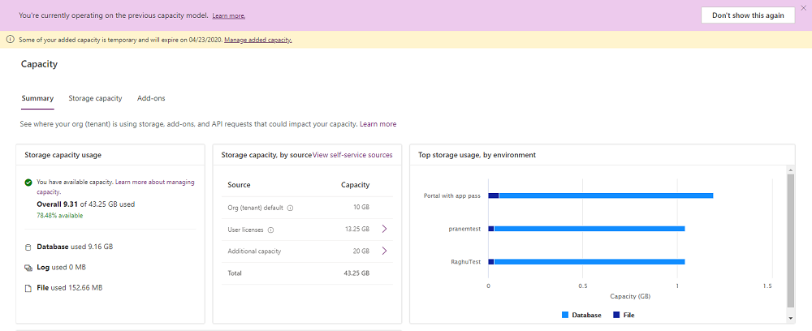
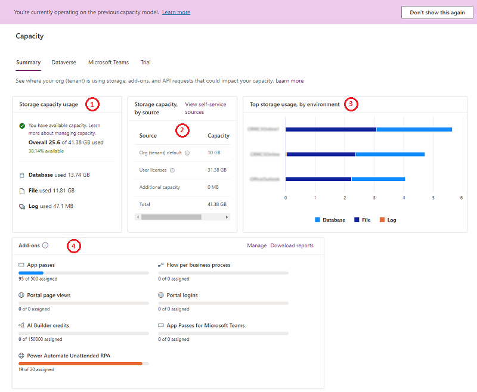
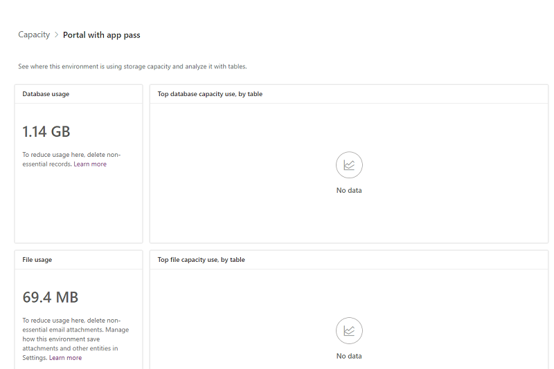

# Legacy storage capacity

In April 2019, we introduced Microsoft Dataverse capacity storage that is optimized for relational data, attachments, and audit logs. If you purchased storage prior to April 2019, you are using the legacy licensing model for storage discussed in this topic.

For information on the new storage model, see [New Microsoft Dataverse storage capacity](capacity-storage.md).

## Licenses for the legacy storage model 

The following licenses provide capacity using the legacy storage model. If you have any of the following licenses and none of the new model licenses, you'll see the legacy model report: 

- Microsoft Dynamics 365 Additional Non-production Instance 
- Microsoft Dynamics 365 Additional Test Instance 
- Microsoft Dynamics 365 Instance 
- Microsoft Dynamics 365 Storage Add-On 

To see whether you have any of these licenses, sign in to the Microsoft 365 admin center, and then go to **Billing** > **Licenses**.

> [!NOTE]
> If you have a mix of the abovementioned legacy model licenses and [new model licenses](capacity-storage.md#licenses-for-the-new-storage-model), you'll see the [new model report](capacity-storage.md).
> 
> If you have none of the abovementioned legacy model licenses nor the [new model licenses](capacity-storage.md#licenses-for-the-new-storage-model), you'll see the [new model report](capacity-storage.md).

## Verifying your legacy storage model

1. Sign in to the Microsoft Power Platform admin center, and then select an environment. 

2. Select **Resources** > **Capacity**.

3. View the data on the **Summary** page.

The legacy licensing storage model looks like the following image.

> [!div class="mx-imgBorder"] 
> 

The report displays available storage capacity by source in addition to overall storage capacity usage. To help customers transition to the new licensing model, current usage is also shown by database, file, and log capacity.

## Capacity page details

> [!NOTE]
> The calculation of storage capacity usage in the legacy licensing model consists of all three storage types&mdash;database, file, and log&mdash;however, it's displayed as one overall storage number.

### Summary tab

This page provides a tenant-level view of where your organization is using storage capacity.

To view the **Summary** page, select **Resources** > **Capacity** > **Summary** tab.

> [!div class="mx-imgBorder"] 
> 

All tables of Dataverse, including system tables, are included in the storage capacity reports.

|Number  |Description |
|---------|---------|
|(1)   |**Storage capacity usage**  <ul><li>**File and database**: The following tables store data in file and database storage: <ul><li>Attachment</li><li>AnnotationBase</li><li>Any custom or out-of-the-box table that has columns of datatype file or image (full size)</li><li>Any table that is used by one or more installed Insights applications and [ends in *- Analytics*](#what-are-tables-ending-in---analytics-in-my-capacity-report) </li> </ul><ul><li>WebResourceBase</li></ul><ul><li>RibbonClientMetadataBase</li></ul></li><li>**Log**: The following tables are used: <ul><li>AuditBase</li><li>PlugInTraceLogBase</li></ul><li>**Database only**: All other tables are counted for your database</li></ul>  |
|(2)    |**Storage capacity, by source** <ul><li>**Org (tenant) default**: The default capacity given at the time of sign-up </li><li>**User licenses**: Additional capacity added for every user license purchased</li><li>**Additional storage**: Any additional storage you bought </li><li>**Total**: Total storage available </li><li>**View self-service sources**: See [View self-service license amounts and storage capacity](view-self-service-capacity.md)</li></ul>      |
|(3)     |**Top storage usage, by environment**: The environments that consume the most capacity        |
|(4)  |  **Add-ons**:  Your organization's add-on usage details. See [View capacity add-ons in Power Platform admin center](capacity-add-on.md#view-capacity-add-ons-in-power-platform-admin-center) |

### Dataverse tab

This page provides similar information as the **Summary** tab, but with an environment-level view of where your organization is using capacity.

To view this page, select **Resources** > **Capacity** > **Dataverse** tab. 

Note the following features:

|Feature  |Description  |
|---------|---------|
|Download     | Select **Download** above the list of environments to download an Excel .CSV file with high-level storage information for each environment that the signed-in admin has permission to see in the Power Platform admin center.        |
|Search     | Use **Search** to search by the environment name and the environment type.         |
|Details  | See the next section for using the **Details** button () to see environment capacity analytics.   |

> [!div class="mx-imgBorder"] 
> 

> [!NOTE]
> - The following environments don't count against capacity and are shown as 0 GB:
>   - Microsoft Teams
>   - Trial 
>   - Preview
>   - Support
>   - Developer
> - You can select an environment that's showing 0 GB, and then go to its storage capacity details page to see the actual consumption.

#### Environment storage capacity details

Select the **Details** button () on the **Summary** tab view to see  an environment-level detailed view of where your organization is using capacity, in addition to the three types of capacity consumption. 

> [!div class="mx-imgBorder"] 
> 

The following details are provided:

- Actual database usage
- Top database tables and their growth over time
- Actual file usage
- Top files tables and their growth over time
- Actual log usage
- Top tables and their growth over time

### Microsoft Teams tab

This page provides a view of the capacity storage used by your Microsoft Teams environments. Teams environment capacity usage doesn't count towards your organization's Dataverse usage.

To view this page, select **Resources** > **Capacity** > **Microsoft Teams** tab. 

|Feature  |Description  |
|---------|---------|
|Download     | Select **Download** above the list of environments to download an Excel .CSV file with high-level storage information for each environment that the signed-in admin has permission to see in the Power Platform admin center.        |
|Search     | Use **Search** to search by the environment name and the environment type.         |

### Add-ons tab

Use this page to view your organization's add-on usage details and to assign add-ons to environments. See [View capacity add-ons in Power Platform admin center](capacity-add-on.md#view-capacity-add-ons-in-power-platform-admin-center)

> [!NOTE]
> This tab only appears if you have add-ons included in your tenant.

### Trial tab

This page provides a view of the capacity storage used by your trial environments. Trial environment capacity usage doesn't count towards your organization's Dataverse usage.

To view this page, select **Resources** > **Capacity** > **Trials** tab. 

|Feature  |Description  |
|---------|---------|
|Download     | Select **Download** above the list of environments to download an Excel .CSV file with high-level storage information for each environment that the signed-in admin has permission to see in the Power Platform admin center.        |
|Search     | Use **Search** to search by the environment name and the environment type.         |

## Example storage capacity scenario

### Scenario: Total storage is over capacity, overage enforcement

|Type  |Entitled  |Consumed  |
|---------|---------|---------|
|**Total storage**     | 100 GB        | 110 GB        |

The 110 GB of storage is used by the three types of storage: database, log, and file. This tenant is 10 GB over in storage usage. Therefore, there is a deficit. This tenant should free up storage or purchase more capacity.

## Changes for exceeding storage capacity entitlements

We're making changes for what happens when an organization's storage capacity is close to, or exceeds the capacity entitled or purchased via add-ons.

Notifications for capacity approaching storage limits will be triggered when any of total legacy model storage has less than 15% of space available.  Another warning notification that admin operations could be impacted will be sent when total legacy model capacity has less than 5% of space available.  The final tier of notification will trigger when the tenant is ‘in overage’ (storage usage exceeds capacity entitlements), which will alert the admin that the operations below will no longer be available until the overage is resolved.

- Create new environment (requires minimum 1GB capacity available)
- Copy an environment (requires minimum 1GB capacity available)
- Restore an environment (requires minimum 1GB capacity available)

These notifications are sent out to tenant admins on a weekly basis. At this time, there is no option for the tenants to opt-out of these notifications or delegate these notifications to someone else. All tenant admins for a tenant will automatically receive these notifications.

Additionally, there will still be a notification banner in the Power Platform admin center when a tenant has exceeded storage capacity.

## Actions to take for a storage capacity deficit

You can always [free up storage](free-storage-space.md), [delete unwanted environments](delete-environment.md), or buy more capacity to be compliant with storage usage. To learn more about capacity add-ons, see the [Dynamics 365 Licensing Guide](https://go.microsoft.com/fwlink/p/?LinkId=866544) or the ["Add-ons" section of the Power Apps and Power Automate Licensing Guide](https://go.microsoft.com/fwlink/?linkid=2085130). You can work through your organization's standard procurement process to purchase capacity add-ons.

## FAQ

### Why is my storage consumption decreasing in database and growing in file?

We are constantly optimizing the Dataverse for ease of use, performance, and efficiency. Part of this ongoing effort is to move data to the best possible storage with the lowest cost for customers. File-type data such as “Annotation” and “Attachment” is moving from database to file storage. This leads to decreased usage of database capacity and an increase in file capacity.

### Why could my database table size decrease while my table and file data sizes remain the same?

As part of moving file-type data such as “Annotation” and “Attachment” out from database and into file storage, we periodically reclaim the freed database space. This leads to decreased usage of database capacity, while the table and file data size computations remain unchanged.

### I have available instances (production and sandbox), but my capacity usage is more than my capacity entitlement. Will I be able to provision new environments? 

Provisioning a new environment requires that you not be delinquent in storage capacity. If you have at least 1 GB of available storage capacity, you can provision environments to align with your available instances.

### I have storage licenses from the legacy licensing model, and I also purchased new model storage licenses. Which report will I see?

You'll see the report for the [new licensing model](capacity-storage.md). 

### Do I get notified through email when my org is over capacity?

Yes, tenant admins are notified through email on a weekly basis if their org is at or over capacity. Additionally, tenant admins will also be notified once their org reaches 15% of available capacity, and once more when their org reaches 5% of available capacity.

### What are tables ending in “- analytics” in my capacity report?

Tables ending in “– Analytics” are tables used by one or more Insights applications, for example Sales Insights, Customer Service Hub, or Field Service and resource scheduling and optimization analytics dashboard to generate predictive insights and/or analytics dashboards. The data is synched from Dataverse tables. See **More information** below for documentation covering the installed Insights applications and the tables used to create insights and dashboards.

**More information:**
- [Sales Insights ](/dynamics365/ai/sales/help-hub#get-started)
- [Field Service and resource scheduling optimization (RSO)](/dynamics365/field-service/scheduling-analytics-reports)                                                                                             
- [Customer Service Hub](/dynamics365/customer-service/customer-service-analytics-insights-csh) 
- [Field Service](/dynamics365/field-service/reports) 

### See also

[Dataverse storage capacity](capacity-storage.md)  
[What's new in storage](whats-new-storage.md)  
[Free up storage space](free-storage-space.md)  
[Capacity add-ons](capacity-add-on.md)

[!INCLUDE[footer-include](../includes/footer-banner.md)]