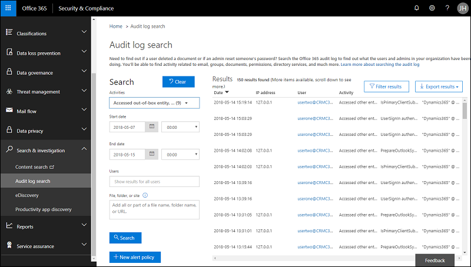

# Activate logging for PowerApps

[!INCLUDE [cc-beta-prerelease-disclaimer](../includes/cc-beta-prerelease-disclaimer.md)]

Log PowerApps activities to track and view user and administrator activity from within the [Office 365 Security & Compliance Center](https://go.microsoft.com/fwlink/?LinkID=824876). 

Office 365 tenant administrators reach the Security & Compliance Center by navigating to [https://protection.office.com](https://protection.office.com). From there, the **Audit log search** is found under the **Search and investigation** dropdown.

Within the **Audit log search** screen, tenant administrators can search audit logs across many popular services including eDiscovery, Exchange, Power BI, Azure AD, Microsoft Teams, Dynamics 365 and now Microsoft PowerApps.

Once the Audit log search screen is accessed, an administrator can filter for specific activities by pulling down the **Activities** dropdown. By scrolling down the list, a section dedicated to Microsoft PowerApps activities can be found. 

This topic covers how you can set [!INCLUDE [pn-ms-dyn-365](../includes/pn-ms-dyn-365.md)] to audit a broad range of data processing activities and use the Office 365 Security & Compliance Center to review the data in activity reports.

## Requirements
- An Office 365 Enterprise [E3](https://products.office.com/business/office-365-enterprise-e3-business-software) or [E5] (https://products.office.com/business/office-365-enterprise-e5-business-software) subscription is required to view the logs; not required to generate the logs.

## What events are audited
Logging takes place at the SDK layer which means a single action can trigger multiple events that are logged. The following are a sample of user events you can audit.

<!--
### Admin-related events

|Event  |Description  |
|---------|---------|
|Publishing customizations  |An admin publishes a new customization which overrides a change done by the previous one. The action requires auditing for analysis.    |
|Attribute deletes     |Admin accidentally deletes an attribute. This action also deletes the data. |
|Team, user management     |Who was added, who was deleted, what access rights a user/team had is important for analyzing impact.|
|Configure instance     |Adding solutions to an instance.|
|Backup and restore     |Backup and restore actions at the tenant.|
|Manage applications     |New instance added, existing instance deleted, trials converted to paid, etc.| 
-->

|Event  |Description  |
|---------|---------|
|Created app   |When the app gets created for the first time by a maker |
|Launched app    |When the app gets launched |
|Marked app as Featured   |Every time the app is marked as Featured|
|Restored app version   |The version of the app when restored|
|Edited app    |Any updates made to the app by the maker|
|Published app     |When the app is published and is now made available to others in the environment|
|Edited app permission  |Every time a user's permissions to the app is changed|
|Deleted app |When the app is deleted  |
|Marked app as Hero |Every time the app is marked as Hero  |
|Deleted app permission |Every time a user's permissions to the app is removed  |

<!--
### Microsoft Social Engagement logging   

The following Microsoft Social Engagement (MSE) entities and actions are logged.

|MSE entity  |MSE pages/panels/controls logged  |
|---------|---------|
|Search Topic Category      |Create, Rename, Delete          |
|Search Topic      |Create, Update, Delete          |
|Custom Source      |Create, Update, Delete           |
|Blocked Keyword      |Add, Delete          |
|Blocked Domain      |Add, Delete          |
|Stream      |Create, Update, Delete         |
|Post (acquired)   |Internal & External Actions   |
|Post (published)   |Send   |
|Author   |Add (GDPR), Delete (GDPR), Delete   |
|Activity Map   |Create, Update, Delete   |
|Alert   |Create, Update, Delete   |
|Preference   |Update   |
|Social Profile   |Create, Update, Reauthenticate, Delete   |
|User   |Edit Role, E-mail   |
|Azure Event Hubs   |Create, Update, Delete   |
|Dynamics 365 for Customer Engagement apps  |Create, Update, Refresh, Delete   |
|Allowed Domain   |Add, Delete   |
|Automation Rule   |Create, Update, Delete   |
|AR Notification   |Enable, Disable   |
|Tag   |Add, Update, Delete   |
|Label   |Add, Update Delete    |
|Search Language   |Add, Delete   |
|Adaptive Sentiment   |Enable, Disable, Reset   |
|Other Global Settings   |Update   |
-->

## Base schema
Schemas define which Dynamics 365 for Customer Engagement apps fields are sent to the Office 365 Security and Compliance Center.  Some fields are common to all applications that send audit data to Office 365, while others are specific to Dynamics 365 for Customer Engagement. The Base schema contains the common fields. 

|Field name  |Type  |Mandatory  |Description  |
|---------|---------|---------|---------|
|Date     |Edm.Date|No         |Date and time of when the log was generated in UTC          |
|App Name   |Edm.String         |No         |Unique Identifier of the PowerApp        |
|Id     |Edm.Guid         |No         |Unique GUID for every row logged          |
|Result Status     |Edm.String         |No         |Status of the row logged. Success in most cases.          |
|Organization Id     |Edm.Guid         |Yes        |Unique identifier of the organization from which the log was generated.       |
|CreationTime     |Edm.Date         |No         |Date and time of when the log was generated in UTC          |
|Operation     |Edm.Date         |No         |Name of operation         |
|UserKey     |Edm.String         |No         |Unique Identifier of the User in AAD       |
|UserType     |Self.UserType         |No         |The audit type (Admin, Regular, System)         |
|Additional Info     |Edm.String        |No         |Additional information if any (e.g. the environment name)       |

<!--
## Dynamics 365 for Customer Engagement apps schema
The Dynamics 365 for Customer Engagement apps schema contains fields specific to Dynamics 365 for Customer Engagement apps and partner teams. 

|Field name  |Type  |Mandatory  |Description  |
|---------|---------|---------|---------|
|User Id     |Edm.String         |No         |Unique identifier of the user GUID in the Dynamics 365 for Customer Engagement apps organization          |
|Crm Organization Unique Name     |Edm.String         |No         |Unique name of the Dynamics 365 for Customer Engagement apps organization          |
|Instance Url     |Edm.String         |No         |URL to the instance          |
|Item Url     |Edm.String         |No         |URL to the record emitting the log          |
|Item Type     |Edm.String         |No         |Name of the entity          |
|Message     |Edm.String         |No         |Name of the message called in Dynamics 365 for Customer Engagement apps apps SDK          |
|User Agent     |Edm.String         |No         |Unique identifier of the user GUID in the Dynamics 365 for Customer Engagement apps organization          |
|EntityId     |Edm.Guid        |No         |Unique identifier of the entity          |
|EntityName     |Edm.String         |No         |Name of the entity in the Dynamics 365 for Customer Engagement apps organization          |
|Fields     |Edm.String          |No         |JSON of Key Value pair reflecting the values that were created or updated         |
|Id     |Edm.String          |No         |Entity name in Dynamics 365 for Customer Engagement apps         |
|Query     |Edm.String         |No         |The Filter query parameters used while executing the FetchXML          |
|QueryResults     |Edm.String         |No         |One or multiple unique records returned by the Retrieve and Retrieve Multiple SDK message call          |
|ServiceContextId     |Edm.Guid         |No         |The unique id associated with service context          |
|ServiceContextIdType     |Edm.String         |No         |Application defined token to define context use          |
|ServiceName     |Edm.String         |No         |Name of the Service generating the log          |
|SystemUserId     |Edm.Guid         |No         |Unique identifier of the user GUID in the Dynamics 365 for Customer Engagement apps organization          |
|UserAgent     |Edm.Guid          |No        |Browser used to execute the request          |
|UserId     |Edm.Guid          |No         |The unique id of the Dynamics system user associated with this activity          |
|UserUpn     |Edm.String         |No         |User principal name of the user associated with this activity          |
-->

## Enable auditing in Dynamics 365 for Customer Engagement

1. In Dynamics 365 for Customer Engagement apps (online), choose **Settings** > **Administration** > **System Settings** > **Auditing tab**.
2. Under **Audit Settings**, enable the following check boxes:
   - **Start Auditing**
   - **Audit user access**
   - **Start Read Auditing** (Note: this only appears if you enable **Start Auditing**.)
3. Under **Enable Auditing in the following areas**, enable the check boxes for the areas you want to audit and then choose **OK**.
   
   
4. Go to **Settings** > **Customizations** > **Customize the System**
5. Under **Components**, expand **Entities** and select an entity to audit, such as **Account**.
6. Scroll down and under **Data Services** enable **Auditing**.
7. Under **Auditing**, enable the following check boxes:
   - **Single record auditing. Log a record when opened.**
   - **Multiple record auditing. Log all records displayed on an opened page.**

   
8. Choose **Save**.
9. Choose **Publish** to publish the customization.
10. Repeat steps 5 - 9 for other entities you want to audit.
11. Turn on audit logging in Office 365. See [Turn Office 365 audit log search on or off](https://support.office.com/article/turn-office-365-audit-log-search-on-or-off-e893b19a-660c-41f2-9074-d3631c95a014).

## Review your audit data using reports in Office 365 Security and Compliance Center

You can review your audit data in the Office 365 Security and Compliance Center. See [Search the audit log for user and admin activity in Office 365](https://support.office.com/article/search-the-audit-log-for-user-and-admin-activity-in-office-365-57ca5138-0ae0-4d34-bd40-240441ef2fb6).

To use the preconfigured Dynamics 365 for Customer Engagement apps reports, go to https://protection.office.com > **Search & investigation** > **Audit log search** and select the **Dynamics 365 activities** tab.

The following are the preconfigured Dynamics 365 for Customer Engagement apps reports:

|  |  |   |
|---------|---------|---------|
|Accessed out-of-box entity     |Accessed custom entity |Accessed admin entity  |
|Performed bulk actions (such as delete and import)  |Accessed other entity type   |Accessed Dynamics 365 admin center    |
|Accessed internal management tool |Signed in or out  |Activated process or plug-in  |

## Create reports
You can create your own reports to review your audit data. See [Search the audit log in the Office 365 Security & Compliance Center](https://support.office.com/article/search-the-audit-log-in-the-office-365-security-compliance-center-0d4d0f35-390b-4518-800e-0c7ec95e946c).

## What's logged

For a list of what's logged with Activity Logging, see [Microsoft.Crm.Sdk.Messages Namespace](https://docs.microsoft.com/dotnet/api/microsoft.crm.sdk.messages?view=dynamics-general-ce-9).

We log all SDK messages except the following:

- WhoAmI
-	RetrieveFilteredForms
-	TriggerServiceEndpointCheck
-	QueryExpressionToFetchXml
-	FetchXmlToQueryExpression
-	FireNotificationEvent
-	RetrieveMetadataChanges
-	RetrieveEntityChanges
-	RetrieveProvisionedLanguagePackVersion
-	RetrieveInstalledLanguagePackVersion
-	RetrieveProvisionedLanguages
-	RetrieveAvailableLanguages
-	RetrieveDeprovisionedLanguages
-	RetrieveInstalledLanguagePacks
-	GetAllTimeZonesWithDisplayName
-	GetTimeZoneCodeByLocalizedName
-	IsReportingDataConnectorInstalled
-	LocalTimeFromUtcTime
-	IsBackOfficeInstalled
-	FormatAddress
-	IsSupportUserRole
-	IsComponentCustomizable
-	ConfigureReportingDataConnector
-	CheckClientCompatibility
-	RetrieveAttribute

## How we categorize read and readmultiple

We use the prefix to categorize.

|If the request starts with:  |We characterize as:  |
|---------|---------|
|RetrieveMultiple     |ReadMultiple  |
|ExportToExcel     |ReadMultiple |
|RollUp |ReadMultiple |
|RetrieveEntitiesForAggregateQuery |ReadMultiple | 
|RetrieveRecordWall  |ReadMultiple | 
|RetrievePersonalWall  |ReadMultiple | 
|ExecuteFetch  |ReadMultiple | 
|Retrieve      |Read  |
|Search     |Read |
|Get     |Read |
|Export     |Read |

## Example generated logs

The following are some examples of logs created with Activity Logging.

### Example 1 – Logs generated when user reads an Account record 

| **Schema Name** |                                                      **Value**                                                      |
|-----------------|---------------------------------------------------------------------------------------------------------------------|
|       ID        |                                        50e01c88-2e43-4005-8be8-9ceb172e2e90                                         |
|     UserKey     |                                                  10033XXXA49AXXXX                                                   |
|    ClientIP     |                                                   131.107.XXX.XX                                                    |
|    Operation    |                                                      Retrieve                                                       |
|      Date       |                                                3/2/2018 11:25:56 PM                                                 |
|    EntityId     |                                        0a0d8709-711e-e811-a952-000d3a732d76                                         |
|   EntityName    |                                                       Account                                                       |
|      Query      |                                                         N/A                                                         |
|  QueryResults   |                                                         N/A                                                         |
|     ItemURL     | https://orgname.onmicrosoft.com/main.aspx?etn=account&pagetype=entityrecord&id=0a0d8709-711e-e811-a952-000d3a732d76 |

### Example 2 – Logs generated when user sees Account records in a Grid (Export to Microsoft Excel logs are like this) 

|**Schema Name**  |**Value**  |
|---------|---------|
|ID     |ef83f463-b92f-455e-97a6-2060a47efe33          |
|UserKey     |10033XXXA49AXXXX           |
|ClientIP     |131.107.XXX.XX          |
|Operation     |RetrieveMultiple           |
|Date     |3/2/2018 11:25:56 PM          |
|EntityId     |N/A         |
|EntityName     |Account          |
|Query     |\<filter type="and">\<condition column="ownerid" operator="eq-userid" />\<condition column="statecode" operator="eq" value="0" />\</filter>         |
|QueryResults     |0a0d8709-711e-e811-a952-000d3a732d76, dc136b61-6c1e-e811-a952-000d3a732d76        |
|ItemURL     |N/A        |

### Example 3 – List of messages logged when user converts a lead to opportunity 

|**ID**  |**EntityID**  |**EntityName**  |**Operation**  |
|---------|---------|---------|---------|
|53c98033-cca4-4420-97e4-4c1b4f81e062      |23ad069e-4d22-e811-a953-000d3a732d76          |Contact         |Create         |
|5aca837c-a1f5-4801-b770-5c66183a58aa      |25ad069e-4d22-e811-a953-000d3a732d76          |Opportunity         |Create         |
|c9585748-fdbf-4ff7-970c-bb37f6aa2c36      |25ad069e-4d22-e811-a953-000d3a732d76          |Opportunity         |Update         |
|a0469f30-078b-419d-be61-b04c9a34121f      |1cad069e-4d22-e811-a953-000d3a732d76          |Lead         |Update         |
|0975bceb-07c7-4dc2-b621-5a7b245c36a4      |1cad069e-4d22-e811-a953-000d3a732d76          |Lead         |Update         |

## Additional considerations

When audit log search in the Office 365 Security and Compliance Center is turned on, user and admin activity from your organization is recorded in the audit log and retained for 90 days. However, your organization might not want to record and retain audit log data. Or you might be using a third-party security information and event management (SIEM) application to access your auditing data. In those cases, a global admin can turn off audit log search in Office 365.

## Known issues

- Office has a 3KB limit for each audit record. Therefore, in some cases a single record from Dynamics 365 for Customer Engagement apps needs to be split into multiple records in Office. The CorrelationId field can be used to retrieve the set of split records for a given source record. Operations that are likely to require splitting include RetrieveMultiple and ExportToExcel.
- Some operations need additional processing to retrieve all relevant data. For example, RetrieveMultiple and ExportToExcel are processed to extract the list of records that are retrieved or exported. However, not all relevant operations are yet processed. For example, ExportToWord is currently logged as single operation with no additional details about what was exported.
- In the Office 365 Security and Compliance Center (protection.office.com), the Activities drop-down has a section called Dynamics 365 for Customer Engagement apps activities, with nine activities listed. However, the audit logs currently only use the Accessed other entity type activity. Selecting any of the others alone will filter out all results. The simplest option for now is to click on the Dynamics 365 for Customer Engagement apps activities header, which will select all activities.
- In future releases, logging will disabled for operations that are determined to not be useful based on a review of the logs. For example, some operations result from automated system activity, not user activity.
- The new flags for enabling Read Auditing in the Organization settings and Entity Settings are not solution aware in version 8.2. Exporting a solution from an 8.2 instance to any other instance will not export these flags. 

### See also
 [Audit data and user activity for security and compliance](audit-data-user-activity.md) 
 [Search the audit log for user and admin activity in Office 365](https://support.office.com/article/search-the-audit-log-for-user-and-admin-activity-in-office-365-57ca5138-0ae0-4d34-bd40-240441ef2fb6)
 [Office 365 Management APIs overview](https://msdn.microsoft.com/office-365/office-365-managment-apis-overview)