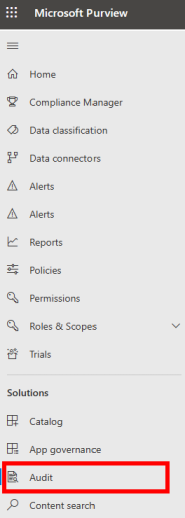

# View Power Automate audit logs 

You can find logs of Power Automate activities in the [Microsoft 365 compliance center](https://compliance.microsoft.com/). These logs are also accessible to developers via the [Office 365 Management API](/office/office-365-management-api/office-365-management-apis-overview).

## Access the logs

1.  Sign into the [compliance center](https://compliance.microsoft.com/) as a tenant admin.
1.  In the left hamburger menu, select **Show all**.
1. Select **Audit** from the **Solutions** category. 
    
    

Power Platform admins can search the **Audit** screen for details from the following popular services.

- Power BI
- Azure AD
- Microsoft Teams
- Dynamics 365
- Power Apps,
- Power Automate
- Dataverse.

Admins can filter for specific activities via the **Activities** list. You'll find the Power Automate activities in this list.

## See audited events

All logging is done at the SDK layer, so a single action can trigger multiple logged events. Here's a sample of the user events that you can audit.

Event | Description
-|-
|Created flow | The time a flow is created|
|Edited flow | Any updates made to the flow|
|Deleted flow | When the flow is deleted|
|Edited permissions | Every time a user's permissions to the flow changes|
|Deleted permissions | Every time a user's permissions to the flow is removed|
|Started a paid trial | When a user starts a paid trial|
|Renewed a paid trial | When a user renews a paid trial|

## Get details on base schema for logging

Schemas define the Power Automate fields that are sent to the Microsoft 365 compliance center. Some fields are common to all applications that send audit data to Microsoft 365, while others are specific to Power Automate. The base schema contains these common fields.

Field display name | Logical name | Type | Mandatory | Description
-|-|-|-|-
Date | CreationTime | Edm.Date | No | Date and time when the log was generated in UTC
Flow details | FlowDetailsUrl | Edm. String | No | Link to the flow’s details page
IP address | ClientIP | Edm.String | No | IP address of the user’s device
ID | ID | Edm.Guid | No | A unique GUID for every row logged
Result status | ResultStatus | Edm.String | No | Status of the row logged
Organization ID | OrganizationId | Edm.Guid | Yes | A unique identifier of the organization from which the log was generated
Operation | Operation | Edm.String | No | Name of an operation
Workload | Workload | Edm.String | No | Workload of an operation
User | UserKey | Edm.String | No | A unique identifier of the user in Azure AD
User type | UserType | Edm.String | No | The audit type (admin, regular, or system)
Flow connector names | FlowConnectorNames | Edm.String | No | Connector names listed in the flow
SharingPermission | SharingPermission | Edm.String | No | Type of permission shared with another user (3 = “Owner”) (CONFIRM)
Recipient UPN | RecipientUPN | Edm.String | No | If permission was updated, shows the UPN of the permission recipient
Additional info | More information, for example, the environment name)

## Limitations

Only activity from cloud flows is recorded in the Microsoft Compliance Center. Recorded activity for desktop flows is in the Microsoft Dataverse audit logs.