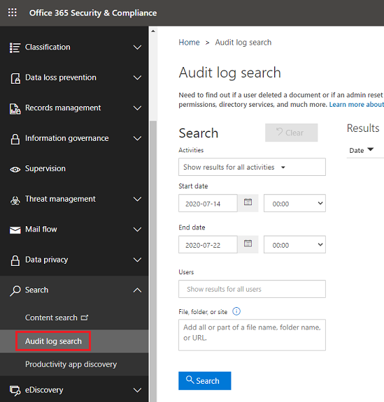
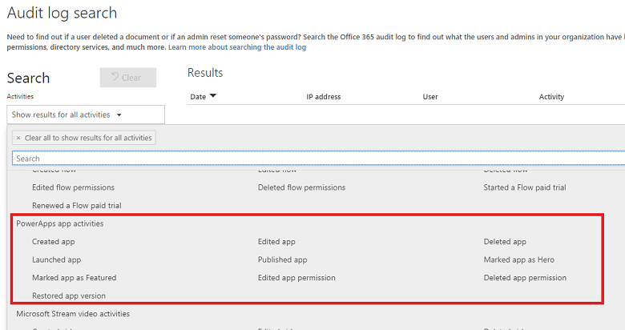

# Power Apps activity logging

[!INCLUDE [cc-data-platform-banner](../includes/cc-data-platform-banner.md)]

Power Apps activities are now tracked from the [Microsoft 365 Security & Compliance Center](https://go.microsoft.com/fwlink/?LinkID=824876). 

Follow these steps.

1. Sign in to the [Security & Compliance Center](https://protection.office.com) as a tenant admin.

2. Select **Search** > **Audit log search**. 

   > [!div class="mx-imgBorder"] 
   > 

Within the **Audit log search** screen, Power Platform admins can search audit logs across many popular services including eDiscovery, Exchange, Power BI, Azure AD, Microsoft Teams, customer engagement apps (Dynamics 365 Sales, Dynamics 365 Customer Service, Dynamics 365 Field Service, Dynamics 365 Marketing, and Dynamics 365 Project Service Automation), and Microsoft Power Apps.

Once the Audit log search screen is accessed, an administrator can filter for specific activities by pulling down the **Activities** dropdown. By scrolling down the list, a section dedicated to Microsoft Power Apps activities can be found. 

## What events are audited
Logging takes place at the SDK layer which means a single action can trigger multiple events that are logged. The following are a sample of user events you can audit.

|Event  |Description  |
|---------|---------|
|Created app   |When the app gets created for the first time by a maker |
|Launched app    |When the app gets launched |
|Marked app as Featured   |Every time the app is marked as Featured|
|Restored app version   |The version of the app when restored|
|Edited app    |Any updates made to the app by the maker|
|Published app     |When the app is published and is now made available to others in the environment|
|Edited app permission  |Every time a user's permissions to the app is changed|
|Deleted app |When the app is deleted  |
|Marked app as Hero |Every time the app is marked as Hero  |
|Deleted app permission |Every time a user's permissions to the app is removed  |

## Base schema
Schemas define which Power Apps fields are sent to the Microsoft 365 Security and Compliance Center.  Some fields are common to all applications that send audit data to Microsoft 365, while others are specific to Power Apps. The Base schema contains the common fields. 

|Field name  |Type  |Mandatory  |Description  |
|---------|---------|---------|---------|
|Date     |Edm.Date|No         |Date and time of when the log was generated in UTC          |
|App Name   |Edm.String         |No         |Unique Identifier of the PowerApp        |
|Id     |Edm.Guid         |No         |Unique GUID for every row logged          |
|Result Status     |Edm.String         |No         |Status of the row logged. Success in most cases.          |
|Organization Id     |Edm.Guid         |Yes        |Unique identifier of the organization from which the log was generated.       |
|CreationTime     |Edm.Date         |No         |Date and time of when the log was generated in UTC          |
|Operation     |Edm.Date         |No         |Name of operation         |
|UserKey     |Edm.String         |No         |Unique Identifier of the User in Azure AD       |
|UserType     |Self.UserType         |No         |The audit type (Admin, Regular, System)         |
|Additional Info     |Edm.String        |No         |Additional information if any (e.g. the environment name)       |

## Review your audit data using reports in Microsoft 365 Security and Compliance Center

You can review your audit data in the Microsoft 365 Security and Compliance Center. See [Search the audit log in the compliance Center](https://docs.microsoft.com/microsoft-365/compliance/search-the-audit-log-in-security-and-compliance?view=o365-worldwide).

To use the preconfigured Power Apps reports, go to https://protection.office.com > **Search & investigation** > **Audit log search** and select the **Power Apps app activities** tab.

> [!div class="mx-imgBorder"] 
> 

### See also
 [Search the audit log in the compliance Center](https://docs.microsoft.com/microsoft-365/compliance/search-the-audit-log-in-security-and-compliance?view=o365-worldwide) 
 [Office 365 Management APIs overview](https://msdn.microsoft.com/office-365/office-365-managment-apis-overview) 
 [Permissions in the Security & Compliance Center](https://docs.microsoft.com/office365/securitycompliance/permissions-in-the-security-and-compliance-center)