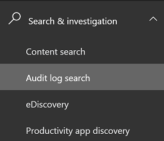

# Activity logging for PowerApps

[!INCLUDE [cc-beta-prerelease-disclaimer](../includes/cc-beta-prerelease-disclaimer.md)]

PowerApps activities are now tracked from the [Office 365 Security & Compliance Center](https://go.microsoft.com/fwlink/?LinkID=824876). Office 365 tenant administrators reach the Security & Compliance Center by navigating to [https://protection.office.com](https://protection.office.com). From there, the **Audit log search** is found under the **Search and investigation** dropdown.

Within the **Audit log search** screen, tenant administrators can search audit logs across many popular services including eDiscovery, Exchange, Power BI, Azure AD, Microsoft Teams, Dynamics 365 for Customer Engagement apps, and now Microsoft PowerApps.

Once the Audit log search screen is accessed, an administrator can filter for specific activities by pulling down the **Activities** dropdown. By scrolling down the list, a section dedicated to Microsoft PowerApps activities can be found. 

<!--
## Requirements
- An Office 365 Enterprise [E3](https://products.office.com/business/office-365-enterprise-e3-business-software) or [E5] (https://products.office.com/business/office-365-enterprise-e5-business-software) subscription is required to view the logs; not required to generate the logs.
-->

## What events are audited
Logging takes place at the SDK layer which means a single action can trigger multiple events that are logged. The following are a sample of user events you can audit.

|Event  |Description  |
|---------|---------|
|Created app   |When the app gets created for the first time by a maker |
|Launched app    |When the app gets launched |
|Marked app as Featured   |Every time the app is marked as Featured|
|Restored app version   |The version of the app when restored|
|Edited app    |Any updates made to the app by the maker|
|Published app     |When the app is published and is now made available to others in the environment|
|Edited app permission  |Every time a user's permissions to the app is changed|
|Deleted app |When the app is deleted  |
|Marked app as Hero |Every time the app is marked as Hero  |
|Deleted app permission |Every time a user's permissions to the app is removed  |

## Base schema
Schemas define which PowerApps fields are sent to the Office 365 Security and Compliance Center.  Some fields are common to all applications that send audit data to Office 365, while others are specific to PowerApps. The Base schema contains the common fields. 

|Field name  |Type  |Mandatory  |Description  |
|---------|---------|---------|---------|
|Date     |Edm.Date|No         |Date and time of when the log was generated in UTC          |
|App Name   |Edm.String         |No         |Unique Identifier of the PowerApp        |
|Id     |Edm.Guid         |No         |Unique GUID for every row logged          |
|Result Status     |Edm.String         |No         |Status of the row logged. Success in most cases.          |
|Organization Id     |Edm.Guid         |Yes        |Unique identifier of the organization from which the log was generated.       |
|CreationTime     |Edm.Date         |No         |Date and time of when the log was generated in UTC          |
|Operation     |Edm.Date         |No         |Name of operation         |
|UserKey     |Edm.String         |No         |Unique Identifier of the User in AAD       |
|UserType     |Self.UserType         |No         |The audit type (Admin, Regular, System)         |
|Additional Info     |Edm.String        |No         |Additional information if any (e.g. the environment name)       |

## Review your audit data using reports in Office 365 Security and Compliance Center

You can review your audit data in the Office 365 Security and Compliance Center. See [Search the audit log for user and admin activity in Office 365](https://support.office.com/article/search-the-audit-log-for-user-and-admin-activity-in-office-365-57ca5138-0ae0-4d34-bd40-240441ef2fb6).

To use the preconfigured PowerApps reports, go to https://protection.office.com > **Search & investigation** > **Audit log search** and select the **PowerApps app activities** tab.

> [!div class="mx-imgBorder"] 
> 

### See also
 [Search the audit log for user and admin activity in Office 365](https://support.office.com/article/search-the-audit-log-for-user-and-admin-activity-in-office-365-57ca5138-0ae0-4d34-bd40-240441ef2fb6) 
 [Office 365 Management APIs overview](https://msdn.microsoft.com/office-365/office-365-managment-apis-overview) 
 [Permissions in the Office 365 Security & Compliance Center](https://docs.microsoft.com/office365/securitycompliance/permissions-in-the-security-and-compliance-center)