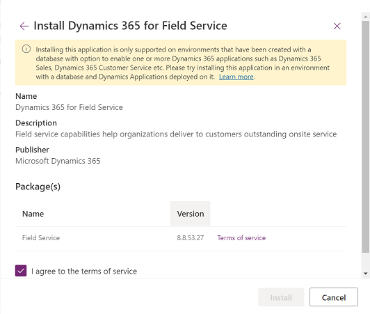
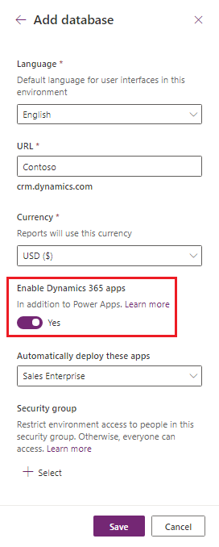

# Manage Dynamics 365 apps

You can now use the Microsoft Power Platform admin center to install, configure, and manage Dynamics 365 apps that run on [Microsoft Dataverse](/powerapps/maker/common-data-service/data-platform-intro). Apps in this topic refer to Dynamics 365 apps such as Dynamics 365 Sales, Dynamics 365 Customer Service, Dynamics 365 Field Service, and Dynamics 365 Marketing as well as apps purchased from Microsoft AppSource requiring any of these Dynamics 365 licenses.

> [!NOTE]
> You can install and manage Dynamics 365 apps only in an environment that was created with a database and with Dynamics 365 apps enabled during the environment creation. A valid Dynamics 365 license is required to enable Dynamics 365 apps during the environment creation. More information: [Create an environment with a database](./create-environment.md#create-an-environment-with-a-database)

You can manage apps from either the [tenant level](#tenant-level-view-of-apps) or the [environment level](#environment-level-view-of-apps).

## Tenant-level view of apps

App management in the **Applications** tab of the Dynamics 365 admin center is now done from the tenant-level view of apps in the Power Platform admin center. Follow these steps to see a list of all licensed Dynamics 365 apps for your tenant.

> [!div class="mx-imgBorder"] 
> 

Follow these steps to see a list of all licensed applications for your tenant.

1. Sign in to the [Power Platform admin center](https://admin.powerplatform.microsoft.com).

2. Select **Resources** > **Dynamics 365 apps** from the left-side menu.

   You'll see a list of installed or available to install or configure Dynamics 365 apps for the signed-in user. An admin will see all installed or available to install apps.

   Duplicate items will appear under **Name** if you have the same app license applied to multiple environments.

   > [!div class="mx-imgBorder"] 
   > 

   Note the following under **Status**:

   - **Enabled**: This app is ready to be installed in your environments. 
   - **Configured**: This app has been configured to an environment. It can be reconfigured to a different environment or configuration to current environment can be updated.
   - **Not configured**: This app is ready to be configured to an environment.

3. From the top menu bar, depending on the status of the app, you can do the following:

    - **Manage**: Select to go to a page where you can manage your app. 
    - **Details**: See information about the app such as the publisher.
    - **Install app**: Install certain applications to the selected environment for which you have permissions. Once an environment is selected, you'll see a list of packages to be installed.

4. If your tenant is multigeo, you can change the locale with the region selector.

   > [!div class="mx-imgBorder"] 
   > 

## Environment-level view of apps

In addition to the environment level, solution management can also be done from the environment-level view in the Power Platform admin center.

> [!div class="mx-imgBorder"] 
>  

Follow these steps to see a list of all the licensed applications you installed for your environment.

1. Sign in to the [Power Platform admin center](https://admin.powerplatform.microsoft.com).

2. Select **Environments** and then select an environment.

3. Under **Resources**, select **Dynamics 365 apps**.

   You'll see a list of Dynamics 365 apps installed **by you** in the selected environment.

   > [!div class="mx-imgBorder"] 
   > 

4. Select an app. From the top menu bar, depending on the status of the app, you can do the following:

    - **Install app**: Admins can install certain applications to the selected environment for which they have permission. Once an environment is selected, you'll see a list of packages to be installed.
    - **Open AppSource**: Select to install an app from AppSource.
    - **Update**: Appears if an update is available. Select to update the package.
    - **Details**: See information about the app such as the publisher.

If you have failed installations, see [Troubleshooting failed installations](#troubleshooting-a-failed-installation).

## Install an app
The process to install an app depends on your view.

### Install an app in the tenant view

1. Sign in to the [Power Platform admin center](https://admin.powerplatform.microsoft.com).

2. Select **Resources** > **Dynamics 365 apps** from the left-side menu.

3. Select an **Enabled** app, and then select **Install** from the top menu bar. 

4. Select an environment, review the packages to be installed, agree to the terms of service, and then select **Install**.

   > [!div class="mx-imgBorder"] 
   > 

   You'll navigate to the environment-level view where you can see the installation status.

   > [!div class="mx-imgBorder"] 
   > 

### Install an app in the environment view

1. Sign in to the [Power Platform admin center](https://admin.powerplatform.microsoft.com).

2. Select **Environments** and then select an environment.

3. Under **Resources**, select **Dynamics 365 apps**.

4. Select **Install app**. 

5. Select an **Enabled** app, and then select **Next**.

   > [!div class="mx-imgBorder"] 
   > 

6. Agree to the terms of service, and then select **Install**.

## Troubleshooting installation error

If you see the following error:

"Installing this application is only supported on environments that have been created with a database with option to enable one or more Dynamics 365 applications such as Dynamics 365 Sales, Dynamics 365 Customer Service, etc. Please try installing this application in an environment with a database and Dynamics Applications deployed on it."

> [!div class="mx-imgBorder"] 
> 

You'll need to follow the steps in [Create an environment with a database](create-environment.md#create-an-environment-with-a-database). You need to set **Enable Dynamics 365 apps** to **Yes**.

## Troubleshooting a failed installation

If the app installation has failed, select **Installation failed** from the environment-level view and review the troubleshooting details. 

If it's necessary to [contact Support](support-overview.md), be sure to provide the details listed on the **Error details** page.

> [!div class="mx-imgBorder"] 
> 

## Delete an app
For information on how to delete an app, see [Delete a model-driven app](/powerapps/maker/model-driven-apps/delete-model-driven-app). 

## FAQ

### Don't see your environment?

The number of environments admins see in the **Select an environment** drop-down list will be less than or equal to the number of environments displayed on the **Environments** page in the Power Platform admin center. Check that no filter is applied on the **Environments** page.    

Filters are applied to the **Select an environment** drop-down list as follows:
1. Displays environments based on the [geographic region](regions-overview.md); selected by the admin in the tenant-level view.
2. Displays environments that only have a database.
3. Displays environments that are only in a ready state. 

### Error: Installing this app is only supported in environments that’ve been created with a database with the option to enable one or more Dynamics 365 apps  

Installing Dynamics 365 applications, such as Dynamics 365 Sales, Dynamics 365 Customer Service etc., is only supported on environments that have been created with a database with the option to enable one or more D365 Applications. Try installing this application in an environment with a database and Dynamics Applications enabled on it. 

> [!div class="mx-imgBorder"] 
> 

[!INCLUDE[footer-include](../includes/footer-banner.md)]
